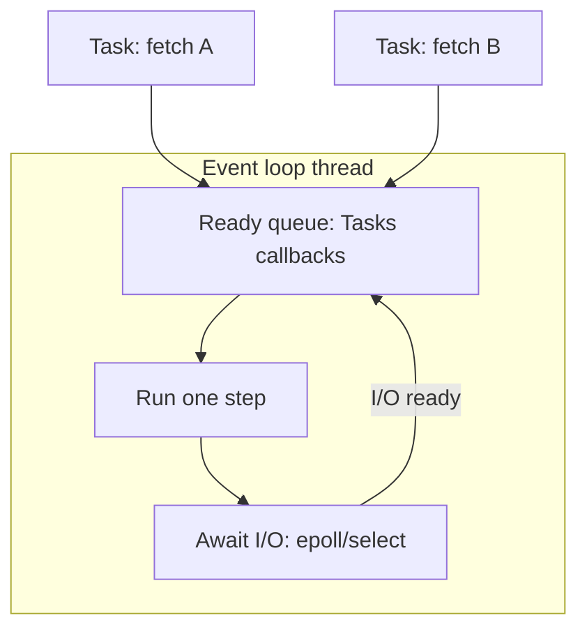

# 04. Event loop: the heart of asyncio

## Intro: "everything is await, but one request blocks everyone"

After migrating to FastAPI the team noticed: during **one** heavy report the **healthcheck** starts timing out. In the code there's `async def`, but inside there's **`time.sleep(30)`** "for simplicity". The event loop is **one per process** of the uvicorn worker: a sync sleep **does not yield** control — **not a single** coroutine progresses for 30 seconds.

Understanding the **event loop** is the key to diagnosing such incidents. Tasks and parallel fetch — [05-tasks-taskgroup](05-tasks-taskgroup.md); anti-patterns in APIs — [27-async-patterns](../fastapi/27-async-patterns.md).

## What you'll learn

- How the **event loop** schedules coroutines and callbacks.
- **`get_running_loop`** vs **`get_event_loop`** (legacy).
- **Call soon**, **call later**, **call_at**.
- Why **blocking the loop** is a system-wide failure, not a local bug.

---

## The event loop in one picture



The loop is **one thread**:

1. Picks a **ready** task/callback.
2. Runs it until the next **`await`** (or completion).
3. Registers an **I/O wait** (socket readable) or a **timer** (`asyncio.sleep`).
4. When the OS signals readiness — wakes the task.

**Cooperative:** the task yields on its own via `await`. There is no preemption like with OS threads.

---

## Getting the loop in code

```python
import asyncio

async def show_loop():
    loop = asyncio.get_running_loop()
    print(loop)  # <_UnixSelectorEventLoop running=True ...>

async def main():
    await show_loop()

asyncio.run(main())
```

| API | When |
|-----|-------|
| `asyncio.get_running_loop()` | inside a coroutine — the **current running** loop |
| `asyncio.run(main())` | creates a **new** loop for the main thread |
| `asyncio.get_event_loop()` | **legacy**; a deprecated pattern in sync code in 3.10+ |

**Rule:** in async code — **`get_running_loop()`**. Don't create a second loop in the same thread without a good reason.

---

## call_soon and timers

```python
import asyncio

def sync_callback():
    print("callback from loop")

async def main():
    loop = asyncio.get_running_loop()
    loop.call_soon(sync_callback)
    await asyncio.sleep(0)  # yield — let the callback run
    loop.call_later(0.1, lambda: print("later"))
    await asyncio.sleep(0.15)

asyncio.run(main())
```

| Method | Purpose |
|-------|------------|
| `call_soon(fn, *args)` | run `fn` on the **next** iteration |
| `call_later(delay, fn)` | after `delay` seconds |
| `call_at(when, fn)` | absolute time (monotonic clock) |

**Careful:** the callback is **sync** — it must be **fast**. Long work in a callback blocks the loop.

---

## asyncio.sleep vs time.sleep

```python
import asyncio
import time

async def good():
    await asyncio.sleep(1)  # loop is free for other tasks

async def bad():
    time.sleep(1)  # loop is FROZEN for 1s
```

Demonstration:

```python
import asyncio
import time

async def ticker():
    for i in range(3):
        print("tick", i)
        await asyncio.sleep(0.2)

async def with_bad_sleep():
    asyncio.create_task(ticker())
    time.sleep(1)  # ticker doesn't print until sleep finishes
    print("done bad")

async def with_good_sleep():
    asyncio.create_task(ticker())
    await asyncio.sleep(1)
    print("done good")

# asyncio.run(with_bad_sleep())  # tick only after a 1s pause
# asyncio.run(with_good_sleep()) # tick every 0.2s while waiting
```

---

## Default loop policy and platforms

| Platform | Default loop |
|-----------|--------------|
| Linux/macOS | `SelectorEventLoop` |
| Windows | `ProactorEventLoop` (3.8+) |

For most applications **don't change** the policy. The exception is integration with a lib that requires a specific loop (rare).

---

## One loop per thread

```python
# ❌ two asyncio.run calls in a row in one script — OK (the loop is closed)
# ❌ asyncio.run inside async — RuntimeError

async def inner():
    pass

async def outer():
    asyncio.run(inner())  # RuntimeError: cannot be called from a running event loop
```

**FastAPI:** uvicorn keeps the loop **alive** for the whole process lifecycle. Lifespan hooks are coroutines on the same loop ([`deploy/fastapi`](../../deploy/fastapi/README.md)).

---

## run_forever and run_until_complete (legacy mental model)

`asyncio.run(coro)` internally does roughly:

```python
# simplified, don't copy into prod
loop = asyncio.new_event_loop()
asyncio.set_event_loop(loop)
try:
    return loop.run_until_complete(coro)
finally:
    loop.run_until_complete(loop.shutdown_asyncgens())
    loop.close()
```

For **long-lived** services the loop runs via **`run_forever`** (uvicorn), not `run` on every request.

---

## Diagnosing blocking

```python
import asyncio

async def watchdog():
    while True:
        await asyncio.sleep(5)
        print("loop alive")

async def simulate_block():
    asyncio.create_task(watchdog())
    # simulating sync CPU — do NOT do this in prod
    sum(i * i for i in range(50_000_000))
```

If the **watchdog** doesn't print during the "block" — the loop is busy with sync code. In prod: **py-spy**, **asyncio debug mode** ([29-debug-profiling](29-debug-profiling.md)).

---

## Relation to the stand

The gateway on **8095** — FastAPI + uvicorn + **one event loop** per worker. `/aggregate-parallel` schedules three `fetch` calls as concurrent tasks on the same loop ([`app.py`](../../deploy/python-async/mock-server/app.py)).

---

## Common mistakes

| Mistake | Consequence | Solution |
|--------|-------------|---------|
| `time.sleep` in a coroutine | freeze | `await asyncio.sleep` |
| Sync DB driver in an async route | freeze | asyncpg / `to_thread` |
| Heavy JSON parse of 50 MB in a handler | latency spike | stream / executor |
| `get_event_loop()` in 3.12 without a running loop | DeprecationWarning | `asyncio.run` or `get_running_loop` |
| Callback with await inside | not allowed — the callback is sync | create a Task |

---

## Summary

The **event loop** is a scheduler for **a single thread** that switches between coroutines on **`await`** and I/O readiness. Any **sync block** without await is a **stop of the whole async process**. `asyncio.run` creates a loop for scripts; **uvicorn** keeps the loop for the API.

## Checklist

- What happens on `await asyncio.sleep(1)` from the loop's point of view?
- Why is `time.sleep` in an `async def` dangerous?
- How does `get_running_loop()` differ from `asyncio.run()`?
- How many event loops per uvicorn worker?

Next lesson: [05. Tasks and TaskGroup](05-tasks-taskgroup.md).
