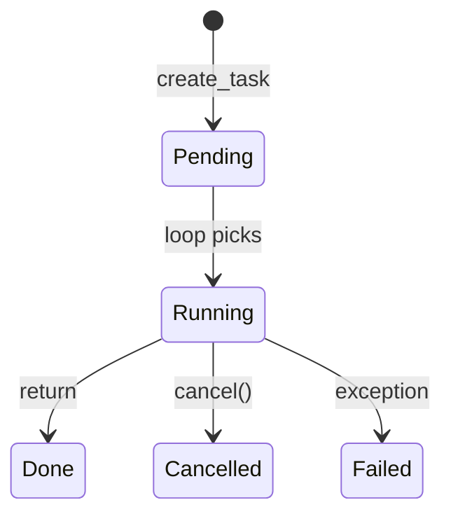

# 05. Tasks and TaskGroup

## Intro: "we launched a fetch and forgot it — the data was lost"

A microservice starts a **background** webhook send via `asyncio.create_task(notify())`, but the handler returns **200** immediately. On deploy the pod gets **SIGTERM** — the task is **killed** without `await`, the partner never gets its callback. You need to understand the **Task lifecycle**: when it starts, how to wait for it, how **TaskGroup** (3.11+) guarantees **structured** completion.

Cancellation — [07-cancellation-timeouts](07-cancellation-timeouts.md); comparison with gather — [09-gather-vs-taskgroup](09-gather-vs-taskgroup.md).

## What you'll learn

- **`asyncio.create_task`** and **`asyncio.Task`**.
- **`TaskGroup`** (Python 3.11+) for structured concurrency.
- **`asyncio.wait`**, **`wait_for`** (overview).
- Fire-and-forget vs explicit await.

---

## create_task — schedule a coroutine

```python
import asyncio

async def fetch(name: str, delay: float) -> str:
    await asyncio.sleep(delay)
    return f"{name}: ok"

async def main():
    # Bad: the coroutine isn't scheduled until awaited
    coro = fetch("A", 0.2)

    # Good: the Task is already in the loop's queue
    task_a = asyncio.create_task(fetch("A", 0.2))
    task_b = asyncio.create_task(fetch("B", 0.1))

    # Between create and await you can do other work
    print("scheduled both")

    results = await asyncio.gather(task_a, task_b)
    print(results)

asyncio.run(main())
```

| Step | Effect |
|-----|--------|
| `coro = fetch(...)` | a coroutine object, **not running** |
| `create_task(coro)` | the loop **will start** it at the first opportunity |
| `await task` | wait for the result or an exception |

**Naming (3.8+):** `task.set_name("webhook")` — handy in logs.

---

## Task states (simplified)



```python
task = asyncio.create_task(fetch("x", 0.1))
print(task.done())   # False
await task
print(task.done())   # True
print(task.result()) # 'x: ok'
```

---

## TaskGroup — a structured batch (3.11+)

```python
import asyncio

async def worker(n: int) -> int:
    await asyncio.sleep(0.1 * n)
    return n * 10

async def main():
    async with asyncio.TaskGroup() as tg:
        t1 = tg.create_task(worker(1))
        t2 = tg.create_task(worker(2))
        t3 = tg.create_task(worker(3))
    # leaving the block — ALL tasks are done (or an ExceptionGroup)

    print(t1.result(), t2.result(), t3.result())

asyncio.run(main())
```

| TaskGroup | Behavior |
|-----------|-----------|
| `async with TaskGroup()` | waits for all children on exit |
| An exception in one task | **cancels** the rest, raises an **ExceptionGroup** |
| After the block | all results are available via `.result()` |

**Structured concurrency:** the group's scope = the tasks' lifetime. More — [16-structured-concurrency](16-structured-concurrency.md).

---

## create_task vs gather vs TaskGroup

| API | Start | Error in one | Style |
|-----|-------|----------------|-------|
| `await gather(a(), b())` | when gather is called | `return_exceptions` optional | functional |
| `create_task` + await | explicit schedule | must be handled manually | flexible |
| `TaskGroup` | `tg.create_task` | cancel siblings + ExceptionGroup | structured |

```python
# gather with exceptions
results = await asyncio.gather(
    fetch("ok", 0.1),
    fetch("fail", 0.1),  # if it raises inside
    return_exceptions=True,
)
```

---

## Fire-and-forget (careful)

```python
async def background_log(msg: str):
    await asyncio.sleep(0.01)
    print("logged:", msg)

async def handler():
    asyncio.create_task(background_log("event"))  # not awaited
    return {"status": "accepted"}
```

**Risks:**

- an exception in the task is **lost** if there's no `add_done_callback`.
- on shutdown the task is **cut off**.

**Better:** an explicit queue + worker ([14-asyncio-queues](14-asyncio-queues.md)) or FastAPI's **BackgroundTasks** for short work.

```python
def _log_task_result(task: asyncio.Task):
    if task.cancelled():
        return
    exc = task.exception()
    if exc:
        print("background failed:", exc)

task = asyncio.create_task(background_log("x"))
task.add_done_callback(_log_task_result)
```

---

## asyncio.wait and wait_for

```python
import asyncio

async def demo_wait():
    tasks = [
        asyncio.create_task(asyncio.sleep(1)),
        asyncio.create_task(asyncio.sleep(2)),
    ]
    done, pending = await asyncio.wait(tasks, timeout=0.5)
    for p in pending:
        p.cancel()
    print(len(done), len(pending))  # 0-1 done, rest pending

async def demo_wait_for():
    try:
        await asyncio.wait_for(asyncio.sleep(10), timeout=0.2)
    except asyncio.TimeoutError:
        print("timed out")
```

`wait_for` — a wrapper with a timeout ([07-cancellation-timeouts](07-cancellation-timeouts.md)). `wait` is low-level; in new code, more often **TaskGroup** + the **`timeout()` context** (3.11+).

---

## Example: concurrent fetch on the stand

```python
import asyncio
import httpx

BASE = "http://localhost:8095"

async def get_json(client: httpx.AsyncClient, path: str):
    r = await client.get(f"{BASE}{path}")
    r.raise_for_status()
    return r.json()

async def dashboard():
    async with httpx.AsyncClient(timeout=30) as client:
        async with asyncio.TaskGroup() as tg:
            t_health = tg.create_task(get_json(client, "/health"))
            t_json = tg.create_task(get_json(client, "/json?size=5"))
    return {"health": t_health.result(), "json": t_json.result()}
```

Lab: [06-lab-concurrent-io](06-lab-concurrent-io.md).

---

## Common mistakes

| Mistake | Symptom | Solution |
|--------|---------|---------|
| `gather` without await | coroutine never awaited | `await gather(...)` |
| Task after the loop is closed | RuntimeError | await/cancel on shutdown |
| ExceptionGroup not caught | 500 without a log | `except* Exception` (3.11+) |
| create_task after the first await of a "series" | loss of parallelism | schedule before awaiting others |
| Keeping thousands of tasks without a limit | memory | Semaphore ([13](13-primitives-locks.md)) |

---

## Summary

A **Task** is a coroutine **scheduled** on the event loop. **`create_task`** gives parallelism up to the first `await`. **TaskGroup** (3.11+) is the preferred way to run a **group** of tasks with automatic cancellation of siblings on error. Fire-and-forget is acceptable only with a **done callback** and an understanding of shutdown.

## Checklist

- How does a coroutine differ from a Task after `create_task`?
- What does TaskGroup do on an exception in one child?
- When is gather preferable to TaskGroup?
- Why is fire-and-forget dangerous on SIGTERM?

Next lesson: [06. Lab: concurrent I/O](06-lab-concurrent-io.md).
