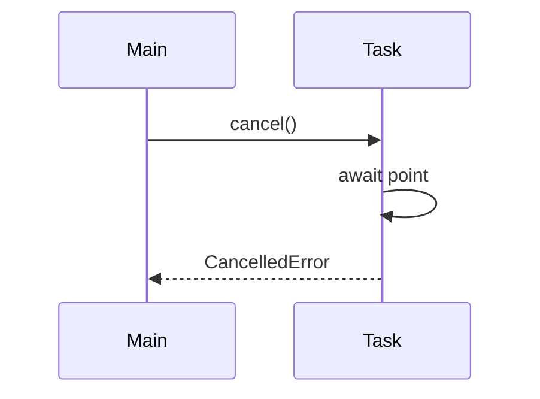

# 07. Cancellation and timeouts

## Intro: "the deploy killed the pod — the transaction hung in the DB"

Kubernetes sent **SIGTERM**, uvicorn started shutting down, but the handler was still **await**-ing an external API without a timeout. After **30 s** — SIGKILL, the PostgreSQL connection is severed, the row stuck in **idle in transaction**. The problem: there's no **upper time bound** and no proper **cancellation** of long tasks.

This chapter covers **`task.cancel()`**, **`CancelledError`**, **`asyncio.timeout`**, **`wait_for`**. Shutdown practice — [08-lab-graceful-shutdown](08-lab-graceful-shutdown.md); production FastAPI — [33-docker-production](../fastapi/33-docker-production.md).

## What you'll learn

- How **cancellation** works in asyncio (cooperative).
- **`async for` + cancel** and cleanup in `finally`.
- **Timeouts:** `asyncio.timeout` (3.11+), `wait_for`.
- Why **swallowing CancelledError** is a bug.

---

## Cooperative cancellation

```python
import asyncio

async def long_job():
    try:
        await asyncio.sleep(60)
    except asyncio.CancelledError:
        print("cleanup before exit")
        raise  # MANDATORY re-raise

async def main():
    task = asyncio.create_task(long_job())
    await asyncio.sleep(0.1)
    task.cancel()
    try:
        await task
    except asyncio.CancelledError:
        print("task was cancelled")

asyncio.run(main())
```

| Step | What happens |
|-----|----------------|
| `task.cancel()` | a cancellation request; the task gets a **CancelledError** at the **nearest await** |
| `except CancelledError: raise` | propagation upward — otherwise cancel is "swallowed" |
| No await in the task | cancel is deferred until the first await |



---

## asyncio.timeout (3.11+)

```python
import asyncio

async def slow():
    await asyncio.sleep(10)
    return "done"

async def main():
    try:
        async with asyncio.timeout(0.5):
            await slow()
    except TimeoutError:
        print("too slow")

asyncio.run(main())
```

| API | Note |
|-----|------------|
| `async with asyncio.timeout(n)` | preferred in 3.11+ |
| `asyncio.wait_for(coro, timeout=n)` | legacy, still common |
| `TimeoutError` | on timeout (not `asyncio.TimeoutError` in 3.11+) |

**Important:** timeout **cancels** the inner coroutine. Handle cleanup in `finally` inside `slow` if a rollback is needed.

---

## wait_for — the classic pattern

```python
import asyncio

async def fetch_simulated():
    await asyncio.sleep(2)
    return {"data": 1}

async def main():
    try:
        result = await asyncio.wait_for(fetch_simulated(), timeout=0.3)
    except asyncio.TimeoutError:
        print("wait_for timeout")
    else:
        print(result)
```

With httpx — set both a **client timeout** *and* a **business timeout** ([17-async-http-httpx](17-async-http-httpx.md)).

---

## Shield from cancel (rare)

```python
async def critical_commit():
    await asyncio.sleep(0.5)
    print("committed")

async def main():
    task = asyncio.create_task(asyncio.shield(critical_commit()))
    await asyncio.sleep(0.1)
    task.cancel()
    await task  # shield: the inner may complete
```

**`shield`** protects the inner from an **external** cancel — use it **very rarely** (risk of "zombie" work on shutdown).

---

## Cancellation + httpx

```python
import asyncio
import httpx

async def fetch(url: str):
    async with httpx.AsyncClient(timeout=30.0) as client:
        try:
            async with asyncio.timeout(1.0):
                r = await client.get(url)
                return r.json()
        except TimeoutError:
            return {"error": "timeout"}

async def main():
    print(await fetch("http://localhost:8095/slow?extra_ms=500"))
```

**What you'll see:** on timeout the request is **aborted** on the client; on the server the handler may still finish (this is normal for HTTP).

---

## TaskGroup and cancel

When exiting a `TaskGroup` with an error, **all siblings are cancelled** ([05-tasks-taskgroup](05-tasks-taskgroup.md)). On **SIGTERM** uvicorn cancels running requests — your code must:

1. Catch **CancelledError** at the top-level await.
2. Close pools (`await engine.dispose()`).
3. Not start new long work after the cancel flag.

---

## Common mistakes

| Mistake | Consequence | Solution |
|--------|-------------|---------|
| `except CancelledError: pass` | shutdown hangs | **re-raise** |
| No timeout on external HTTP | hung requests, connection leak | `timeout` + httpx limits |
| Cancel of sync blocking code | cancel won't fire until return | remove the block / to_thread |
| Thinking cancel = kill thread | only at an await | split into await chunks |
| shield everywhere | SIGTERM doesn't stop it | use it selectively |

---

## In production

- **K8s** `terminationGracePeriodSeconds` ≥ worst-case graceful shutdown.
- **FastAPI lifespan** — close the httpx client, DB pool ([`deploy/fastapi`](../../deploy/fastapi/README.md)).
- **Idempotency** — cancel may happen **after** an upstream success.

---

## Summary

**Cancellation** in asyncio is **cooperative**: `cancel()` delivers a **CancelledError** at an await. A **timeout** is a special case of cancel on a timer. Always **re-raise CancelledError** after cleanup. Combine an **httpx timeout** and **`asyncio.timeout`** for defense in depth.

## Checklist

- Where exactly does cancel fire inside a task?
- How does `asyncio.timeout` differ from an httpx timeout?
- Why can't you swallow CancelledError?
- What happens to sibling tasks in a TaskGroup on an error?

Next lesson: [08. Lab: graceful shutdown](08-lab-graceful-shutdown.md).
