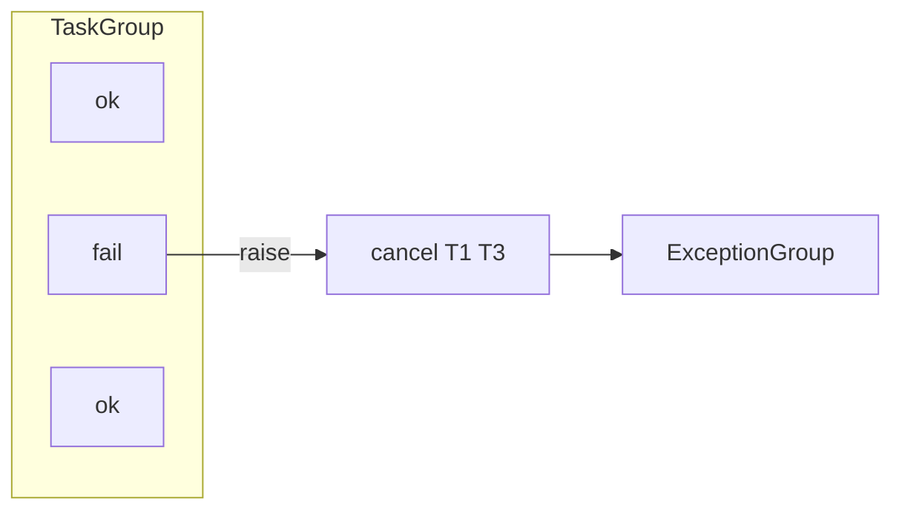

# 09. asyncio.gather vs TaskGroup

## Intro: "one failed shard took down the whole batch"

An ETL script pulls **20 APIs** via `gather`. One endpoint returned **500** — without `return_exceptions=True` the whole batch failed, and **19 successful** responses were thrown away. They rewrote it on **TaskGroup** — on the first error the siblings **cancel**, but now you need **`except*`** for the **ExceptionGroup**. Which API to choose?

The comparison is the key to [16-structured-concurrency](16-structured-concurrency.md) and the labs [06](06-lab-concurrent-io.md), [18](18-lab-parallel-fetch.md).

## What you'll learn

- The semantics of **`asyncio.gather`** and the **`return_exceptions`** option.
- The semantics of **`TaskGroup`** and **ExceptionGroup**.
- When **gather** is still appropriate.
- The **partial success** vs **all-or-nothing** patterns.

---

## gather — a functional fan-in

```python
import asyncio

async def ok(v: int) -> int:
    await asyncio.sleep(0.05)
    return v

async def fail() -> None:
    await asyncio.sleep(0.05)
    raise RuntimeError("boom")

async def demo_gather_fail_fast():
    # without return_exceptions — the first raise propagates
    await asyncio.gather(ok(1), fail(), ok(2))

async def demo_gather_partial():
    results = await asyncio.gather(
        ok(1), fail(), ok(2),
        return_exceptions=True,
    )
    print(results)  # [1, RuntimeError('boom'), 2]
```

| Parameter | Effect |
|----------|--------|
| `return_exceptions=False` (default) | first exception → cancel the rest? **No** — the others **run to completion**, but gather raises |
| `return_exceptions=True` | exceptions are **in the list** as elements |
| Order of results | **the argument order**, not completion order |

**Important:** gather **does not cancel** siblings on an error (until gather completes). TaskGroup — **does cancel** them.

---

## TaskGroup — structured all-or-nothing

```python
import asyncio

async def demo_taskgroup():
    try:
        async with asyncio.TaskGroup() as tg:
            tg.create_task(ok(1))
            tg.create_task(fail())
            tg.create_task(ok(2))
    except* RuntimeError as eg:
        print("failures:", len(eg.exceptions))
```



On exit from `async with` **all** children are done or cancelled. **Partial results** exist only for those that finished before the error (unreliable to rely on).

---

## Comparison table

| Criterion | gather | TaskGroup |
|----------|--------|-----------|
| Python | 3.7+ | **3.11+** |
| Error in one | raise (or in the list) | **cancel siblings** + ExceptionGroup |
| Partial success | `return_exceptions=True` | not a design goal |
| Access to Task objects | needs a separate create_task | `tg.create_task` |
| Scope readability | one line | an explicit `async with` block |
| Structured concurrency | no | **yes** |

---

## When gather

```python
# Independent read-only sources — partial is OK
async def load_dashboard(user_id: int):
    profile, settings, notifs = await asyncio.gather(
        fetch_profile(user_id),
        fetch_settings(user_id),
        fetch_notifications(user_id),
        return_exceptions=True,
    )
    if isinstance(profile, Exception):
        profile = None
    ...
```

- **Read-only** aggregation with a **degraded** UI.
- Migrating legacy code (broad support for 3.9).
- A fixed set of coroutines **without** nested dynamic spawn.

---

## When TaskGroup

```python
async def transfer_funds(from_id: int, to_id: int, amount: int):
    async with asyncio.TaskGroup() as tg:
        tg.create_task(debit(from_id, amount))
        tg.create_task(credit(to_id, amount))
    # both or neither — a business invariant
```

- **Transactional** invariants (all or nobody).
- **Dynamic** spawn in a loop inside a single scope.
- New code on **3.11+** without a legacy constraint.

---

## gather + create_task for an early start

```python
async def early_start():
    t1 = asyncio.create_task(ok(1))
    t2 = asyncio.create_task(ok(2))
    await asyncio.sleep(0)  # other sync work
    return await asyncio.gather(t1, t2)
```

The TaskGroup equivalent:

```python
async with asyncio.TaskGroup() as tg:
    t1 = tg.create_task(ok(1))
    t2 = tg.create_task(ok(2))
# results here
```

---

## ExceptionGroup and except*

```python
try:
    async with asyncio.TaskGroup() as tg:
        tg.create_task(fail())
        tg.create_task(fail())
except* RuntimeError as eg:
    for e in eg.exceptions:
        print("got:", e)
```

Python 3.11 **PEP 654** — several errors in one bubble. An ExceptionGroup may appear in the uvicorn logs — don't confuse it with a single traceback.

---

## Example: aggregate endpoints

Gateway **8095**:

- `/aggregate` — a **sequential** for loop (not gather).
- `/aggregate-parallel` — **`asyncio.gather`** over three fetches.

See [`app.py`](../../deploy/python-async/mock-server/app.py). In [18-lab-parallel-fetch](18-lab-parallel-fetch.md) you'll reproduce it locally.

---

## Common mistakes

| Mistake | Consequence | Solution |
|--------|-------------|---------|
| gather without await | never awaited | `await gather(...)` |
| TaskGroup without except* | unhandled ExceptionGroup | `except* Exception` |
| Partial success in a TaskGroup | data loss | gather + return_exceptions |
| Expecting sibling cancel in gather | extra upstream calls | TaskGroup or manual cancel |
| gather in a loop N=10000 | memory spike | Semaphore + bounded pool ([13](13-primitives-locks.md)) |

---

## Summary

**gather** is a flexible **fan-in** with optional **partial success**. **TaskGroup** is a **structured** scope: an error **cancels** siblings, errors become an **ExceptionGroup**. For new code on 3.11+, prefer **TaskGroup** for the "all or nobody" invariant; **gather** — for degraded read aggregation.

## Checklist

- Does gather cancel siblings on an error?
- How do you get partial success?
- When do you need `except*`?
- What does `/aggregate-parallel` use on the stand?

Next lesson: [10. Async context managers](10-async-context-managers.md).
