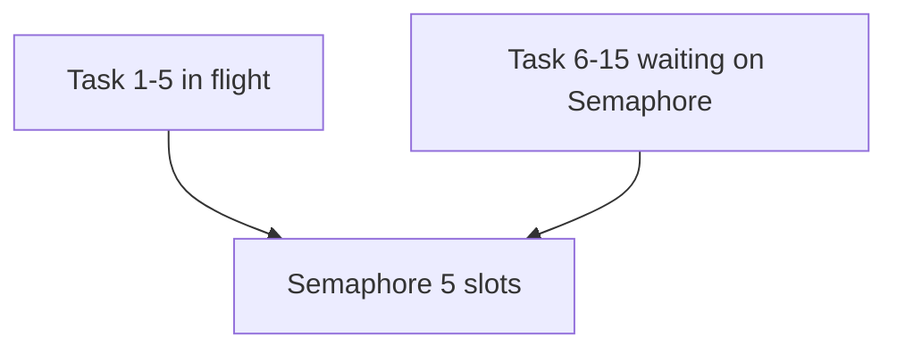

# 13. Lock, Semaphore, Event

## Intro: "100 parallel HTTP requests — the upstream blocked us"

A migration script ran a **`gather`** over **500 URLs** without a limit. The upstream returned **429** and **connection reset**; locally — an avalanche of **TIME_WAIT**. You need a **Semaphore(20)** — no more than 20 concurrent in-flight requests. In parallel another service shared a **mutable cache dict** between tasks — a race, corrupted entries. You need a **Lock**.

The asyncio primitives aren't "like threading" — they're **coordination** of coroutines on **a single thread**. Queues — [14-asyncio-queues](14-asyncio-queues.md); rate limit in FastAPI+Redis — [28-redis-cache](../fastapi/28-redis-cache.md).

## What you'll learn

- **`asyncio.Lock`** — mutual exclusion.
- **`Semaphore` / `BoundedSemaphore`** — a parallelism limit.
- **`Event`** — a signal between tasks.
- **`Condition`** (overview).

---

## Lock — one writer

```python
import asyncio

cache: dict[str, int] = {}
lock = asyncio.Lock()

async def upsert(key: str, delta: int):
    async with lock:
        cache[key] = cache.get(key, 0) + delta
        await asyncio.sleep(0.01)  # simulate work

async def main():
    await asyncio.gather(*(upsert("x", 1) for _ in range(100)))
    print(cache["x"])  # 100 — without a lock there's a race, less

asyncio.run(main())
```

| Primitive | When |
|----------|-------|
| **Lock** | mutate shared **mutable** state |
| **Semaphore** | limit the **count** of concurrent operations |
| **Event** | a one-shot or persistent **flag** |

**Important:** without **preemption** the race window is between **await**s inside the critical section. Keep the section **short**, without I/O inside the lock if possible.

---

## Semaphore — bounded concurrency

```python
import asyncio
import httpx

BASE = "http://localhost:8095"
SEM = asyncio.Semaphore(5)

async def fetch_limited(client: httpx.AsyncClient, path: str, i: int):
    async with SEM:
        print(f"start {i}")
        r = await client.get(f"{BASE}{path}")
        r.raise_for_status()
        print(f"done {i}")
        return r.json()

async def main():
    async with httpx.AsyncClient(timeout=30) as client:
        await asyncio.gather(*(fetch_limited(client, "/slow?extra_ms=50", i) for i in range(15)))

asyncio.run(main())
```

**What you'll see:** no more than **5** concurrent `start` — the rest wait on `async with SEM`.



---

## BoundedSemaphore

```python
sem = asyncio.BoundedSemaphore(3)
# release() without acquire → ValueError (catch bugs)
```

A regular Semaphore can "accumulate" extra releases — Bounded catches such errors.

---

## Event — coordination

```python
import asyncio

ready = asyncio.Event()

async def waiter(name: str):
    print(f"{name} waiting")
    await ready.wait()
    print(f"{name} go")

async def setter():
    await asyncio.sleep(0.2)
    print("set event")
    ready.set()

async def main():
    await asyncio.gather(waiter("A"), waiter("B"), setter())

asyncio.run(main())
```

| Method | Action |
|-------|----------|
| `await event.wait()` | block until set |
| `event.set()` | wake **all** waiters |
| `event.clear()` | reset (rare) |

The shutdown pattern from [08-lab-graceful-shutdown](08-lab-graceful-shutdown.md) is a special case of **Event**.

---

## Condition (overview)

```python
condition = asyncio.Condition()
items: list[int] = []

async def consumer():
    async with condition:
        while not items:
            await condition.wait()
        return items.pop(0)

async def producer(v: int):
    async with condition:
        items.append(v)
        condition.notify()
```

For producer-consumer a **Queue** is often simpler ([14-asyncio-queues](14-asyncio-queues.md)).

---

## Semaphore vs connection pool limits

| Layer | What it limits |
|-------|------------------|
| `httpx.Limits(max_connections=N)` | TCP connections in the client |
| **Semaphore** | business concurrent **operations** |
| Upstream rate limit | 429 / Retry-After |

Use **both**: the pool doesn't replace an application-level throttle.

---

## Redis distributed lock (cross-link)

An in-process Lock **doesn't work** across uvicorn workers. For a cluster — Redis `SET NX` ([`redis-basic`](../redis-basic/README.md), [28-redis-cache](../fastapi/28-redis-cache.md)).

---

## Common mistakes

| Mistake | Consequence | Solution |
|--------|-------------|---------|
| Lock over the whole HTTP await | serial throughput = 1 | lock only the cache mutation |
| Semaphore(1000) "just in case" | no upstream protection | measure + tune |
| Deadlock of two Locks | hang | acquire in a fixed order |
| threading.Lock in async | blocks the event loop | asyncio.Lock |
| Event without clear on reuse | a false wake | a new Event or clear |

---

## Summary

**Lock** protects **shared mutable state**. **Semaphore** limits the **number of concurrent** async operations — a must-have for mass HTTP/DB. **Event** synchronizes phases (startup ready, shutdown). All the primitives are **async** — await on acquire/wait.

## Checklist

- Why is threading.Lock dangerous in a coroutine?
- Semaphore(5) + 20 tasks — how many in-flight?
- Lock vs Semaphore — a common interview question?
- Where is the connections limit in httpx?

Next lesson: [14. asyncio.Queue](14-asyncio-queues.md).
