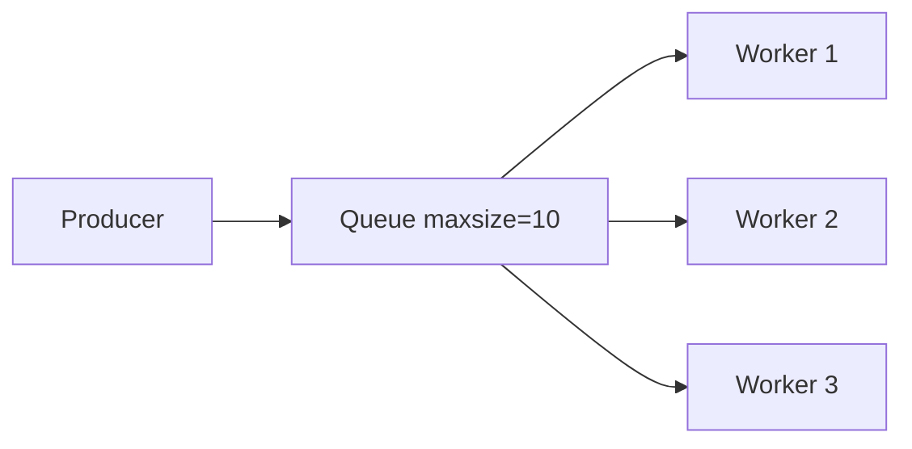

# 14. asyncio.Queue and producer-consumer

## Intro: "a Celery queue is expensive — we need an in-process worker pool"

A service accepts **1000 upload jobs** and processes them with an **httpx POST** to a converter API. `gather(1000)` — OOM and a ban. The architecture: **3 worker coroutines** read from an **`asyncio.Queue`**, main **produces** job ids. Backpressure: **`Queue(maxsize=50)`** — the producer **awaits put** when the queue is full.

Worker pool lab — [15-lab-worker-pool](15-lab-worker-pool.md). Distributed queue — RabbitMQ/Kafka ([`rabbitmq-basic`](../rabbitmq-basic/README.md)); Redis lists — [`redis-basic`](../redis-basic/README.md).

## What you'll learn

- The **`asyncio.Queue`** API: put, get, task_done, join.
- **Producer-consumer** with multiple workers.
- A **sentinel** for graceful shutdown.
- **maxsize** as backpressure.

---

## Queue basics

```python
import asyncio

async def producer(q: asyncio.Queue):
    for i in range(5):
        await q.put(i)
        print("produced", i)
    await q.put(None)  # sentinel — stop the consumer

async def consumer(q: asyncio.Queue):
    while True:
        item = await q.get()
        if item is None:
            q.task_done()
            break
        print("consumed", item)
        await asyncio.sleep(0.05)
        q.task_done()

async def main():
    q = asyncio.Queue()
    await asyncio.gather(producer(q), consumer(q))

asyncio.run(main())
```

| Method | Description |
|-------|----------|
| `await q.put(item)` | enqueue; blocks if **maxsize** is reached |
| `await q.get()` | dequeue; blocks if empty |
| `q.task_done()` | mark the item processed |
| `await q.join()` | wait until all items are done |

---

## Multiple workers + sentinel

```python
async def worker(wid: int, q: asyncio.Queue):
    while True:
        item = await q.get()
        if item is None:
            q.task_done()
            break
        print(f"worker {wid} processing {item}")
        await asyncio.sleep(0.1)
        q.task_done()

async def main():
    q = asyncio.Queue(maxsize=10)
    workers = [asyncio.create_task(worker(i, q)) for i in range(3)]
    for job in range(12):
        await q.put(job)
    # shutdown: one sentinel per worker
    for _ in workers:
        await q.put(None)
    await q.join()
    await asyncio.gather(*workers)
```

**Sentinel pattern:** **`N` None** for **N** workers — each gets its own stop signal.



---

## Backpressure with maxsize

```python
async def slow_consumer(q: asyncio.Queue):
    while True:
        item = await q.get()
        if item is None:
            q.task_done()
            return
        await asyncio.sleep(0.2)
        q.task_done()

async def fast_producer(q: asyncio.Queue):
    for i in range(20):
        await q.put(i)  # blocks when q full
        print("put", i)
```

**maxsize=5** — the producer **can't** outrun the consumer without a bound on memory.

---

## PriorityQueue (when you need priority)

```python
q = asyncio.PriorityQueue()
await q.put((1, "high"))
await q.put((10, "low"))
priority, item = await q.get()
```

For fair FIFO a regular **Queue** is enough.

---

## Queue vs gather

| gather 500 tasks | Queue + 10 workers |
|------------------|---------------------|
| 500 coroutines alive | ~10 active + queue buffer |
| spike memory | bounded |
| hard throttle | natural backpressure |

---

## Integration with a Semaphore

```python
sem = asyncio.Semaphore(5)

async def worker(q: asyncio.Queue):
    while True:
        url = await q.get()
        if url is None:
            q.task_done()
            break
        async with sem:
            await fetch(url)
        q.task_done()
```

A double limit is redundant; choose **one** choke point.

---

## Mock gateway as a job target

```python
import httpx

BASE = "http://localhost:8095"

async def process_job(client: httpx.AsyncClient, job_id: int):
    r = await client.get(f"{BASE}/slow", params={"extra_ms": job_id % 100})
    r.raise_for_status()
    return job_id, r.json()["delay_ms"]
```

The [15-lab-worker-pool](15-lab-worker-pool.md) lab uses this pattern.

---

## Common mistakes

| Mistake | Consequence | Solution |
|--------|-------------|---------|
| Forgot task_done | join hangs | always task_done after get |
| One sentinel for N workers | N-1 workers hang | N sentinels |
| Unbounded Queue | OOM under a spike | maxsize |
| put without await (sync) | wrong API | await put |
| Consumer exception without task_done | join leak | try/finally task_done |

---

## Summary

**asyncio.Queue** is the idiomatic **producer-consumer** in a single process. **maxsize** gives **backpressure**. A **sentinel None** stops workers cleanly. For multi-node — an external queue (Redis, RabbitMQ).

## Checklist

- What does `await q.join()` do?
- Why maxsize?
- How many sentinels for 5 workers?
- Queue vs Celery — when to use which?

Next lesson: [15. Lab: worker pool](15-lab-worker-pool.md).
