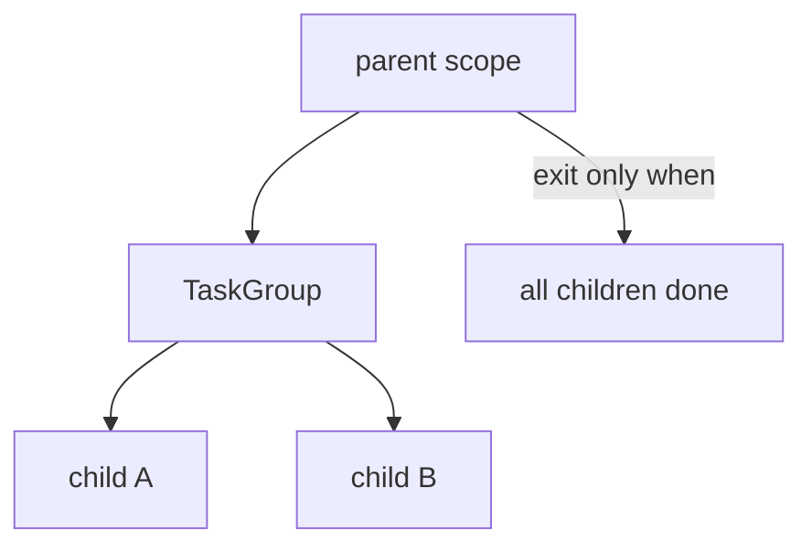

# 16. Structured concurrency

## Intro: "a background task outlived its parent — it wrote to a closed DB"

Legacy code: `asyncio.create_task(cleanup())` in a handler **without await**; the request finished, the session was **closed**, but the task was still **await session.execute**. Intermittent **`InterfaceError`**. **Structured concurrency** is the rule: **the lifetime of child tasks ⊆ the lifetime of the parent scope**. In Python 3.11+ this is **`TaskGroup`**; the concept is broader — Trio, **anyio** ([34-system-design-async](34-system-design-async.md)).

## What you'll learn

- The principles of **structured concurrency** (the Nursery model).
- **TaskGroup** as the Python implementation.
- **Anti-patterns:** orphan tasks, detached callbacks.
- The relation to **shutdown** and **testing**.

---

## The problem of unstructured tasks

```python
import asyncio

async def orphan_work():
    await asyncio.sleep(1)
    print("orphan still running")

async def handler_bad():
    asyncio.create_task(orphan_work())  # detached
    return "200 OK"  # scope ends — who awaits orphan?

async def handler_good():
    async with asyncio.TaskGroup() as tg:
        tg.create_task(orphan_work())
    # orphan_work MUST finish before return
    return "200 OK"
```

| Unstructured | Structured |
|--------------|------------|
| a task may outlive the parent | children **don't outlive** the scope |
| errors are lost | **ExceptionGroup** |
| shutdown is hard | cancel on scope exit |

---

## TaskGroup = a structured scope

```python
import asyncio

async def child(name: str):
    await asyncio.sleep(0.1)
    return name

async def parent():
    async with asyncio.TaskGroup() as tg:
        a = tg.create_task(child("A"))
        b = tg.create_task(child("B"))
    return a.result(), b.result()
```



Comparison with gather — [09-gather-vs-taskgroup](09-gather-vs-taskgroup.md).

---

## Cancellation propagates down

```python
async def parent_with_cancel():
    try:
        async with asyncio.TaskGroup() as tg:
            tg.create_task(asyncio.sleep(10))
            tg.create_task(asyncio.sleep(10))
            raise ValueError("parent fail")
    except* ValueError:
        pass
    # both sleep tasks cancelled
```

**Structured cancel:** an error in the parent scope → siblings cancelled. Like **SIGTERM** on a request tree in a well-designed app.

---

## Nursery mental model (Trio → asyncio)

| Trio | asyncio 3.11+ |
|------|---------------|
| `async with nursery:` | `async with TaskGroup() as tg:` |
| `nursery.start_soon(fn)` | `tg.create_task(fn())` |
| Cannot leave with running tasks | same |

**anyio** abstracts over asyncio and Trio — see [34-system-design-async](34-system-design-async.md); uvicorn lifespan — [30-uvloop-production](30-uvloop-production.md).

---

## FastAPI request scope

```python
# anti-pattern
@router.post("/jobs")
async def create_job():
    asyncio.create_task(process_job())  # unstructured
    return {"accepted": True}

# better
@router.post("/jobs")
async def create_job():
    async with asyncio.TaskGroup() as tg:
        tg.create_task(process_job())
    return {"done": True}  # if process is short

# production: external queue Celery/SQS
```

Long work — **not** in the request TaskGroup; a **Queue** or broker ([15-lab-worker-pool](15-lab-worker-pool.md)).

---

## Testing structured code

```python
import pytest

@pytest.mark.asyncio
async def test_parent():
    a, b = await parent()
    assert a == "A"
    assert b == "B"
```

Orphan tasks in tests → **warnings** "Task was destroyed but pending". TaskGroup makes tests **deterministic** ([27-pytest-asyncio](27-pytest-asyncio.md)).

---

## Capstone preview

[36-capstone](36-capstone.md) — an aggregator service: **TaskGroup** per incoming batch, **Semaphore** on outbound, **timeout** per upstream — all three layers structured.

---

## Common mistakes

| Mistake | Consequence | Solution |
|--------|-------------|---------|
| create_task without a scope | orphan + lost errors | TaskGroup or explicit await |
| TaskGroup for hours-long work | block the request | external worker |
| Ignore ExceptionGroup in logs | silent partial fail | except* + metrics |
| Shield all children | broken cancel | narrow shield |
| Mix gather + TaskGroup without rules | confusing semantics | one style per layer |

---

## Summary

**Structured concurrency** is the discipline of a **task tree**: children **don't outlive** the parent, errors **bubble up**, cancel **propagates**. In asyncio 3.11+ — **`TaskGroup`**. Long-lived background work — a **Queue/broker**, not a detached `create_task`.

## Checklist

- Why is an orphan task dangerous with a closed DB session?
- TaskGroup vs a fire-and-forget create_task?
- When is TaskGroup **not** suitable for an HTTP handler?
- The relation to graceful shutdown ([08](08-lab-graceful-shutdown.md))?

Next lesson: [17. Async HTTP with httpx](17-async-http-httpx.md).
