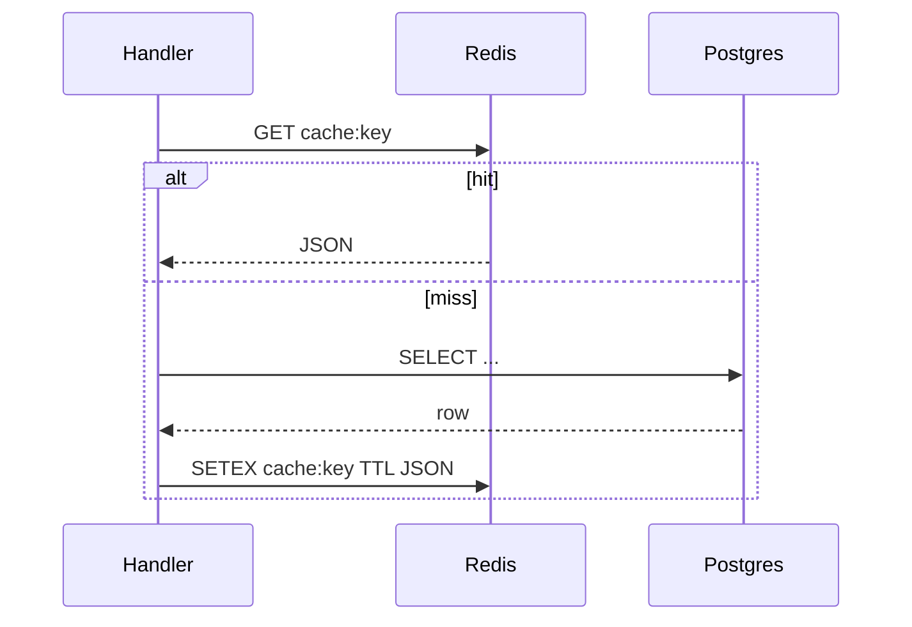

# 21. redis.asyncio and caching patterns

## Intro: "Postgres is saved, but every report hits the DB 50 times"

After [20-lab-async-database](20-lab-async-database.md) the data lives in PostgreSQL. The dashboard report requests the same aggregates **every 200 ms** — the DB load grows linearly with the number of users, even though the response doesn't change for 30 seconds. The solution is **async Redis**: `await redis.get()` doesn't block the event loop, and a TTL removes staleness.

The **`redis`** library (redis-py 5.x) includes **`redis.asyncio`**. The old `aioredis` package was **merged** into redis-py — don't install both. Practice — [22-lab-redis-async](22-lab-redis-async.md); the stand — [`deploy/redis`](../../deploy/redis/README.md).

## What you'll learn

- **`redis.asyncio.Redis`** and the connection pool.
- Patterns: **cache-aside**, **write-through**, a **rate limit counter**.
- Pipeline and `MULTI/EXEC` in an async context.
- Differences from the sync `redis.Redis` in `async def`.

---

## The client and pool

```bash
cd deploy/redis
docker compose up -d
redis-cli -h localhost -p 6379 ping
```

```python
import redis.asyncio as redis

async def main():
    client = redis.Redis(
        host="localhost",
        port=6379,
        decode_responses=True,
        socket_connect_timeout=5,
    )
    try:
        await client.set("course:hello", "async", ex=60)
        value = await client.get("course:hello")
        print(value)
    finally:
        await client.aclose()  # redis-py 5.x

# Recommended: one client per application (lifespan)
```

| Parameter | Meaning |
|----------|--------|
| `decode_responses=True` | str instead of bytes |
| `ex=60` | TTL of 60 seconds |
| `aclose()` | close the pool on shutdown |
| `from_url("redis://localhost:6379/0")` | URL style for compose |

In the Docker network: `redis://redis:6379/0` ([`deploy/redis`](../../deploy/redis/README.md)).

---

## Cache-aside



```python
import json

async def get_aggregate(client: redis.Redis, session, key: str) -> dict:
    cached = await client.get(f"cache:{key}")
    if cached:
        return json.loads(cached)

    data = await load_from_db(session, key)  # await SQL
    await client.setex(f"cache:{key}", 30, json.dumps(data))
    return data
```

**Invalidation:** `await client.delete(f"cache:{key}")` after a write to PG. Or a short TTL for an eventually consistent cache.

---

## Rate limiting (fixed window)

Relation to [32-backpressure-semaphores](32-backpressure-semaphores.md): a semaphore is in-process; Redis is **between** API instances.

```python
async def allow_request(client: redis.Redis, user_id: str, limit: int = 100) -> bool:
    key = f"ratelimit:{user_id}:{int(time.time()) // 60}"
    pipe = client.pipeline()
    pipe.incr(key)
    pipe.expire(key, 120)
    count, _ = await pipe.execute()
    return int(count) <= limit
```

---

## Pipeline and transactions

```python
async def batch_set(client: redis.Redis, items: dict[str, str]) -> None:
    async with client.pipeline(transaction=True) as pipe:
        for k, v in items.items():
            await pipe.set(k, v, ex=300)
        await pipe.execute()
```

A pipeline does **not** make operations atomic across different keys without `MULTI`. For strict atomicity — a Lua script or single-key ops.

---

## aioredis → redis.asyncio migration

| Old aioredis | redis-py 5.x |
|-----------------|--------------|
| `aioredis.create_redis_pool` | `redis.Redis()` / `ConnectionPool` |
| `await redis.close()` | `await redis.aclose()` |
| `redis.set` | `await redis.set` |

```python
# Singleton for the FastAPI lifespan
_redis: redis.Redis | None = None

async def get_redis() -> redis.Redis:
    global _redis
    if _redis is None:
        _redis = redis.from_url("redis://localhost:6379/0", decode_responses=True)
    return _redis
```

---

## Common mistakes

| Mistake | Why it's bad | The right way |
|--------|--------------|---------------|
| sync `redis.Redis` in an async handler | blocks the loop | `redis.asyncio` |
| A new client per request | socket exhaustion | one pool in the lifespan |
| Cache without a TTL | stale forever / memory leak | `setex` / `expire` |
| `KEYS *` in production | blocks Redis | `SCAN` |
| Storing large blobs without compression | memory pressure | gzip + a size limit |

---

## On the stand

```bash
cd deploy/redis && docker compose up -d
bash scripts/smoke.sh
# Redis Commander: http://localhost:8081
```

Check from Python:

```python
import asyncio
import redis.asyncio as redis

async def ping():
    r = redis.from_url("redis://localhost:6379/0")
    print(await r.ping())
    await r.aclose()

asyncio.run(ping())
```

---

## In production

- **Eviction:** `maxmemory-policy` in [`deploy/redis/config`](../../deploy/redis/config/redis-single.conf).
- **TLS and ACL:** a production Redis with a password — `rediss://` + username.
- **Observability:** `INFO stats`, latency doctor; the relation to capstone metrics — [36-capstone](36-capstone.md).
- **Fallback:** when Redis is down — degrade to the DB, don't crash the whole API ([34-system-design-async](34-system-design-async.md)).

---

## Summary

**redis.asyncio** is the standard async client in the Python 3.11+ ecosystem. Use **one pool per process**, a **TTL on the cache**, a **pipeline** for batches. Redis complements asyncpg, it doesn't replace the source of truth.

## Checklist

- How does `redis.asyncio` differ from a sync client in a coroutine?
- Describe cache-aside in three steps.
- Why `aclose()` on SIGTERM?
- When is a rate limit in Redis better than an `asyncio.Semaphore`?

Next lesson: [22. Lab: Redis cache](22-lab-redis-async.md).
