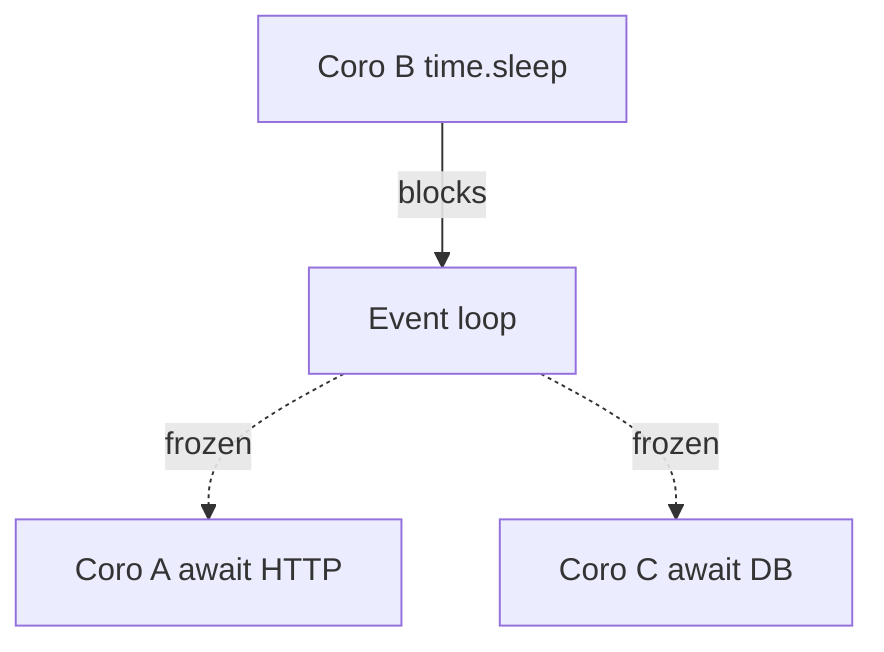

# 23. run_in_executor, to_thread and ProcessPoolExecutor

## Intro: "an async API, but one pandas call killed p99"

A FastAPI service handles **httpx** and **asyncpg** great, but in a handler it calls **`json.loads` on 50 MB** and **`PIL.Image.resize`** — the event loop freezes for **400 ms**, all other requests queue up. Async doesn't cancel out **CPU** and **sync I/O**: you need a bridge to a **thread** or **process** pool.

See [27-async-patterns](../fastapi/27-async-patterns.md) for the API context; this chapter is the mechanics of **executors**. The lab — [24-lab-mixed-workload](24-lab-mixed-workload.md).

## What you'll learn

- **`loop.run_in_executor`** and **`asyncio.to_thread`** (3.9+).
- When to use **ThreadPoolExecutor** vs **ProcessPoolExecutor**.
- GIL limitations and the pool size.
- How not to turn a thread pool into "1000 threads".

---

## The problem: blocking the loop

```python
import time

async def bad_handler():
    time.sleep(2)  # NEVER in async — blocks ALL coroutines
    return "ok"
```



---

## asyncio.to_thread (preferred for sync I/O)

```python
import asyncio

def sync_read_file(path: str) -> str:
    with open(path, encoding="utf-8") as f:
        return f.read()

async def main():
    content = await asyncio.to_thread(sync_read_file, "data.txt")
    print(len(content))
```

| API | When |
|-----|-------|
| `asyncio.to_thread(fn, *args)` | a sync function in the default thread pool |
| `loop.run_in_executor(executor, fn, *args)` | your own executor or ProcessPool |

**Default pool size:** `min(32, os.cpu_count() + 4)` — not infinite.

---

## run_in_executor with a ThreadPoolExecutor

```python
import asyncio
from concurrent.futures import ThreadPoolExecutor

def cpu_light_io(url: str) -> int:
    import urllib.request
    with urllib.request.urlopen(url, timeout=10) as r:
        return len(r.read())

async def fetch_sync_in_thread(url: str) -> int:
    loop = asyncio.get_running_loop()
    return await loop.run_in_executor(None, cpu_light_io, url)

async def main():
    size = await fetch_sync_in_thread("http://localhost:8095/health")
    print(size)
```

`None` = the default executor. For a legacy SDK without an async version — a reasonable compromise.

---

## ProcessPoolExecutor for CPU-bound

```python
import asyncio
from concurrent.futures import ProcessPoolExecutor

def heavy_hash(data: bytes) -> str:
    import hashlib
    h = hashlib.sha256()
    for i in range(100_000):
        h.update(data)
        h.update(str(i).encode())
    return h.hexdigest()

async def main():
    loop = asyncio.get_running_loop()
    with ProcessPoolExecutor(max_workers=2) as pool:
        digest = await loop.run_in_executor(pool, heavy_hash, b"seed")
    print(digest[:16])
```

| Thread pool | Process pool |
|-------------|--------------|
| shared memory, GIL | separate memory, no GIL on CPU |
| fast start | expensive fork/spawn |
| sync I/O, light CPU | numpy/pandas/crypto batch |

**Careful:** the function must be **picklable**; on Windows — `if __name__ == "__main__"`.

---

## Limiting executor parallelism

```python
import asyncio
from concurrent.futures import ThreadPoolExecutor

_executor = ThreadPoolExecutor(max_workers=4)
_semaphore = asyncio.Semaphore(4)

async def bounded_to_thread(fn, *args):
    async with _semaphore:
        return await asyncio.to_thread(fn, *args)
```

Relation to [32-backpressure-semaphores](32-backpressure-semaphores.md): a semaphore on the **number of concurrent** offload operations.

---

## Comparing the approaches

| Load | Solution |
|----------|---------|
| Legacy sync HTTP (`requests`) | `httpx.AsyncClient` is better than a thread |
| Sync DB driver | migrate to asyncpg, not a thread forever |
| PIL / pandas hot path | ProcessPool or a separate worker service |
| `open()` without aiofiles | `to_thread` for rare reads |
| 100 ms CPU per request | **not** asyncio alone — multiprocessing |

---

## Common mistakes

| Mistake | Why it's bad | The right way |
|--------|--------------|---------------|
| `to_thread` for every 1 KB parse | overhead > the win | inline in the loop |
| ProcessPool per call | spawn is more expensive than the work | reuse the pool |
| 500 threads via the executor | OOM, thrashing | cap + semaphore |
| Blocking code "hidden" in a library | a hidden freeze | profile the loop |
| CPU in a thread pool "for the GIL" | the GIL stays | ProcessPool |

---

## On the stand

Compare the freeze with the mock gateway:

```python
import asyncio
import time
import httpx

async def with_sleep():
    time.sleep(0.5)  # bad

async def with_to_thread():
    await asyncio.to_thread(time.sleep, 0.5)

async def benchmark():
    async with httpx.AsyncClient() as client:
        t0 = asyncio.get_event_loop().time()
        await asyncio.gather(
            client.get("http://localhost:8095/health"),
            with_to_thread(),
        )
        print("to_thread ok:", asyncio.get_event_loop().time() - t0)
```

`with_sleep` in a gather **serializes** the HTTP; `to_thread` — the HTTP and sleep are parallel.

---

## In production

- Limit the task **size** in the process pool (timeout, max input).
- **Metrics:** the executor queue depth, p99 with/without offload.
- Long-term: move CPU into **Celery/RQ** or a separate microservice ([26-when-not-async](26-when-not-async.md)).

---

## Summary

**asyncio.to_thread** and **run_in_executor** are a bridge for **blocking** sync code. Threads — for sync I/O and light CPU; processes — for heavy CPU. They don't replace the architectural choice of an async stack.

## Checklist

- Why is `time.sleep` in a coroutine more dangerous than `asyncio.sleep`?
- When is ProcessPool better than ThreadPool?
- What's the default max workers of the asyncio thread pool?
- Why a Semaphore on top of to_thread?

Next lesson: [24. Lab: mixed workload](24-lab-mixed-workload.md).
