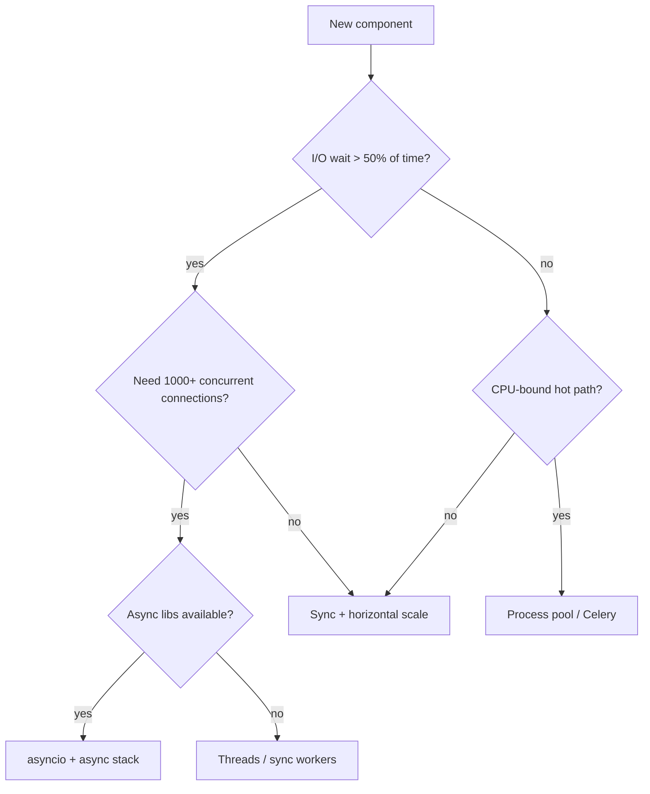
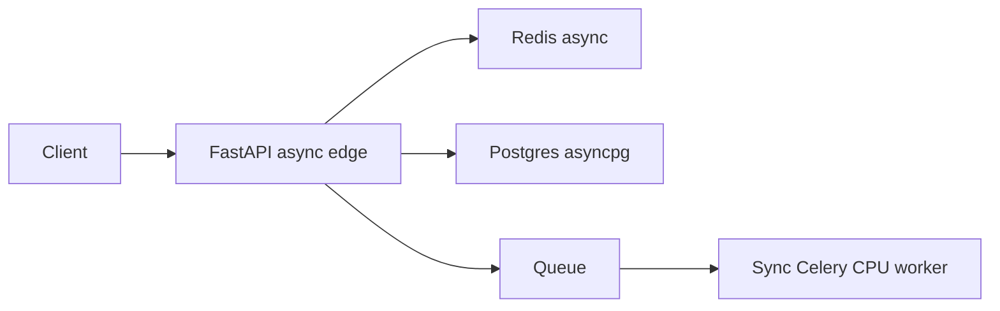

# 26. When NOT to use async

## Intro: “we rewrote everything to asyncio — the team is tired, no win”

After phases 4–5 you know executors, subprocess, DB, and Redis. The risk is **over-engineering**: an 80-line CLI, two HTTP calls per hour, a team with no async culture — asyncio adds **cognitive load** without a latency win. A mature engineer can say **“here sync + workers is enough”**.

Related: [01-sync-vs-async](01-sync-vs-async.md) (landscape), [31-fastapi-bridge](31-fastapi-bridge.md) (when async in an API is justified).

## What you'll learn

- Decision tree: asyncio vs threads vs processes vs sync.
- Signals that async is the **wrong** choice.
- How to live with **legacy sync** without “async everything”.
- Organizational and operational costs of async.

---

## Decision tree



---

## When sync is enough

| Scenario | Why sync is OK |
|----------|----------------|
| Nightly batch ETL | throughput, not latency; simplicity |
| Admin script, 5 SQL queries | one process, no concurrency |
| CRUD at 20 RPS, p99 < 100 ms | sync workers + connection pool |
| Jupyter / data exploration | interactive, not a production server |
| Team without async tests | learning cost > gain |

```python
# Honest sync — better than bad async
import httpx

def fetch_report(urls: list[str]) -> list[dict]:
    with httpx.Client(timeout=30.0) as client:
        return [client.get(u).json() for u in urls]
```

For **3 URLs**, sequential sync is **milliseconds** of overhead; asyncio will not pay for itself.

---

## When threads beat asyncio

| Situation | Threads |
|-----------|---------|
| Many **sync-only** SDKs (billing, legacy SOAP) | thread per request or pool |
| Blocking file I/O without aiofiles | thread pool is simpler |
| Gradual migration from Flask | WSGI + threads, not a big bang |
| Tiny CPU + sync I/O mix | not ideal, but pragmatic |

**GIL:** threads do **not** parallelize CPU, but they **release** the GIL on blocking I/O — like asyncio, but with higher RAM overhead.

---

## When processes / a queue

| Situation | Solution |
|-----------|----------|
| Image ML inference 2 s CPU | Celery worker, GPU pod |
| PDF generation farm | RQ / Kafka consumer |
| Crash isolation (untrusted code) | subprocess sandbox |
| Scale CPU linearly with cores | N sync workers on N cores |

An async API can **accept** a request and **enqueue** a job — the “async edge, sync core” pattern ([34-system-design-async](34-system-design-async.md)).

---

## Hidden costs of asyncio

| Cost | How it shows up |
|------|-----------------|
| Whole stack must be async | httpx, asyncpg, redis.asyncio — you can’t slip in one `requests` |
| Testing | pytest-asyncio, async fixtures ([27-pytest-asyncio](27-pytest-asyncio.md)) |
| Debugging | stack traces through await chains ([29-debug-profiling](29-debug-profiling.md)) |
| Junior onboarding | await poisoning, forgotten cancel |
| Ecosystem gaps | library without async → workarounds |

---

## Hybrid architectures (normal)



- **Edge** async — thousands of idle websocket / long poll.
- **Workers** sync — pandas, report, ffmpeg.
- Do **not** drag pandas into the uvicorn process.

---

## Red flags: “async for fashion”

1. No measurement: sequential vs concurrent baseline.
2. “All endpoints async”, but 95% of time is 2 ms ORM.
3. Blocking in `async def` “temporarily” for years.
4. One uvicorn worker on a 16-core CPU-only service.
5. Dropping sync tests “because async”.

---

## Common mistakes

| Mistake | Consequence | Alternative |
|---------|-------------|-------------|
| Async CLI with 1 user | complexity | Typer sync |
| asyncio for a CPU cluster | one core | multiprocessing |
| Ignoring sync FastAPI `def` endpoints | Starlette thread pool — OK for blocking | intentional `def` |
| Microservice async “everywhere” | 5 async stacks | async only at the I/O boundary |

---

## On the mock-exams stands

| Stand | Async? | Why |
|-------|--------|-----|
| deploy/python-async gateway | yes | fan-out I/O |
| deploy/postgres migrations | sync (Flyway) | one-shot |
| deploy/redis smoke script | sync redis-cli | CLI tool |

---

## Summary

**Async** is not moral superiority — it’s a **tool for concurrent I/O**. Sync, threads, and processes remain first-class. Choose by **load profile**, **ecosystem**, and **maintenance cost**.

## Checklist

- Name three cases to “keep sync”.
- When is a thread pool better than migrating to httpx?
- What is “async edge, sync core”?
- Which red flag from the list have you seen in projects?

Next lesson: [27. pytest-asyncio](27-pytest-asyncio.md).
