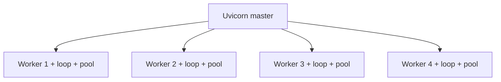

# 30. uvloop, uvicorn workers, and backpressure

## Intro: “one worker on 8 cores — CPU 12%, latency climbs”

Locally, asyncio on the **stdlib loop** works. In production under **10k RPS** the team sets **uvicorn --workers 4** and **uvloop** — and suddenly hits **Postgres pool exhaustion** and **OOM** on outbound HTTP. You need to know: **how many event loops** per process, how **uvloop** speeds up the loop, and where **backpressure** starts.

See [32-backpressure-semaphores](32-backpressure-semaphores.md), FastAPI deploy — [`deploy/fastapi`](../../deploy/fastapi/README.md).

## What you'll learn

- **uvloop** vs the default asyncio loop.
- **uvicorn workers** = processes, not threads.
- Sizing: workers × DB pool × Redis connections.
- Backpressure at the ASGI and application levels.

---

## uvloop

```bash
pip install uvloop
```

```python
import asyncio
import uvloop

asyncio.set_event_loop_policy(uvloop.EventLoopPolicy())

async def main():
    ...

asyncio.run(main())
```

Uvicorn:

```bash
uvicorn app.main:app --loop uvloop --host 0.0.0.0 --port 8090
```

| | stdlib loop | uvloop |
|---|-------------|--------|
| Implementation | Python + selectors | libuv (C) |
| I/O throughput | baseline | often +10–30% on pure I/O |
| Windows | yes | **no** (Linux/macOS) |
| Compatibility | 100% | rare edge cases with custom loops |

**Not a silver bullet:** blocking pandas still blocks.

---

## uvicorn workers

```bash
uvicorn app.main:app --workers 4 --loop uvloop
```



| Fact | Consequence |
|------|-------------|
| 1 worker = 1 process = 1 loop | coroutines are not shared across workers |
| 4 workers on 4 cores | CPU-bound work **inside** a worker is still 1 core |
| Each worker has its own DB pool | 4 × pool_size connections |
| Shared in-memory state | **no** without Redis — use Redis |

**Rough workers formula:** `(2 × CPU cores) + 1` for I/O — a starting point, not a law.

---

## Sizing connections

From [19-asyncpg-database](19-asyncpg-database.md):

```
workers × (pool_size + max_overflow) ≤ max_connections - 20
```

Example: 4 workers, `pool_size=5`, `max_overflow=5` → up to **40** PG connections.

Redis: one `redis.asyncio` client per worker — **4 TCP** to Redis, usually OK.

Outbound HTTP: without a limit, 4 workers × 100 concurrent = **400** sockets to upstream — you need a **Semaphore** ([32-backpressure-semaphores](32-backpressure-semaphores.md)).

---

## Backpressure (overview)

**Backpressure** — the system **refuses** to accept work faster than it can process.

| Level | Mechanism |
|-------|-----------|
| TCP | kernel buffers fill → slow read |
| ASGI server | max connections, timeouts |
| Application | Semaphore, Queue maxsize |
| Upstream | 429, retry-after |
| Client | httpx limits, timeout |

```python
# application: no more than 50 concurrent upstream calls
SEM = asyncio.Semaphore(50)

async def fetch_limited(client, url):
    async with SEM:
        return await client.get(url)
```

Without backpressure — memory spike (all responses in RAM), cascade failure upstream.

---

## Graceful shutdown in production

```bash
# Docker / k8s SIGTERM
uvicorn app.main:app --workers 4 --timeout-graceful-shutdown 30
```

- Stops accepting new connections.
- Waits for in-flight requests to finish (up to grace).
- **lifespan** closes pools ([08-lab-graceful-shutdown](08-lab-graceful-shutdown.md), [31-fastapi-bridge](31-fastapi-bridge.md)).

---

## On the mock-exams stands

```bash
cd deploy/fastapi
docker compose up -d
curl -s http://localhost:8090/health
```

Compare one worker vs several (if you change compose) — latency under `ab` or `hey` at 50 concurrent.

Gateway **8095** — one FastAPI process; for asyncio labs the stdlib loop is enough.

---

## Common mistakes

| Mistake | Effect | Fix |
|---------|--------|-----|
| 16 workers on 4 cores | context switch hell | ≤ 2× cores for I/O |
| In-memory rate limit | broken with N workers | Redis |
| uvloop on Windows dev | ImportError | stdlib on dev, uvloop in Linux CI |
| No graceful shutdown | cut-off DB transactions | lifespan + SIGTERM |
| No semaphore on fan-out | upstream 502 storm | limit concurrency |

---

## Production metrics

- **Request latency** p50/p95/p99 per endpoint.
- **Active connections** Postgres / Redis.
- **Event loop lag** (custom: schedule noop, measure delay).
- **Process RSS** per worker.
- **502/503 rate** upstream.

---

## Summary

**uvloop** speeds up the event loop on Linux; **workers** scale **processes**, not coroutines inside one. Count **connections × workers** and add **backpressure** before OOM. Production asyncio is sizing and observability, not just `async def`.

## Checklist

- How many event loops with `--workers 4`?
- Why does an in-memory cache break with multiple workers?
- Where does uvloop not work?
- What is backpressure at the application level?

Next lesson: [31. FastAPI bridge](31-fastapi-bridge.md).
