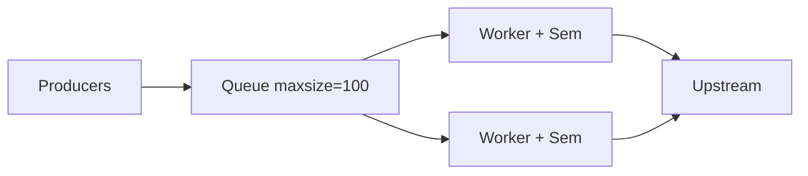

# 32. Backpressure and Semaphore at scale

## Intro: “1000 concurrent fetches — upstream dies, our API OOMs”

Without a limit, `asyncio.gather(*[fetch(u) for u in urls])` on 10,000 URLs opens **10,000** sockets and response buffers. Memory runs out before upstream returns 429. **Semaphore** is the simplest **in-process backpressure**; with Redis — across instances ([21-redis-asyncio](21-redis-asyncio.md)).

Lab — [35-lab-rate-limited-fetcher](35-lab-rate-limited-fetcher.md). Production theory — [30-uvloop-production](30-uvloop-production.md).

## What you'll learn

- **`asyncio.Semaphore`** and **`BoundedSemaphore`**.
- Patterns: worker pool, limited map, batching.
- Combining with **Queue** ([14-asyncio-queues](14-asyncio-queues.md)).
- Rate limit vs concurrency limit.

---

## Semaphore basics

```python
import asyncio

SEM = asyncio.Semaphore(10)  # no more than 10 at once

async def fetch(client, url: str) -> str:
    async with SEM:
        r = await client.get(url)
        r.raise_for_status()
        return r.text[:100]

async def fetch_many(client, urls: list[str]) -> list[str]:
    return await asyncio.gather(*[fetch(client, u) for u in urls])
```

| Parameter | Meaning |
|-----------|---------|
| `Semaphore(10)` | 10 slots; the 11th coroutine waits on `async with` |
| `BoundedSemaphore` | cannot release more than acquired (bug protection) |
| Value 0 | everyone waits; deadlock if nobody releases |

**Important:** a semaphore does **not cancel** already running tasks — it limits **entry** into the critical section.

---

## Explicit acquire / release

```python
async def fetch_explicit(sem: asyncio.Semaphore, client, url: str):
    await sem.acquire()
    try:
        return await client.get(url)
    finally:
        sem.release()
```

`async with` is preferred — release on **CancelledError**.

---

## Limited map (template)

```python
async def limited_map(
    sem: asyncio.Semaphore,
    client,
    urls: list[str],
    worker,
) -> list:
    async def one(url: str):
        async with sem:
            return await worker(client, url)

    return await asyncio.gather(*[one(u) for u in urls])
```

For **millions** of URLs — do not create a million tasks at once; batches of 500 + semaphore 50.

---

## Semaphore + Queue worker pool

See [15-lab-worker-pool](15-lab-worker-pool.md), [`examples/worker_pool.py`](examples/worker_pool.py):



`Queue(maxsize=N)` — backpressure when producers outpace consumers: `await queue.put` blocks.

---

## Concurrency vs rate

| | Concurrency limit | Rate limit |
|---|-------------------|------------|
| Limits | simultaneous in-flight | requests per second |
| Tool | Semaphore | token bucket (Redis) |
| Example | 20 parallel HTTP | 100 req/min per API key |
| Burst | up to N at once | smooths burst |

You can use **both**: `Semaphore(20)` + Redis rate 1000/min ([21-redis-asyncio](21-redis-asyncio.md)).

---

## Retry + semaphore

```python
async def fetch_retry(sem, client, url, attempts=3):
    async with sem:
        for i in range(attempts):
            try:
                r = await client.get(url)
                r.raise_for_status()
                return r
            except httpx.HTTPStatusError:
                if i == attempts - 1:
                    raise
                await asyncio.sleep(2 ** i * 0.1)
```

The semaphore is held for the **entire** retry — the slot is occupied longer. Alternative: semaphore only around a “successful slot attempt” — more complex, higher throughput.

---

## httpx Limits

```python
limits = httpx.Limits(max_connections=50, max_keepalive_connections=20)
async with httpx.AsyncClient(limits=limits) as client:
    ...
```

Duplicates part of the semaphore at the connection-pool level — use **both** deliberately.

---

## Common mistakes

| Mistake | Effect | Fix |
|---------|--------|-----|
| Semaphore(10000) | like no limit | size to upstream SLA |
| gather 1M tasks | OOM | chunk + semaphore |
| Forgot sem in retry loop | thundering herd | sem outside or inside consistently |
| Process-wide sem only | N workers = N×limit | Redis global limit |
| Deadlock: sem in sem | freeze | one locking level |

---

## On stand 8095

```python
import asyncio
import httpx

SEM = asyncio.Semaphore(3)
BASE = "http://localhost:8095"

async def timed_fetch(client, i: int):
    async with SEM:
        t0 = asyncio.get_event_loop().time()
        await client.get(f"{BASE}/slow?extra_ms={i * 30}")
        return asyncio.get_event_loop().time() - t0

async def main():
    async with httpx.AsyncClient(timeout=30.0) as client:
        times = await asyncio.gather(*[timed_fetch(client, i) for i in range(9)])
    print("max batch of 3:", max(times))

asyncio.run(main())
```

9 requests with sem=3 — ~3 “waves” by max slow delay.

---

## In production

- Emit a **metric**: `sem_available`, queue depth.
- **Adaptive** concurrency (AIMD) — advanced ([34-system-design-async](34-system-design-async.md)).
- Document the **limit** in the on-call runbook.

---

## Summary

**Semaphore** is the minimal backpressure in asyncio. Combine with **Queue maxsize**, **httpx Limits**, **Redis rate limit** for multi-instance. Lab 35 locks it in on real URLs.

## Checklist

- How does Semaphore differ from Lock?
- Why are 10,000 tasks worse than 10,000 URLs with sem=50?
- Where should the semaphore sit during retry?
- How does the limit scale across 4 uvicorn workers?

Next lesson: [33. Interview Q&A](33-interview-qa.md).
