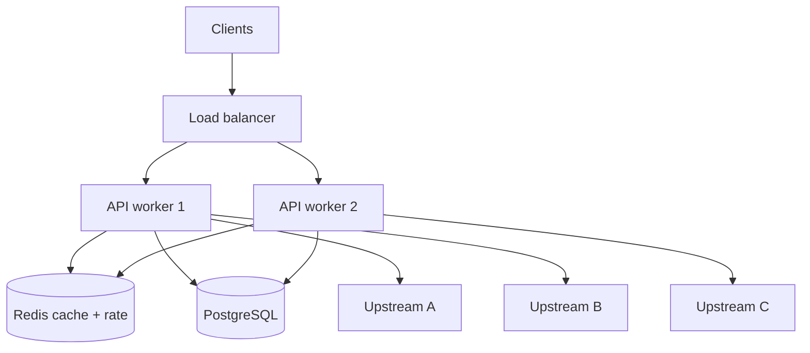

# 34. System design: async microservices

## Intro: “design a price aggregator with 50 APIs”

On a system design interview you get **fan-out**, **SLA**, **failure modes**. Async Python is a good fit for an **I/O-bound edge** if you understand **limits**, **idempotency**, and **observability**. This chapter is a framework without tying to one library; implementation — [36-capstone](36-capstone.md).

Related: [32-backpressure-semaphores](32-backpressure-semaphores.md), [33-interview-qa](33-interview-qa.md), stands [`deploy/python-async`](../../deploy/python-async/README.md), [`deploy/postgres`](../../deploy/postgres/README.md), [`deploy/redis`](../../deploy/redis/README.md).

## What you'll learn

- **edge / orchestrator / worker** layers.
- **Fan-out**, **timeout**, **partial failure**.
- **Circuit breaker** and **bulkhead** (overview).
- Metrics and SLO for an async pipeline.

---

## Reference architecture



| Layer | Role | Async? |
|-------|------|--------|
| Edge API | auth, validate, aggregate | yes (I/O) |
| Cache | hot reads, rate counters | redis.asyncio |
| DB | source of truth, audit | asyncpg |
| CPU workers | PDF/ML | sync queue |

---

## Fan-out with limits

```python
SEM = asyncio.Semaphore(30)
TIMEOUT = 5.0

async def call_one(client, url: str) -> dict | None:
    async with SEM:
        try:
            async with asyncio.timeout(TIMEOUT):
                r = await client.get(url)
                r.raise_for_status()
                return r.json()
        except (TimeoutError, httpx.HTTPError):
            return None

async def aggregate(urls: list[str]) -> list[dict]:
    async with httpx.AsyncClient() as client:
        results = await asyncio.gather(*[call_one(client, u) for u in urls])
    return [r for r in results if r is not None]
```

| Decision | Why |
|----------|-----|
| Semaphore | don’t kill upstream and RAM |
| Per-call timeout | don’t wait on one slow call |
| `None` on error | partial success beats total fail |
| gather | concurrent I/O |

For 10k URLs — **chunk** URLs by 200, not one gather for all.

---

## Circuit breaker (overview)

States: **Closed** (normal) → **Open** (fail fast) → **Half-open** (probe).

| Parameter | Example |
|-----------|---------|
| Failure threshold | 5 errors in 10 s |
| Open duration | 30 s |
| Half-open probes | 1 request |

```python
class SimpleBreaker:
    def __init__(self, threshold: int = 5):
        self.failures = 0
        self.threshold = threshold
        self.open_until = 0.0

    def allow(self) -> bool:
        return time.monotonic() >= self.open_until

    def record_success(self):
        self.failures = 0

    def record_failure(self):
        self.failures += 1
        if self.failures >= self.threshold:
            self.open_until = time.monotonic() + 30
```

Production: a library + metrics on state transitions. Breaker **per upstream**, not one global.

---

## Bulkhead

Isolate pools: a separate semaphore for **payments** vs **catalog** — failure in one domain does not consume all slots.

---

## Idempotency and retries

- **Retry** only on idempotent GET or with an **idempotency-key** on POST.
- Exponential backoff + jitter.
- Semaphore held for the whole retry — less thundering herd, but lower throughput.

---

## Data consistency

| Pattern | Consistency |
|---------|-------------|
| Cache-aside | eventual |
| Write-through | stronger, slower |
| Saga / outbox | distributed transactions |

Async does not change CAP — only **how fast** you call nodes.

---

## Multi-instance concerns

| Problem | Solution |
|---------|----------|
| In-memory semaphore | only 1 worker; Redis rate limit |
| Sticky sessions | usually not needed for a stateless API |
| Connection storms | pool limits, pgbouncer |
| Thundering herd on cache miss | singleflight / lock ([22-lab-redis-async](22-lab-redis-async.md)) |

---

## Observability

- **RED**: Rate, Errors, Duration per endpoint.
- **Traces**: span per downstream call (OpenTelemetry).
- **Logs**: correlation_id through fan-out.
- Stand: [`deploy/observability`](../../deploy/observability/README.md).

Alerts: p99 > SLO, breaker open > 1 min, pool wait time ↑.

---

## Failure scenarios (design review checklist)

1. One upstream 10 s slow — timeout + partial response.
2. All upstream 503 — 503 with retry-after or degraded mode.
3. Redis down — fallback DB, higher latency OK.
4. PG pool exhausted — 503, not hang.
5. Deploy SIGTERM — drain in-flight 30 s.

---

## On the mock-exams stands

Prototype on **8095**:

```bash
curl http://localhost:8095/aggregate-parallel
```

Compare with your semaphore-fetcher from [35-lab-rate-limited-fetcher](35-lab-rate-limited-fetcher.md). Add Postgres audit from [20-lab-async-database](20-lab-async-database.md).

---

## Summary

Async microservice design = **fan-out with limits** + **timeouts** + **partial failure** + **shared state in Redis/DB** + **metrics**. Circuit breaker and bulkhead protect upstream and neighboring domains. Implement end-to-end in the capstone.

## Checklist

- Draw fan-out with 3 upstreams and mark the limits.
- What does the API return when 2/5 upstreams succeed?
- Where do you store rate limit for 4 uvicorn workers?
- When is a queue better than async fan-out in the API process?

Next lesson: [35. Lab: rate-limited fetcher](35-lab-rate-limited-fetcher.md).
