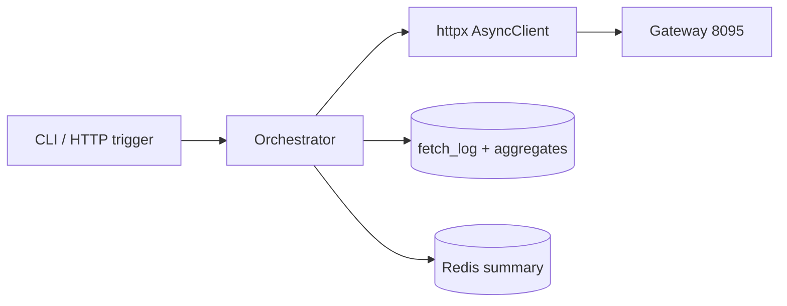

# 36. Capstone: async pipeline aggregator

## Brief

**4–6 hours.** Build an aggregator service that:

1. Accepts a list of **source paths** (or a preset).
2. **Fetches in parallel** via httpx with **semaphore + retry + timeout**.
3. **Parses** JSON (and computes simple metrics).
4. **Stores** an audit trail in **PostgreSQL** (asyncpg/SQLAlchemy).
5. Caches a summary in **Redis** with TTL.
6. Exports **metrics** (stdout or `/metrics` text).
7. Shuts down **cleanly** (close clients, dispose engine).

Stands: [`deploy/python-async`](../../deploy/python-async/README.md) (**8095**), [`deploy/postgres`](../../deploy/postgres/README.md), [`deploy/redis`](../../deploy/redis/README.md). Optionally package like [`deploy/fastapi`](../../deploy/fastapi/README.md).

---

## Architecture



| Module | Responsibility |
|--------|----------------|
| `config.py` | URLs, limits, DSN |
| `fetcher.py` | semaphore, retry ([35-lab-rate-limited-fetcher](35-lab-rate-limited-fetcher.md)) |
| `parser.py` | extract items count, delay_ms |
| `store.py` | async insert batch ([20-lab-async-database](20-lab-async-database.md)) |
| `cache.py` | cache-aside summary ([22-lab-redis-async](22-lab-redis-async.md)) |
| `main.py` | lifespan, orchestration, metrics |

---

## Phase 1. Skeleton (45 min)

```bash
mkdir -p capstone/aggregator
cd capstone/aggregator
python -m venv .venv
pip install httpx sqlalchemy asyncpg redis pytest pytest-asyncio
```

`main.py`:

```python
import asyncio
import signal
from contextlib import asynccontextmanager

from aggregator.config import Settings
from aggregator.pipeline import run_pipeline

shutdown = asyncio.Event()

@asynccontextmanager
async def app_lifespan(settings: Settings):
    # init engine, redis, httpx — yield — cleanup
    yield
    # await engine.dispose(), redis.aclose(), client.aclose()

async def main():
    settings = Settings()
    async with app_lifespan(settings):
        worker = asyncio.create_task(run_pipeline(settings, shutdown), name="pipeline")
        await shutdown.wait()
        worker.cancel()
        await asyncio.gather(worker, return_exceptions=True)

def on_signal():
    shutdown.set()

if __name__ == "__main__":
    loop = asyncio.new_event_loop()
    for sig in (signal.SIGINT, signal.SIGTERM):
        try:
            loop.add_signal_handler(sig, on_signal)
        except NotImplementedError:
            pass
    loop.run_until_complete(main())
```

Windows: Enter-to-shutdown as in [08-lab-graceful-shutdown](08-lab-graceful-shutdown.md).

---

## Phase 2. Fetch + parse (60 min)

Reuse [`examples/fetch_parallel.py`](examples/fetch_parallel.py) and lab **35**.

```python
@dataclass
class ParsedRecord:
    url: str
    status: int
    latency_ms: float
    item_count: int | None
    delay_ms: int | None

def parse_json_payload(data: dict) -> tuple[int | None, int | None]:
    items = data.get("items")
    delay = data.get("delay_ms")
    return (len(items) if isinstance(items, list) else None, delay)
```

**Criterion:** 15+ paths in one run, ok rate > 80% with `fail?rate=0.3`.

---

## Phase 3. Store + cache (60 min)

Tables:

```sql
-- fetch_log already exists; add
CREATE TABLE IF NOT EXISTS run_summary (
    id SERIAL PRIMARY KEY,
    run_id UUID NOT NULL,
    total INT,
    ok INT,
    fail INT,
    avg_latency_ms REAL,
    created_at TIMESTAMPTZ DEFAULT NOW()
);
```

After a run:

- INSERT batch into `fetch_log`.
- INSERT one `run_summary` row.
- `SETEX aggregator:last_summary` in Redis.

---

## Phase 4. Metrics (30 min)

```python
def emit_metrics(run_id: str, ok: int, fail: int, elapsed: float) -> None:
    print(f"METRIC run_id={run_id} ok={ok} fail={fail} elapsed_s={elapsed:.2f}")
```

Optional: Prometheus client `aggregator_ok_total`, `aggregator_latency_seconds`.

---

## Phase 5. Tests (45 min)

Minimum from [28-lab-testing-async](28-lab-testing-async.md):

- unit: `parse_json_payload`, retry with AsyncMock
- unit: cache hit skips DB
- integration (`RUN_INTEGRATION=1`): one fetch to `/health`

```bash
pytest tests/ -v
RUN_INTEGRATION=1 pytest tests/test_integration.py -v
```

---

## Phase 6. Hardening (60 min)

| Task | Link |
|------|------|
| Semaphore sizing | [32-backpressure-semaphores](32-backpressure-semaphores.md) |
| Debug slow path | [29-debug-profiling](29-debug-profiling.md) |
| Breaker on `/fail` | [34-system-design-async](34-system-design-async.md) |
| CLI args: `--concurrency`, `--paths-file` | argparse |

Optional: HTTP trigger via FastAPI ([31-fastapi-bridge](31-fastapi-bridge.md)) — `POST /aggregate` starts the pipeline in `BackgroundTasks` (know the limits).

---

## Capstone success criteria

- [ ] Parallel fetch with a concurrency limit
- [ ] Retry + timeout on unstable paths
- [ ] Postgres: fetch_log + run_summary
- [ ] Redis: cached last summary with TTL
- [ ] Graceful shutdown without leaked connections
- [ ] ≥ 5 unit tests, ≥ 1 integration
- [ ] README in `capstone/` with run commands *(local, not course root)*
- [ ] Wall-clock clearly below sequential (measure both modes)

---

## Bring up the stands

```bash
cd deploy/python-async && docker compose up -d
cd deploy/postgres && docker compose up -d
cd deploy/redis && docker compose up -d
```

Smoke:

```bash
curl -s http://localhost:8095/health
docker exec mock-postgres psql -U course -d course -c "SELECT 1"
redis-cli -h localhost -p 6379 ping
```

---

## Rubric (self-assessment)

| Level | Signs |
|-------|-------|
| Pass | fetch + store, no cache/tests |
| Good | + Redis + tests + shutdown |
| Excellent | + metrics + breaker + docs + sequential vs parallel benchmark |
| Staff-ish | + idempotent rerun, run_id dedup, OTEL spans |

---

## What to submit

1. Repo/folder `capstone/aggregator`.
2. Screenshot or log of one successful run with metrics.
3. `pytest` output.
4. A paragraph: “what I’d improve in production” (workers, queue, OTEL).

---

## Next

- Deploy as a service in [`deploy/fastapi`](../../deploy/fastapi/README.md).
- Work through [interview-cheatsheet](interview-cheatsheet.md) and [33-interview-qa](33-interview-qa.md).
- Compare with [27-async-patterns](../fastapi/27-async-patterns.md) in a real API.

Congratulations — you’ve finished the **python-async** course (lessons 19–36). Back to phase 1: [01-sync-vs-async](01-sync-vs-async.md).
