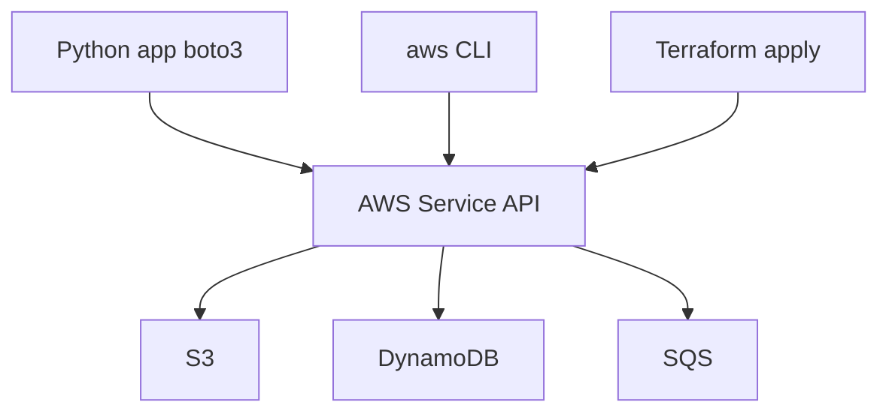

# 01. SDK landscape: boto3 vs CLI vs Terraform

## Intro: "the script works on my machine, in CI it fails with AccessDenied"

A developer wrote `aws s3 cp` in a bash deploy script. Locally it's fine (profile `dev`). In GitLab CI — **AccessDenied**. A colleague suggests boto3, DevOps suggests Terraform, security suggests IAM roles. What should you choose, and **where is the boundary of responsibility**?

A Python backend in mock-exams most often talks to AWS through **boto3** — the official SDK. But the SDK is only one layer in the ecosystem. This chapter is a map, before you write your first `client("s3")`.

## What you'll learn

- Three ways to "talk to AWS": **SDK**, **CLI**, **IaC**.
- When boto3 belongs in application code, and when Terraform belongs in the pipeline.
- How this connects to the [`deploy/python-aws`](../../deploy/python-aws/README.md) environment and the `shop_aws` package.

---

## Three interfaces to one API

| Interface | Language / format | Typical use |
|-----------|---------------|------------------------|
| **boto3** | Python | runtime: upload, query DB, send SQS |
| **AWS CLI** | shell | ops, debug, one-off scripts |
| **Terraform / CDK** | HCL / Python | create bucket, IAM, VPC — **infrastructure** |

All three call the **same AWS HTTP APIs** (REST/JSON). The difference is **who**, **when**, and **with which credentials**.



---

## boto3: when and why

**boto3** is a thin wrapper over **botocore** (HTTP client + serializers).

| Scenario | boto3? |
|----------|--------|
| Upload a file from a FastAPI endpoint | ✅ |
| CRUD an item in DynamoDB from a worker | ✅ |
| Create a VPC and 12 subnets | ❌ → Terraform |
| One-off debug "is the object in the bucket" | CLI is faster |
| Lambda handler reads an S3 event | ✅ |

The course's reference stack: [`shop_aws/clients.py`](../../deploy/python-aws/stack/shop_aws/clients.py), [`S3Service`](../../deploy/python-aws/stack/shop_aws/s3_service.py), [`DynamoDBRepository`](../../deploy/python-aws/stack/shop_aws/dynamodb_repo.py).

---

## AWS CLI vs boto3

```bash
# CLI — debugging, CI one-liner
aws s3 ls s3://shop-uploads/ --endpoint-url http://localhost:4566

# boto3 — the same in Python, typeable, testable
from shop_aws.clients import client
client("s3").list_objects_v2(Bucket="shop-uploads")
```

| Criterion | CLI | boto3 |
|----------|-----|-------|
| Unit tests | hard | moto / LocalStack |
| Embed in an app | subprocess hack | native |
| Credential chain | `~/.aws/credentials` | same + env vars |
| Tab completion | yes | IDE autocomplete |

**Rule:** application logic → **boto3**; ops / smoke → **CLI or lab_cli**.

---

## Terraform: a different layer

Terraform **creates resources** (bucket, table, queue, IAM policy). boto3 **uses** ones that already exist.

```text
Terraform apply  →  bucket "shop-uploads" exists
FastAPI + boto3  →  put_object into shop-uploads
```

In the local environment, bootstrap is done in Python ([`bootstrap_localstack.py`](../../deploy/python-aws/stack/scripts/bootstrap_localstack.py)) — for labs it's simpler than Terraform. In production, Terraform/CDK creates the resources and the application just reads the names from env (`SHOP_BUCKET`).

See also [`aws-terraform`](../aws-terraform/README.md).

---

## LocalStack vs real AWS

| | LocalStack `:4566` | AWS cloud |
|--|-------------------|-----------|
| Endpoint | `AWS_ENDPOINT_URL` | default (regional) |
| Credentials | `test` / `test` | IAM role / keys |
| Billing | free local | pay per request |
| Parity | ~90% for S3/DDB/SQS | 100% |

The course uses **LocalStack 3.8** — the same boto3 calls work in the cloud with `endpoint_url=None`.

---

## The Python + AWS ecosystem

| Component | Role |
|-----------|------|
| **boto3** | high-level SDK |
| **botocore** | HTTP, retries, paginators |
| **aioboto3** | async wrapper (separate course) |
| **moto** | mock in pytest without Docker |
| **LocalStack** | full emulator in Docker |

Environment tests: [`test_s3_moto.py`](../../deploy/python-aws/stack/tests/test_s3_moto.py).

---

## Interview questions

- How does boto3 differ from the AWS CLI at the architecture level?
- Why is a bucket not created from a request handler?
- How does LocalStack change the endpoint configuration?

---

## Common mistakes

| Mistake | Consequence |
|--------|-------------|
| Creating a bucket from a request handler | race, no IaC, drift |
| Hardcoding `us-east-1` without env | wrong region in staging |
| CLI in a production cron without idempotency | fragile parsing |
| Mixing Terraform state and runtime config | secrets in code |

## Summary

**boto3** — for runtime Python. **CLI** — debug and ops. **Terraform** — provision infrastructure. All three are clients of one API. Course environment: LocalStack + `shop_aws` services.

Next: [02-session-client-resource](02-session-client-resource.md).
