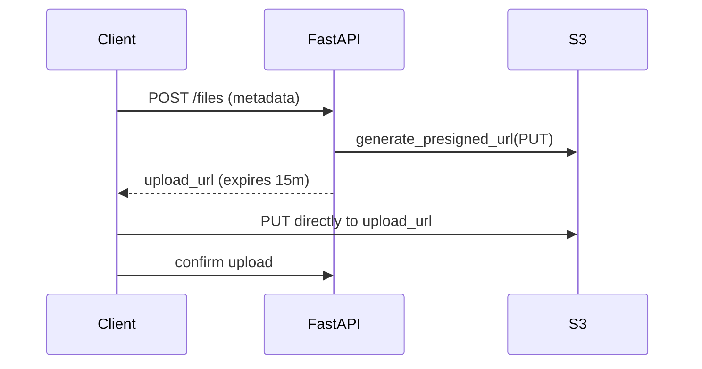

# 09. S3 advanced: presigned URLs, multipart overview

## Intro: "serving files through the API — expensive and slow"

FastAPI proxies every download: the app reads from S3 → streams to the client. **Double bandwidth**, latency, load on the pods. The better way: a **presigned URL** — the client downloads directly from S3 with a temporary signature.

For files **> 5 GB** — **multipart upload**. In labs an overview is enough; in production it's mandatory.

## What you'll learn

- Generate a presigned URL for GET and PUT.
- TTL, security, LocalStack quirks.
- The multipart upload API surface.

---

## Presigned URL — the idea



boto3 signs the request with **your backend's** credentials — the client never sees the AWS keys.

---

## generate_presigned_url (GET)

```python
url = s3.generate_presigned_url(
    ClientMethod="get_object",
    Params={"Bucket": "shop-uploads", "Key": "reports/q1.pdf"},
    ExpiresIn=3600,
)
```

| Param | Note |
|-------|------|
| `ExpiresIn` | max 7 days (SigV4) |
| `ResponseContentDisposition` | force download filename |

---

## Presigned PUT (browser upload)

```python
url = s3.generate_presigned_url(
    ClientMethod="put_object",
    Params={
        "Bucket": "shop-uploads",
        "Key": f"uploads/{user_id}/{file_id}",
        "ContentType": "image/jpeg",
    },
    ExpiresIn=900,
)
```

Frontend: `fetch(url, { method: 'PUT', body: file })`. The **Content-Type** in Params must match the request — otherwise a signature mismatch.

---

## generate_presigned_post (form upload)

```python
resp = s3.generate_presigned_post(
    Bucket="shop-uploads",
    Key="uploads/${filename}",
    Fields={"Content-Type": "image/png"},
    Conditions=[["content-length-range", 0, 10485760]],
    ExpiresIn=600,
)
```

Restricts size and content-type **on the policy side**.

---

## Security checklist

| Rule | Why |
|------|-----|
| Short TTL (5–15 min) | a leaked URL expires |
| Key includes a random UUID | not guessable |
| Restrict Content-Type | no executable upload |
| HTTPS only | no MITM |
| Don't presign ListBucket | enumeration risk |

A presigned URL ≠ authorization — the backend **decides** who gets a URL.

---

## Multipart upload (overview)

```text
create_multipart_upload → upload_part (×N) → complete_multipart_upload
```

| API | Role |
|-----|------|
| `create_multipart_upload` | start, get UploadId |
| `upload_part` | chunk + PartNumber |
| `complete_multipart_upload` | assemble |
| `abort_multipart_upload` | cleanup on failure |

High-level: `transfer.upload_file` — boto3 splits automatically. LocalStack supports multipart with limitations.

---

## LocalStack presigned

The endpoint in the URL must be **reachable by the client**: a browser on the host → `http://localhost:4566`. When generating, you can pass `Config(s3={'addressing_style': 'path'})` for path-style URLs.

---

## Common mistakes

| Mistake | Symptom |
|--------|---------|
| Clock skew | SignatureDoesNotMatch |
| Wrong Content-Type on PUT | 403 |
| Expired URL | AccessDenied |
| Proxying through the app without need | cost + latency |

## Summary

**Presigned URLs** offload traffic to S3. GET — download; PUT/POST — direct upload. **Multipart** — files > 5 GB. The backend controls **who** and **where**, it doesn't proxy the bytes.

Next: [10-lab-presigned-url](10-lab-presigned-url.md).
