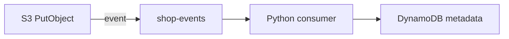

# 11. S3 event notifications: concept

## Intro: "the file is uploaded — who triggers the processing?"

A user upload to S3 has finished. You need: a virus scan, a thumbnail, writing metadata to DynamoDB. Polling the bucket every 5 seconds is **expensive and slow**. **S3 Event Notifications** push an event to Lambda, SQS, or SNS.

In the course stack: [`process_s3_upload`](../../deploy/python-aws/stack/shop_aws/lambda_handlers/handlers.py) — the Lambda handler pattern.

## What you'll learn

- Event types (`s3:ObjectCreated:*`).
- Destinations: Lambda, SQS, SNS, EventBridge.
- Event payload structure and idempotency.

---

## Push vs poll

| Poll `list_objects` | Event notification |
|---------------------|-------------------|
| latency seconds–minutes | near real-time |
| cost per list request | cost per event |
| complex dedup | at-least-once delivery |

Production: **events**; batch analytics: poll + manifest ok.

---

## Notification configuration

```text
Bucket shop-uploads
  Event: s3:ObjectCreated:Put
  Filter prefix: uploads/
  Filter suffix: .jpg
  Destination: Lambda process_s3_upload
```

Terraform (conceptual):

```hcl
resource "aws_s3_bucket_notification" "uploads" {
  bucket = aws_s3_bucket.uploads.id
  lambda_function {
    lambda_function_arn = aws_lambda_function.processor.arn
    events              = ["s3:ObjectCreated:*"]
    filter_prefix       = "uploads/"
  }
}
```

---

## Event payload

Lambda receives:

```json
{
  "Records": [{
    "eventName": "ObjectCreated:Put",
    "s3": {
      "bucket": {"name": "shop-uploads"},
      "object": {"key": "uploads/photo.jpg", "size": 1024}
    }
  }]
}
```

Handler in the stack:

```python
def process_s3_upload(event, context):
    for record in event.get("Records", []):
        key = urllib.parse.unquote_plus(record["s3"]["object"]["key"])
        body_preview = s3.get_bytes(key)[:32]
        table.put_item(pk=f"file:{key}", data={...})
```

| Field | Note |
|-------|------|
| `key` | URL-encoded — **unquote_plus** |
| `size` | from event, verify if critical |
| multiple Records | batch in one invocation |

---

## Destinations comparison

| Target | When |
|--------|------|
| **Lambda** | sync processing < 15 min |
| **SQS** | buffer, retry, scale consumers |
| **SNS** | fan-out to multiple subscribers |
| **EventBridge** | routing rules, cross-account |

[`SQSService`](../../deploy/python-aws/stack/shop_aws/sqs_service.py) — the foundation for the S3 → SQS → worker pattern.

---

## Delivery semantics

- **At-least-once** — duplicate events are possible.
- The handler must be **idempotent** (`pk=file:{key}` upsert ok).
- Lambda fails → retry (async) or DLQ.



---

## Filter rules

| Filter | Use |
|--------|-----|
| `prefix` | tenant folder |
| `suffix` | `.pdf` only |
| Event type | `ObjectRemoved` for cleanup |

Without a filter — **every** object triggers → cost.

---

## Common mistakes

| Mistake | Symptom |
|--------|---------|
| Forgot to unquote the key | wrong object path |
| Non-idempotent handler | duplicate DDB rows |
| Lambda in the same VPC without an S3 gateway | timeout |
| Recursive loop (Lambda writes to the same bucket unfiltered) | infinite triggers |

## Summary

S3 **pushes events** to Lambda/SQS/SNS. The payload — `Records[]` with bucket/key. **Decode the key**, design **idempotent** handlers. Stack: `process_s3_upload` → DynamoDB metadata.

Next: [12-lab-s3-metadata](12-lab-s3-metadata.md).
