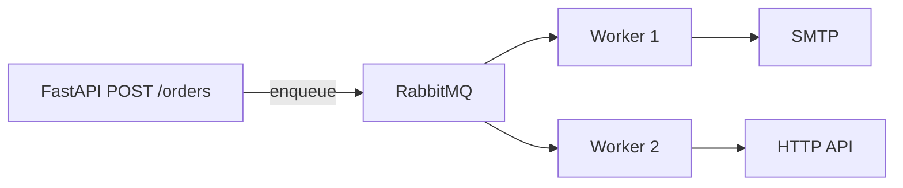

# 01. Task queues: Celery vs SQS vs raw AMQP

## Intro: "send an email after checkout — without blocking the request"

The user hit **Pay**. Now you need to: charge the payment, create the order, **send an email**, update analytics, sync the warehouse. If all of this happens inside one HTTP request, you get 5-15 second latency, nginx timeouts, angry users.

**The fix:** move the slow, non-critical work into a **background queue**. A worker picks up the task whenever it can. The HTTP response — "order accepted" — comes back in 200 ms.

Celery is the **de facto standard** for Python + RabbitMQ/Redis. But it's not the only tool.

## What you'll learn

- When you actually need a **task queue**, versus when cron or Kafka is enough.
- Celery vs **AWS SQS** vs a **raw RabbitMQ consumer**.
- Where Celery fits in the mock-exams stack (FastAPI, Django, DevOps).

---

## Sync vs async processing

| Approach | Pros | Cons |
|--------|-------|--------|
| **Sync in the request** | simple | latency, cascade failures |
| **Thread pool in-process** | quick to add | lost on restart, no retry across nodes |
| **External queue + workers** | scale, retry, isolation | infrastructure, eventual consistency |

---

## Celery vs alternatives

| Tool | Model | Best for |
|------|-------|----------|
| **Celery** | task queue, Python-native | email, reports, ETL chunks, Django/FastAPI |
| **AWS SQS** | managed queue | cloud-native, Lambda consumers |
| **RabbitMQ (raw pika)** | AMQP | full control, non-Python consumers |
| **Kafka** | distributed log | event streaming, replay, many consumers |
| **cron / Beat only** | schedule | periodic cleanup, no event trigger |
| **asyncio background** | in-process | lightweight, no durability |

[`messaging-deep`](../messaging-deep/README.md) — when to pick a queue vs a log.

---

## Celery building blocks (preview)

| Component | Role |
|-----------|------|
| **Producer** | your API calls `task.delay()` |
| **Broker** | RabbitMQ / Redis — stores messages |
| **Worker** | the `celery worker` process — executes the task |
| **Result backend** | Redis / DB — stores the return value (optional) |
| **Beat** | scheduler for periodic tasks |

Details: [02-celery-architecture](02-celery-architecture.md).

---

## When NOT to use Celery

- **Hard real-time** (< 100 ms SLA) — a queue adds latency.
- **Exactly-once end-to-end** without extra design — Celery gives **at-least-once** delivery.
- **Heavy streaming analytics** — Kafka is a better fit.
- **One cron job a day** — a systemd timer is simpler.

---

## Python ecosystem map

| Stack | Integration |
|-------|-------------|
| Django | `django-celery-results`, `@shared_task` |
| FastAPI | trigger `delay()` from an endpoint |
| Flask | same pattern |
| Serverless | SQS + Lambda instead of Celery workers |

---

## Course stand

[`deploy/celery`](../../deploy/celery/README.md):

- API **8093** — trigger tasks
- RabbitMQ **5673** / UI **15673**
- Redis — results
- Flower **5555** — monitoring

---

## Common mistakes

| Mistake | Consequence |
|--------|-------------|
| Queue for CPU-heavy work without scaling | workers pegged |
| No idempotency | duplicate charges on retry |
| Broker = result backend confusion | lost results or wrong config |

## Summary

Celery is a **distributed task queue** for Python. The broker decouples the API from the workers. At-least-once delivery means you need to design for **idempotency**. Don't confuse it with a Kafka event log.

Next: [02-celery-architecture](02-celery-architecture.md).
