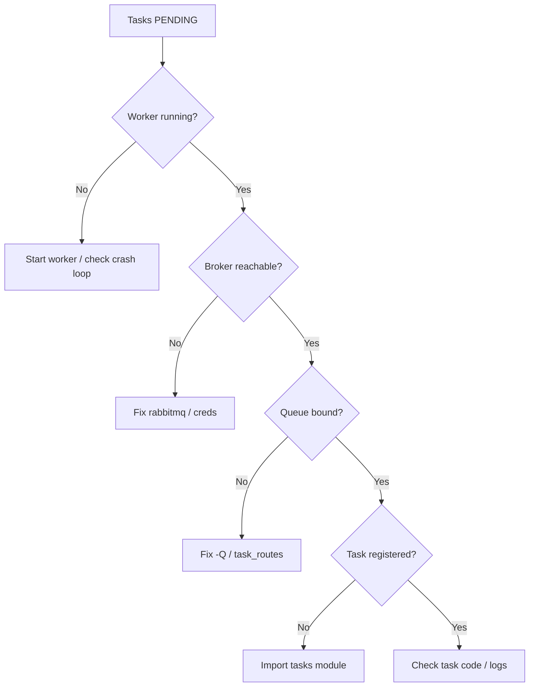

# 33. Troubleshooting production

## Intro

3 AM — "orders not processing". A runbook without panic.

## What you'll learn

- Symptom → cause matrix.
- Poison messages.
- Memory leaks, worker restarts.

---

## Diagnostic flow



---

## Common symptoms

| Symptom | Likely cause |
|---------|--------------|
| Always PENDING | no worker, wrong queue |
| Immediate FAILURE | bad args, import error |
| Stuck STARTED | hung external call, no time limit |
| Duplicate processing | acks_late + no idempotency |
| Beat tasks doubled | multiple beat |
| Redis OOM | result_expires missing |
| Worker memory grow | result stored huge blob |

---

## inspect checklist

```bash
celery -A shop.celery_app inspect ping
celery -A shop.celery_app inspect active_queues
celery -A shop.celery_app inspect registered
rabbitmqctl list_queues name messages consumers messages_unacknowledged
```

---

## Poison pill

Task always fails → infinite retry. Fix:

1. `Reject(requeue=False)`
2. max_retries cap
3. DLQ + manual inspect

---

## Worker recycle

```bash
celery worker --max-tasks-per-child=1000
```

Mitigate memory leaks in C extensions.

---

## Clock skew

Beat + crontab — NTP on all nodes. Skew → schedules drift.

---

## Deploy checklist

- [ ] One beat
- [ ] Workers `-Q` match routes
- [ ] Migrations before workers (Django)
- [ ] Broker HA
- [ ] Idempotent tasks
- [ ] Flower not public

---

## Common mistakes

| Mistake | Impact |
|---------|--------|
| Deploy new task before workers | NotRegistered |
| Rolling deploy kills all workers | brief backlog spike — OK |
| Shared dev broker in prod | crosstalk disaster |

## Summary

PENDING → worker → broker → queue binding → registered. Cap retries. DLQ poison pills. max-tasks-per-child for leaks.

Next: [34-security](34-security.md).
