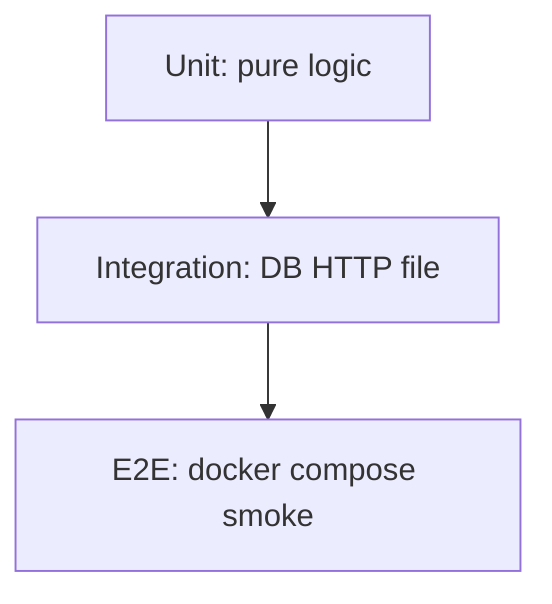

# 01. Testing landscape: pyramid, confidence, TDD

## Intro: "100% coverage — and a bug in prod"

The release passed a "green" pipeline: **847 unit tests**, coverage **98%**. An hour later there's an incident in prod: checkout fails against **real** PostgreSQL, because the tests mocked the DB and only checked the happy path of a mock object. Coverage measured **lines**, not **behavior**.

Testing is not a checkbox in Jira, but a **contract with your future self**: "I can change the code and learn within minutes what broke." This chapter sets up the **mental model** for the whole course: what to test, at what level, and why.

## What you'll learn

- The **unit / integration / e2e** pyramid and typical proportions.
- The difference between **confidence** and **coverage** (a metric).
- When to use **TDD**, when **test-after** — in backend/DevOps practice.
- How the **`shop-lab`** package in [`examples/`](examples/pyproject.toml) models a real project.

---

## The test pyramid

| Level | Object | Speed | Share (rough) | Example in shop-lab |
|---------|--------|----------|-----------------|-------------------|
| **Unit** | function, class without I/O | milliseconds | 60–70% | `apply_discount()` |
| **Integration** | module + sqlite/HTTP | seconds | 20–30% | Cart + sqlite, UserService + mock |
| **E2E** | full stack, curl | minutes | 5–10% | gateway :8095 smoke |

**Antipattern:** 90% e2e — a 40-minute pipeline, developers stop running tests locally before push.

**Antipattern:** 100% unit with everything mocked — "green CI", red prod.

---

## Confidence vs coverage

| | Coverage | Confidence |
|---|----------|------------|
| Measures | which **lines** ran | whether you can **safely refactor** |
| Tool | pytest-cov | your brain + review |
| Catches | uncalled dead code | broken business logic |

Coverage of **98%** doesn't help if an assert checks `mock.return_value == mock.return_value`. A good test checks **observable behavior**: return value, side effect, exception, a call with the right args.

---

## pytest vs unittest

| | unittest | pytest |
|---|----------|--------|
| Assert | `self.assertEqual(a, b)` | `assert a == b` |
| Setup | `setUp` / `tearDown` | `@pytest.fixture` |
| Parametrize | `subTest` | `@pytest.mark.parametrize` |
| Discovery | subclassing `TestCase` | `test_*.py`, `test_*` |
| Plugins | limited | cov, asyncio, xdist, hypothesis |

In the industry **pytest** is the de facto standard. unittest remains in legacy and the stdlib; knowing both is useful in interviews.

---

## TDD and test-after

**TDD (Red → Green → Refactor):**

1. **Red** — you write a test, it fails (the function doesn't exist yet).
2. **Green** — minimal code to make the test pass.
3. **Refactor** — you improve the code without changing behavior.

**Test-after** is the norm for DevOps scripts, hotfixes, and legacy. **Test-first** is for pricing, validation, and public APIs.

| Approach | When |
|--------|-------|
| TDD | new clean logic, an API contract |
| Test-after | bugfix (a **regression test** first) |
| Characterization test | legacy without docs — you pin down the current behavior |

---

## What to test in shop-lab

| Module | Unit | Integration | E2E |
|--------|------|-------------|-----|
| [`pricing.py`](examples/src/shop/pricing.py) | parametrize, Hypothesis | — | — |
| [`cart.py`](examples/src/shop/cart.py) | fixtures, state | sqlite roundtrip | — |
| [`users.py`](examples/src/shop/users.py) | mock httpx | `responses` | live :8095 |
| [`async_utils.py`](examples/src/shop/async_utils.py) | pytest-asyncio | — | — |

Lab code: [`examples/src/shop/`](examples/src/shop/).

---

## Related mock-exams courses

| Course | Relation |
|------|-------|
| [`fastapi/30-testing`](../fastapi/30-testing.md) | TestClient, API integration |
| [`python-async/27`](../python-async/27-pytest-asyncio.md) | async tests in depth |
| [`gitlab-basic`](../gitlab-basic/README.md) | pytest job in CI |
| [`appsec-fundamentals`](../appsec-fundamentals/README.md) | SAST + tests in SDLC |

---

## Common mistakes

| Mistake | Consequence | What to do |
|--------|-------------|------------|
| Chasing 100% coverage | meaningless asserts | 80–90% threshold + review |
| Only e2e | slow CI | the pyramid |
| Mocking everything | false confidence | mock only the I/O **boundary** |
| No regression for a bug | the bug comes back | test-first on the fix |

## Interview questions

- Draw the **pyramid** and explain where your last project's unit vs integration sits.
- How does **confidence** differ from **coverage**?
- When to mock, when to use a fake in-memory DB?

## Summary

Tests buy **confidence in changes**. The pyramid keeps CI fast; pytest is the course's main tool. shop-lab is your training ground up to the capstone.

Next: [02-pytest-basics](02-pytest-basics.md).
