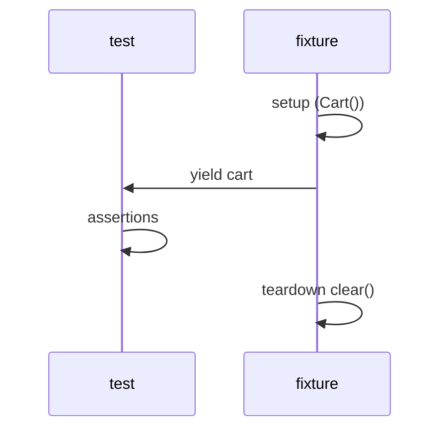

# 04. Fixtures: scope, autouse, yield, composition

## Intro: "test B fails only after test A"

Test A added an item to a global `Cart`. Test B expected an empty cart — it **only failed in the full suite**, passing locally. A classic case of **shared mutable state**. pytest fixtures are a way to give each test a **fresh** object and **reliably clean up** after itself, even if the test failed.

## What you'll learn

- Fixture **scope**: function, module, session.
- **Yield fixtures** for teardown.
- **`autouse`** — when it's appropriate.
- **Composition** — a fixture depends on a fixture.
- The link to `conftest.py` — [12-conftest-layout](12-conftest-layout.md).

---

## A basic fixture

```python
import pytest
from decimal import Decimal
from shop.cart import Cart


@pytest.fixture
def cart() -> Cart:
    return Cart()


def test_empty_cart(cart):
    assert cart.total() == 0


def test_add_item(cart):
    cart.add("SKU-1", Decimal("10.00"), 2)
    assert cart.total() == Decimal("20.00")
```

pytest **injects** the fixture by the name of the test function's argument.

---

## Scope: lifetime

| scope | Created | When to use |
|-------|----------|-------------------|
| **function** | each test | **default**; mutable state |
| **class** | each TestClass | rarely |
| **module** | once per file | expensive read-only setup |
| **package** | package of tests | shared config |
| **session** | the whole pytest run | docker, DB once |

```python
@pytest.fixture(scope="module")
def readonly_catalog():
    return {"SKU-1": Decimal("10.00")}
```

**Rule:** Cart, a DB connection with writes — **function** scope or yield + cleanup.

---

## Yield fixture = setup + teardown

```python
@pytest.fixture
def cart() -> Cart:
    c = Cart()
    yield c
    c.clear()  # runs even if the test failed


@pytest.fixture
def user_service():
    from shop.users import UserService
    svc = UserService("http://fake.example")
    yield svc
    svc.close()
```



---

## autouse

```python
@pytest.fixture(autouse=True)
def _reset_debug_env(monkeypatch):
    monkeypatch.delenv("SHOP_DEBUG", raising=False)
```

| autouse=True | When |
|--------------|-------|
| Yes | global env reset, disable network |
| No | an explicit `cart` in the signature — test readability |

Don't hide **business setup** in autouse — the reviewer can't see the dependencies.

---

## Composing fixtures

```python
@pytest.fixture
def filled_cart(cart):
    from decimal import Decimal
    cart.add("A", Decimal("5.00"), 2)
    cart.add("B", Decimal("3.00"), 1)
    return cart


def test_total_nonzero(filled_cart):
    assert filled_cart.total() > 0
```

`filled_cart` **depends** on `cart` — pytest builds a dependency DAG.

---

## fixture vs global

| | global Cart() | fixture |
|---|---------------|---------|
| Isolation | no | yes |
| Test order | matters | doesn't matter |
| Parallel (xdist) | breaks | ok with function scope |

---

## Common mistakes

| Mistake | Consequence | What to do |
|--------|-------------|------------|
| session scope + mutable | cross-test leak | function + yield |
| Forgot teardown | open files, connections | yield / finalizer |
| autouse for everything | confusing tests | explicit arguments |
| `return` instead of `yield` | no cleanup | yield for teardown |

## Interview questions

- The difference between **scope function vs session**?
- Why a **yield** fixture?
- When is **autouse** a bad idea?

## Summary

Fixtures = dependency injection for tests. Mutable state — **function scope** + **yield teardown**. Composition via fixture arguments.

Next: [05-lab-fixtures](05-lab-fixtures.md).
