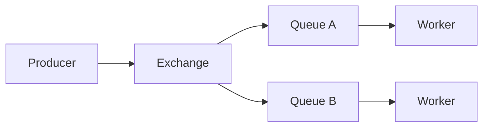

# 01. Why RabbitMQ: task queues, Kafka and SQS

## Intro: "send it to Kafka" for every button

After every order, the checkout team writes "send email" to **Kafka**. The email service doesn't need **30 days of history** or **replay** — it needs to process a task **once** and **remove** the message from the queue. Ops spends weeks tuning retention, while the developer waits for **priority** and **dead letter** for emails that hit an SMTP error. An SRE suggests **RabbitMQ**: AMQP, routing by key, ack/nack, a Management UI during an incident. This chapter is about **when RabbitMQ is a good fit**, and when **Kafka** ([kafka-basic/18](../kafka-basic/18-vs-queues.md)) or **Amazon SQS** ([aws-intermediate/07](../aws-intermediate/07-sqs-dlq.md)) is better.

## What you'll learn

- The difference between a **task queue** and an **event log** (Kafka).
- Scenarios: work queue, notification fan-out, RPC-style reply.
- Why the environment uses login **`course` / `course`** and vhost **`/`**.
- The connection to the Kafka course: [18. Kafka vs RabbitMQ vs SQS](../kafka-basic/18-vs-queues.md).

## Three messaging models

| Model | Question | Example |
|--------|--------|--------|
| **Task queue** | Who does the work once? | image resize, sending an SMS |
| **Pub/Sub** | Who learns about the event? | order.created → billing + analytics |
| **Event log** | Who reads history by offset? | CDC, stream processing |

**RabbitMQ** is strong at the **first two** via **exchanges** and **bindings**. **Kafka** — at the **third** (retention, consumer groups, replay).



## RabbitMQ in one paragraph

**RabbitMQ** is an **AMQP 0-9-1** broker: a producer publishes to an **exchange**, the exchange places copies into **queues** by **rules**, and a consumer **pull/push**es from the queue and **acknowledges (ack)** processing. A message **disappears** from the queue after ack (unlike a log, where the consumer moves the offset).

Training environment: [`deploy/rabbitmq`](../../deploy/rabbitmq/README.md) — AMQP `localhost:5672`, UI [localhost:15672](http://localhost:15672).

## Kafka vs RabbitMQ (brief)

| Criterion | Kafka | RabbitMQ |
|----------|-------|----------|
| Storage | retention by time/size | until ack / TTL / DLX |
| Replay | yes | usually no |
| Routing | topic + partition | exchange types + routing key |
| Throughput | very high log | medium/high queue |
| Ops | own cluster, ZooKeeper/KRaft | Erlang cluster, policies |

A detailed table and interview questions — [kafka-basic/18-vs-queues](../kafka-basic/18-vs-queues.md).

## Amazon SQS (when not Rabbit)

**SQS** is a managed queue in AWS: visibility timeout, DLQ, Lambda trigger. It has no exchanges and no complex topic routing "out of the box" at the level of a single broker. Choose SQS if you're **already in AWS** and don't want to stand up Rabbit. Choose Rabbit if you need **on-prem / multi-cloud**, **topic/direct routing**, **priority**, a single broker for dozens of patterns.

## When to choose RabbitMQ

**Good fit:**

- **Background tasks** (email, PDF, webhook retry) with removal after processing.
- **Complex routing** (topic: `orders.eu.#`, direct: `payment.failed`).
- **Multiple subscribers** to a single event via fanout or separate bindings.
- **RPC** (reply-to queue) within a single data center.

**Questionable:**

- A new service needs to **read all events for the past month** — Kafka/log.
- **Millions of msg/s** into a single logical stream without sharding — Kafka partitions.
- AWS only, minimal ops — **SQS**.

## On the environment: first touch

```bash
cd deploy/rabbitmq
docker compose up -d
docker compose ps
bash scripts/smoke.sh
```

```bash
docker exec mock-rabbitmq rabbitmq-diagnostics -q ping
docker exec mock-rabbitmq rabbitmqadmin -u course -p course list exchanges name type
```

| URL / port | Purpose |
|------------|------------|
| [localhost:15672](http://localhost:15672) | Queues, Exchanges, Bindings (UI) |
| `localhost:5672` | AMQP (applications, labs via `rabbitmqadmin` in the container) |

## Common mistakes

| Mistake | Why it's bad | The right way |
|--------|--------------|---------------|
| "Kafka everywhere" | extra ops, no task priorities | tasks → queue; history → log |
| Publishing **to a queue** directly (in code) | bypasses routing | publish to an **exchange** + binding |
| Ignoring **ack** | messages return on disconnect | manual ack after success |
| One vhost for prod and lab | permission confusion | a separate vhost `/lab` |
| Secrets in the repository | leak | environment variables, not `course` in prod |

## In production

- **Cluster** of 3+ nodes, **quorum queues** (intermediate), monitoring via the [Prometheus plugin](https://www.rabbitmq.com/docs/prometheus).
- **TLS** and separate users with **permissions** per vhost.
- **Policies**: TTL, max-length, DLX (dead letter exchange).
- Consumer **idempotency**: at-least-once → duplicates are possible.
- **Hybrid**: an outbox in PostgreSQL → Rabbit for workers; Kafka for analytics.

## Interview notes

- An **exchange** doesn't store messages for long — it routes them into queues.
- **At-least-once** with manual ack and redelivery.
- **Prefetch** limits the "in-flight" unacked messages per consumer.
- Rabbit is **not** a distributed log; don't confuse a **queue** with a **Kafka partition**.

## Summary

RabbitMQ is a **broker for queues and flexible routing** for tasks and notifications. Kafka is a **log** for replay and stream processing. SQS is a **managed queue** in AWS. The Basic course teaches the AMQP model on a local `mock-rabbitmq`; the Kafka comparison is reinforced in [chapter 12](12-vs-kafka-sqs.md) and [kafka-basic/18](../kafka-basic/18-vs-queues.md).

## Checklist

- In one sentence: how does a task queue differ from an event log?
- A case for Rabbit priority + DLX (preview)?
- The Management UI URL and the environment credentials?
- When is SQS preferable to self-hosted Rabbit?

Next lesson: [02. Architecture](02-architecture.md).
