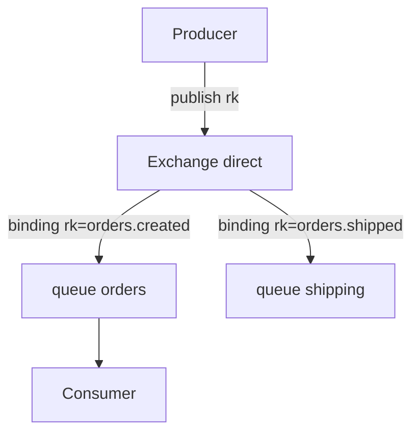

# 02. Architecture: broker, exchange, queue, binding

## Intro: "the message vanished" — but is there a binding?

Incident: a producer sends to exchange `orders`, a consumer listens on queue `orders.q`, but the **queue is empty**. In the UI you can see the exchange without a **binding** to that queue with the right **routing key**. The messages went to an **alternate** exchange or were dropped (`mandatory` / unroutable). This chapter is the **AMQP mental model** on the single-node `mock-rabbitmq` environment; in a cluster you have the same entities, plus replication (intermediate).

## What you'll learn

- The hierarchy: **connection → channel → exchange → queue → consumer**.
- **Exchange** types: direct, fanout, topic, headers (overview).
- **Binding**, **routing key**, **vhost**.
- Message fields: **payload**, **properties**, **headers**.

## Broker and vhost

A **broker** is a RabbitMQ process (node). A **virtual host (vhost)** is a logical isolation (like a "database"): its own exchanges, queues, permissions. The environment has one vhost **`/`** and user **`course`**.

```bash
docker exec mock-rabbitmq rabbitmqctl list_vhosts
docker exec mock-rabbitmq rabbitmqctl list_permissions -p /
```

## Connection and channel

A client opens a **TCP connection** (AMQP `5672`), and inside it — **channels** (lightweight multiplexed sessions). Rule: **don't share a channel between threads** in an application; in the labs one shell means one implicit channel in `rabbitmqadmin`.

| Entity | Role |
|----------|------|
| Connection | TCP + auth |
| Channel | declare, publish, consume |
| Consumer | subscription to a queue |

## Exchange

An **exchange** receives messages from a producer and **routes** them into queues based on the exchange type and bindings.

| Type | Behavior |
|-----|-----------|
| **direct** | routing key **matches** the binding key |
| **fanout** | to **all** bound queues (routing key is ignored) |
| **topic** | wildcard: `*` — one word, `#` — zero or more |
| **headers** | match by headers (rarer in the labs) |
| **default** (`""`) | straight to the queue whose name equals the routing key |



Built-in exchanges: `amq.direct`, `amq.fanout`, `amq.topic` — in the labs we create **our own** names `lab.*`.

## Queue

A **queue** is a FIFO buffer (with priority caveats). A message stays until a consumer **acks** it or its **TTL** expires.

```bash
docker exec mock-rabbitmq rabbitmqctl list_queues name messages consumers
```

| Parameter | Meaning |
|----------|--------|
| `durable` | survives a broker restart (not the contents without persistent messages) |
| `exclusive` | only this connection |
| `auto_delete` | delete when the last consumer disconnects |

## Binding

A **binding** is the link **exchange → queue** (+ a routing key for direct/topic). Without a binding, messages **don't reach** the queue (unless it's the default exchange to the queue name).

```bash
docker exec mock-rabbitmq rabbitmqadmin -u course -p course \
  declare binding source=lab.ex destination=lab.q routing_key=lab.key
```

## Message

- **Body** — payload (JSON, bytes).
- **Properties**: `content_type`, `delivery_mode` (1 non-persistent, 2 persistent), `reply_to`, `correlation_id`.
- **Headers** — arbitrary metadata (routing in a headers exchange).

Persistent (`delivery_mode=2`) + a durable queue **reduce** loss on crash, but don't give exactly-once.

## Management UI

[http://localhost:15672](http://localhost:15672) → **Queues**, **Exchanges**, **Bindings** — a visual check of the labs. The **Get messages** tab is a manual consume (like `rabbitmqadmin get`).

## On the environment: object overview

```bash
docker exec mock-rabbitmq rabbitmqadmin -u course -p course list exchanges name type
docker exec mock-rabbitmq rabbitmqadmin -u course -p course list queues name messages
docker exec mock-rabbitmq rabbitmqadmin -u course -p course list bindings source destination routing_key
```

After [lab 03](03-lab-first-queue.md), `lab.first.ex` / `lab.first.q` will appear.

## Common mistakes

| Mistake | Symptom | Fix |
|--------|---------|-------------|
| Publish without a binding | 0 messages in the queue | create a binding or check the rk |
| Confusing **queue name** and **routing key** | messages go to the wrong place | an explicit naming scheme |
| An exclusive queue in two consumers | the second one can't connect | a shared durable queue |
| Expecting ordering between queues | different order | one consumer or shard |
| `guest` on remote | ACCESS_REFUSED | user `course` on the environment |

## In production

- Naming: `{domain}.{event}.{version}` for exchanges/topics in Kafka; for Rabbit — `orders.events` + rk `order.created.v1`.
- **Quorum queues** instead of classic mirrored (RabbitMQ 3.8+).
- **Limits**: max-length, message TTL, overflow `reject-publish` or DLX.
- Monitoring: `rabbitmq_queue_messages_ready`, consumers, **unacked**.

## Interview notes

- An exchange **isn't required** to store messages — the queue stores them.
- The **default exchange** — a direct route to a queue by the name in the rk.
- A **channel exception** closes the channel, not the whole connection.
- **Prefetch (QoS)** — per channel, a limit on unacked per consumer.

## Summary

RabbitMQ routes via **exchange + binding + routing key** into **queues**, where **consumers** take the work and **ack**. Understanding this chain explains 90% of the "the message didn't arrive" labs.

## Checklist

- How does an exchange differ from a queue?
- Why do you need a binding?
- Which two exchange types will you study in basic (direct, fanout, topic)?
- The list queues command in the container?

Next lesson: [03. Lab: first queue](03-lab-first-queue.md).
