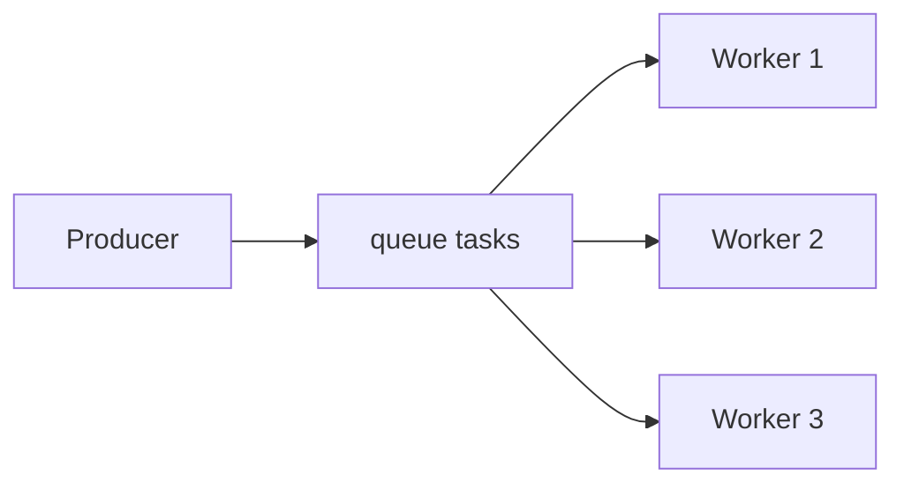

# 04. Work queues: competing consumers and fair dispatch

## Intro: one worker can't keep up

The `resize.thumb` queue is piling up **10,000** messages, one consumer processes **2 msg/s** — the SLA is burning. You add a second and a third pod with the same **queue name** — RabbitMQ hands out messages **round-robin** among consumers. This is the **work queue** (task queue) pattern: many workers, **one** queue, each message processed by **exactly one** consumer. This chapter is about load distribution and **prefetch** (ack details — [10](10-ack-prefetch.md)).

## What you'll learn

- The **competing consumers** pattern on a single queue.
- **Round-robin** and the effect of **prefetch (QoS)**.
- Why a long task without prefetch blocks "fairness".
- The difference from **Kafka**: partitions are pinned to a consumer within a group.

## Work queue



A producer publishes to an exchange → binding → **one** queue `lab.work.q`. Several consumers are subscribed to the **same** queue — the broker gives the next message to a **free** consumer (taking prefetch into account).

| | Work queue (Rabbit) | Kafka consumer group |
|---|---------------------|----------------------|
| Unit of parallelism | consumers on **one** queue | **partitions** |
| Message after read | removed after **ack** | offset commit |
| Scale | more consumers | more partitions |

## Round-robin

By default RabbitMQ sends messages to consumers **in turn, in a circle**. If Worker1 got a heavy message and **doesn't ack**, then with `prefetch=1` it won't get the next one until it finishes — the other workers keep going (fair dispatch).

Example with 4 messages and 2 consumers (A and B):

```text
msg1 → A
msg2 → B
msg3 → A
msg4 → B
```

If A is "stuck" on msg1 (unacked), then with `prefetch=1` the next msg3 will go to B — the queue doesn't stall completely.

## A message as a "task"

A work queue payload is usually JSON with job fields:

```json
{
  "job_id": "550e8400-e29b-41d4-a716-446655440000",
  "type": "resize.thumbnail",
  "s3_key": "uploads/42.jpg",
  "attempt": 1
}
```

Properties:

| Property | Why |
|----------|--------|
| `message_id` | deduplication in the consumer |
| `correlation_id` | link to the HTTP request |
| `expiration` | TTL in ms (not a replacement for a business TTL in the DB) |
| `priority` | 0–255 (requires `x-max-priority` on the queue) |

Publisher in the lab: `rabbitmqadmin publish … payload='…'`. In code — `basic_publish` after declaring the topology.

## Prefetch (preview)

**`basic.qos(prefetch_count=N)`** — no more than **N unacked** messages per channel. On the environment `rabbitmqadmin get` emulates a one-off consume; in applications (Python `pika`, Java client) prefetch is mandatory for work queues.

| prefetch | Effect |
|----------|--------|
| none / large | one consumer can "grab" a batch |
| 1 | maximally fair, less throughput |
| 10–50 | a balance for fast tasks |

## Durable and persistent

For tasks that survive a restart:

- queue `durable=true`
- messages `delivery_mode=2` (persistent)

On the single-node lab environment this is a training habit; in production — **quorum queues** (intermediate).

## On the environment: concept

Topology for [lab 05](05-lab-work-queue.md):

- exchange `lab.work.ex` (direct)
- queue `lab.work.q`
- routing key `task`

```bash
# after lab 05
docker exec mock-rabbitmq rabbitmqctl list_queues name messages consumers | grep lab.work
```

You expect **consumers=2** with two parallel `get`s in different terminals (or a script).

## Common mistakes

| Mistake | Symptom | Fix |
|--------|---------|-------------|
| Different queue names across workers | duplicate processing / empty queue | **one** queue name |
| Auto-ack on failure | task loss | manual ack after success |
| Too large a prefetch | one pod took it all | prefetch 1–10 |
| A separate queue per worker | no competing | one shared queue |
| Treating a Kafka partition = a Rabbit queue | wrong scaling | see [kafka-basic/06](../kafka-basic/06-consumer.md) |

## Scaling and backpressure

| Signal | Action |
|--------|----------|
| `messages_ready` growing | add consumer pods |
| `messages_unacknowledged` high | check stuck workers, prefetch |
| `ack rate` << `publish rate` | speed up processing or throttle the producer |
| broker RAM growing | max-length policy, DLX, defer publish |

**Backpressure** on the producer: when depth > threshold — return 429 HTTP or pause publish; don't fill the queue endlessly.

## In production

- **Horizontally scale** consumers by the `messages_ready` metric.
- **Dead letter exchange** for poison messages (intermediate).
- **Idempotency**: re-delivery after nack/requeue.
- **TTL** on tasks that "expired after 24h".
- K8s **HPA** by `rabbitmq_queue_messages` (Prometheus).

## Interview notes

- Work queue = **one queue**, N consumers, **one** handler per message.
- **At-least-once** → duplicates possible on redelivery.
- Kafka scales consumption via **partitions**, not "one more copy of the topic".

## Summary

A work queue distributes **tasks** among workers via a shared queue and round-robin. **Prefetch** and **manual ack** make the distribution predictable across tasks of varying duration.

## Checklist

- How many consumers will process a single message?
- How does a work queue differ from fanout?
- Why prefetch=1 for heavy jobs?
- How do you check the number of consumers on the environment?

Next lesson: [05. Lab: work queue](05-lab-work-queue.md).
