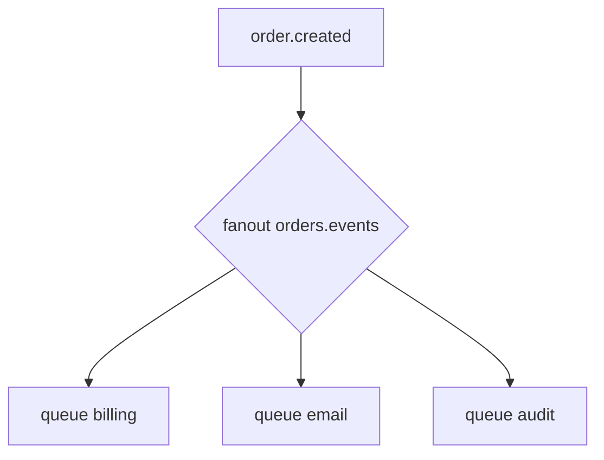

# 06. Pub/Sub: fanout exchange

## Intro: one event — three subsystems

An order was created: you need to deduct a bonus, send an email, and write to audit. A **work queue** doesn't fit — one message must reach **three independent** queues. A **fanout exchange** delivers a **copy** of each message to **all** bound queues. With fanout, the routing key is **ignored** — only the bindings matter.

## What you'll learn

- The **publish/subscribe** pattern on fanout.
- The difference from **direct** (one queue per key) and from **Kafka** (separate consumer groups read one topic).
- Naming queues for each subscriber.
- When fanout is overkill — the topic exchange ([08](08-routing-direct-topic.md)).

## Fanout



| Exchange type | Where the message goes |
|--------------|---------------------|
| direct | to queues with a **matching** rk |
| fanout | to **all** bound queues |
| topic | by an rk **pattern** |

## A separate queue per subscriber

Anti-pattern: two different services read **one** queue — they **share** the messages (work queue). For pub/sub each service creates **its own** queue and binds it to the fanout:

- `orders.events.billing`
- `orders.events.email`
- `orders.events.audit`

## Kafka analogy (carefully)

In Kafka there's **one** topic and **different consumer groups** — each group gets all messages. In Rabbit it's **fanout + N queues** — the same "every subscriber sees everything" effect, but the model is **copies in queues**, not log offsets. Replay is a weak spot of Rabbit; see [12](12-vs-kafka-sqs.md).

| Task | Kafka | Rabbit fanout |
|--------|-------|---------------|
| A new subscriber "from scratch" | new group, offset=earliest | only **new** msg (no backlog in someone else's queue) |
| Removal after read | no (log) | ack removes from **its own** queue |
| Filter by event type | a separate topic or stream filter | a topic exchange instead of fanout |

## Temporary queues (preview)

A subscriber can declare an **exclusive auto-delete queue**, bind it to the fanout, and receive events only while it's online (classic **pub/sub with drop-off**). In production it's more common to use a **durable** queue per service — to survive a consumer restart.

```text
fanout events
  └─ exclusive queue tmp-7f3a (auto-delete) ← websocket gateway
```

## Order consistency

Fanout copies **the same** message; the order **between** queues is not guaranteed. Within **one** queue the order is FIFO (with a requeue caveat). If audit must see events **before** email — don't rely on fanout ordering; use a **saga** or a single orchestrator.

## On the environment

Topology for [lab 07](07-lab-fanout.md):

```text
lab.fanout.ex (fanout)
  ├─ lab.fanout.a.q
  └─ lab.fanout.b.q
```

```bash
docker exec mock-rabbitmq rabbitmqadmin -u course -p course \
  declare exchange name=lab.fanout.ex type=fanout durable=true
```

Binding **without** a routing_key:

```bash
docker exec mock-rabbitmq rabbitmqadmin -u course -p course \
  declare binding source=lab.fanout.ex destination=lab.fanout.a.q
```

## Common mistakes

| Mistake | Symptom | Fix |
|--------|---------|-------------|
| Two services on one queue | only one receives the event | queue per service |
| Expecting rk filtering on fanout | rk is ignored | direct/topic |
| Forgetting durable on the queue | loss on restart | durable + persistent |
| Fanout to 100 services without limits | memory pressure | TTL, max-length, separate vhosts |

## In production

- A **topic exchange** often replaces fanout when there are many subscribers and filtering is needed (`orders.*.created`).
- **Federation / shovel** for cross-DC (intermediate).
- Monitor the **depth** of each subscriber queue separately.
- Don't confuse it with a **work queue** on a single queue name.

## When fanout doesn't fit

- You need delivery **only** to `billing` — use **direct** or **topic**.
- There are **hundreds** of subscribers with different filters — **topic** `orders.<service>.#` instead of hundreds of fanout exchanges.
- You need a **replay** of a month of history — Kafka / log, not Rabbit fanout.

## Interview notes

- Fanout = **broadcast** to all bindings.
- Pub/sub in Rabbit = **multiple queues**, not "one queue for everyone".
- For selective routing — **topic** or **headers**.

## Summary

Fanout broadcasts a **copy** of an event to all bound queues — classic **pub/sub** inside the broker. Each consumer service owns **its own** queue.

## Checklist

- Is the routing key ignored for fanout?
- Why shouldn't two microservices share one queue in pub/sub?
- How does fanout differ from a work queue?
- When do you need topic instead of fanout?

Next lesson: [07. Lab: fanout](07-lab-fanout.md).
