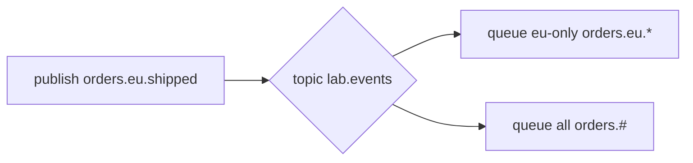

# 08. Routing: direct and topic exchange

## Intro: "all events" into one queue — overload

Fanout on `orders.events` sends **everything** to audit, email and billing. Billing only wants `payment.captured`, email — `order.shipped` and `order.delivered`. **Direct** routes by the **exact** routing key; **topic** — by a **pattern** (`orders.eu.*`, `orders.#`). This chapter is about selective routing without a dozen fanout exchanges.

## What you'll learn

- **Direct exchange**: rk = binding key.
- **Topic exchange**: `*`, `#` in a binding pattern.
- The routing key naming scheme: `domain.entity.action`.
- When topic replaces a multitude of direct bindings.

## Direct exchange

Producer:

```text
exchange: lab.notify.direct
routing_key: sms.sent
```

Binding:

```text
queue lab.sms.q  ←  routing_key sms.sent
queue lab.email.q ← routing_key email.sent
```

A message with `rk=sms.sent` will reach **only** `lab.sms.q`.

| publish rk | binding rk | Delivery |
|------------|------------|----------|
| `sms.sent` | `sms.sent` | yes |
| `sms.sent` | `email.sent` | no |

Several bindings on **one** queue with different rk — OR (any match).

## Topic exchange

A binding pattern uses words separated by a **dot**:

| Symbol | Meaning |
|--------|----------|
| `*` | exactly **one** word |
| `#` | **zero or more** words |

Binding examples → accepts rk:

| binding | routing key | match? |
|---------|-------------|--------|
| `orders.*.created` | `orders.eu.created` | yes |
| `orders.*.created` | `orders.eu.uk.created` | no (`*` is one word) |
| `orders.#` | `orders.eu.created` | yes |
| `orders.#` | `orders` | yes (zero words after) |
| `*.error` | `api.error` | yes |



## Naming routing keys

Recommendation:

```text
<domain>.<entity>.<action>
orders.payment.failed
orders.shipment.delivered
```

Versioning: a `.v1` suffix or a `schema_version` header.

## Direct vs topic vs fanout

| You need | Exchange |
|-------|----------|
| Everything to all subscribers | fanout |
| A fixed set of channels | direct |
| Filter by hierarchy / region | topic |
| Match by headers without rk | headers |

## On the environment

Lab [09](09-lab-routing.md) uses:

- `lab.route.direct` + queues `sms` / `email`
- `lab.route.topic` + `orders.eu.*` and `orders.#`

```bash
docker exec mock-rabbitmq rabbitmqadmin -u course -p course \
  declare exchange name=lab.route.topic type=topic durable=true
```

## Common mistakes

| Mistake | Symptom | Fix |
|--------|---------|-------------|
| Confusing `*` and `#` | missing or extra msg | the table above |
| rk without dots for topic | the pattern doesn't match | a unified word format |
| One direct rk for everything | an explosion of bindings | topic `orders.#` |
| Topic for 2 static rk | overkill | direct is simpler |
| Case-sensitive rk | silent drop | lowercase convention |

## In production

- A **consistent hashing exchange** to shard by key (rare, advanced).
- An **alternate exchange** for unroutable (monitoring losses).
- Document a **table of rk → queue → owner team**.
- Test topic patterns with a match unit table (as in lab 09).

## Interview notes

- Direct = **exact match** rk.
- Topic = **wildcard** match; `#` only in the binding, not in the publish rk.
- Several bindings on a queue — a **union** of routes.

## Summary

**Direct** — point delivery by routing key. **Topic** — subscription by a pattern for hierarchical events. Together they cover most enterprise routing without a fanout storm.

## Checklist

- How does `orders.#` differ from `orders.*`?
- How many queues will fanout vs direct with a single rk reach?
- An example rk for `payment.failed`?
- When is direct simpler than topic?

Next lesson: [09. Lab: routing](09-lab-routing.md).
