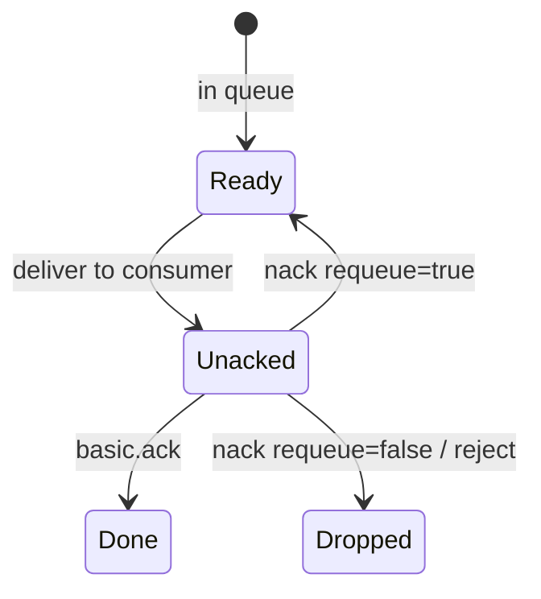

# 10. Ack, nack and prefetch

## Intro: the consumer crashed — the task came back

A worker took the "charge the money" message and crashed before committing to the DB. Without an **ack**, the broker treats the delivery as incomplete: when the channel closes, the message is **redelivered** to another consumer (or the same one). The team turned on **manual ack** and **prefetch=1** — fair dispatch and control over "in flight". This chapter is about the **at-least-once** semantics and error handling via **nack**.

## What you'll learn

- **Auto ack** vs **manual ack**.
- **Ack**, **nack**, **requeue** true/false.
- **Prefetch (QoS)** and unacked messages.
- **Poison message** and why you need DLX (intermediate preview).

## The delivery lifecycle



| Mode | When ack |
|-------|-----------|
| autoAck=true | immediately on deliver |
| manual | after successful processing |

On the environment `rabbitmqadmin get ackmode=…` imitates the variants.

## Ack modes in rabbitmqadmin

| ackmode | Behavior (lab) |
|---------|-----------------|
| `ack_requeue_true` | read and **return** to the queue |
| `ack_requeue_false` | read and **remove** (success) |
| `reject_requeue_true` | reject, return |
| `reject_requeue_false` | reject, discard |

In clients: `basic_ack(delivery_tag)`, `basic_nack(requeue=…)`.

## Nack and requeue

A **transient** error (timeout to an API): `nack(requeue=true)` — retry with backoff in the consumer.

A **permanent** error (broken JSON): `nack(requeue=false)` or publish to a **DLX** — otherwise an endless redelivery loop.

| Situation | Action |
|----------|----------|
| DB unavailable for 30 s | requeue + retry limit |
| Invalid schema | reject → DLQ |
| Success | ack |

## Prefetch

```text
basic_qos(prefetch_count=10)
```

The broker won't send the consumer more than **10 unacked** messages. It combines with a work queue: a slow worker doesn't block the queue with prefetch=1.

| Value | When |
|----------|-------|
| 1 | heavy jobs, fair |
| 10–50 | fast idempotent tasks |
| too large | one consumer monopolizes |

## At-least-once and idempotency

Rabbit guarantees **at-least-once** with ack after processing: a failure **before** ack → redelivery → **duplicate**. The consumer must be **idempotent** (`idempotency_key`, UPSERT).

Comparison: [kafka-basic/14](../kafka-basic/14-failures.md), [18-vs-queues](../kafka-basic/18-vs-queues.md).

## On the environment

Lab [11](11-lab-ack-nack.md): queue `lab.ack.q`, requeue scenarios.

```bash
docker exec mock-rabbitmq rabbitmqctl list_queues name messages_unacknowledged | head
```

## Common mistakes

| Mistake | Symptom | Fix |
|--------|---------|-------------|
| Ack before writing to the DB | loss on crash | ack after commit |
| Infinite requeue | poison loop | DLX, max retries |
| No prefetch | one pod eats it all | qos prefetch |
| Long processing without heartbeat | channel closed | increase the timeout, smaller msg |
| Assuming exactly-once | an illusion | idempotency + outbox |

## In production

- **Publisher confirms** + mandatory for unroutable.
- **DLX** + a `*.dlq` queue + an alert on depth.
- **Quorum queues** for HA ack semantics.
- Tracing: `correlation_id`, OpenTelemetry (intermediate).
- **TTL** + dead-letter for "stuck" retries.

## Interview notes

- **Unacked** — messages "in the hands" of the consumer.
- The **redelivery** flag in properties after nack/requeue.
- Prefetch is per **channel**, not globally per connection.
- Rabbit vs SQS: the **visibility timeout** ≈ the lease until ack.

## Summary

**Manual ack** ties removal of a message to the success of the business logic. **Nack/requeue** — a controlled retry. **Prefetch** balances the workers. Together — a reliable work queue without the illusion of exactly-once.

## Checklist

- When is ack safe?
- The difference between nack requeue true/false?
- What is unacked?
- Why do you need idempotency?

Next lesson: [11. Lab: ack and nack](11-lab-ack-nack.md).
