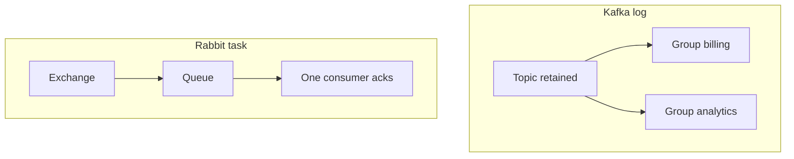

# 12. RabbitMQ vs Kafka vs SQS (interview)

## Intro: "we already have Kafka — why Rabbit?"

Architect board: the orders microservice writes to **MSK**, the email worker reads from **the same topic** and "loses" the offset on a bug. Analytics wants **all** events, email — **a single delivery** and removal. Platform proposes **Rabbit** for the task queue and keeps Kafka for the **event log**. The interview asks about trade-offs without fanaticism. This chapter systematizes [kafka-basic/18](../kafka-basic/18-vs-queues.md) with a focus on **RabbitMQ**.

## What you'll learn

- A comparison of the **data model**, **guarantees**, **ops**.
- When **Rabbit**, when **Kafka**, when **SQS**.
- How to phrase answers and typical traps.
- The connection to AWS: [07-sqs-dlq](../aws-intermediate/07-sqs-dlq.md).

## Summary table

| Criterion | **Apache Kafka** | **RabbitMQ** | **Amazon SQS** |
|----------|------------------|--------------|----------------|
| Model | Distributed **log** | **Queue** + exchanges | Managed **queue** |
| Replay | yes (retention) | usually **no** | **no** |
| Fan-out | consumer **groups** | fanout / topic bindings | **several consumers share** one queue |
| Routing | topic + partition key | direct / topic / headers | none (FIFO — group id) |
| Order | within a **partition** | within one queue | FIFO queue — yes |
| Throughput | very high | medium/high | high (managed) |
| Ops | KRaft/ZK, tuning | Erlang cluster | serverless |
| Semantics | at-least-once, EOS options | ack / nack / DLX | visibility timeout |
| Typical case | streaming, CDC, analytics | tasks, routing, RPC | AWS decouple, Lambda |

## RabbitMQ — when yes

- A **work queue** with competing consumers and **prefetch**.
- **Complex routing** (`orders.eu.*`, priorities).
- **TTL**, **per-message** DLX, **RPC** reply-to.
- On-prem / multi-cloud **without** a tie to AWS.

## RabbitMQ — when no

- A new service must **read a month of history**.
- A single **event backbone** with stream processing (Flink) across all domains.
- The team isn't ready to **operate** a broker (a small MVP in AWS → SQS).

## Kafka — when yes (a reminder)

- **Replay**, several **independent** subscribers via groups.
- High volume, **long** storage.
- **Stream processing**, log aggregation.

More: [kafka-basic/18-vs-queues](../kafka-basic/18-vs-queues.md), [01-why-kafka](../kafka-basic/01-why-kafka.md).

## SQS — when yes

- Already **AWS**, you need managed, pay-per-use.
- A **Lambda** event source, a simple worker pool.
- The **visibility timeout** semantics without a routing graph is acceptable.

Limitations: no exchanges; **FIFO** throughput limits; no "read from the start of the quarter".

## Interview pairs

**Q: Is Rabbit a smaller Kafka?**  
A: No. Rabbit is a **queue broker** with routing; Kafka is a **log** with offsets. Different models.

**Q: How do you do fan-out in Rabbit vs Kafka?**  
A: Rabbit — **fanout/topic** + a separate queue per service. Kafka — one topic, **different consumer groups**.

**Q: Duplicates?**  
A: Rabbit at-least-once on redelivery; SQS — after the visibility timeout; Kafka — after a rebalance without commit.

**Q: Orders in AWS — SQS or Rabbit?**  
A: One worker pool, simplicity — **SQS**. Complex routing on-prem — **Rabbit** or **MSK** + a separate task adapter.

## Hybrid in production

- An **outbox** in PostgreSQL → Debezium → **Kafka**; side-effect workers on **Rabbit**.
- **MSK** for analytics, **SQS** to a legacy Lambda.
- **Rabbit** inside the DC, **shovel** to the cloud (intermediate).

## Common interview mistakes

| Bad answer | Better |
|--------------|-------|
| "Kafka is always better" | criteria: replay, throughput, ops |
| "SQS doesn't scale" | it scales; no log semantics |
| "Rabbit isn't reliable" | cluster, quorum, ack |
| Confusing **partition** and **queue** | a partition = a shard of the log |
| "Fanout SQS" | you need **SNS** + several queues |

## On the environment

Rabbit: [`deploy/rabbitmq`](../../deploy/rabbitmq/README.md). Kafka: [`deploy/kafka`](../../deploy/kafka/README.md). Formulate where the `order.created` event would go in each broker (topic vs exchange rk).

## Summary

**Kafka** — a log and streaming. **Rabbit** — a queue, routing, tasks. **SQS** — a managed queue in AWS. The choice is based on **replay**, the **fan-out model**, **routing**, the **cloud** and **ops competency**.

## Checklist

- In one sentence: log vs queue?
- A case for Rabbit DLX + priority?
- A case for Kafka replay?
- Why do 10 SQS consumers **share** a queue, while 10 Kafka groups — **don't**?

Next lesson: [13. Final project](13-final-project.md).
