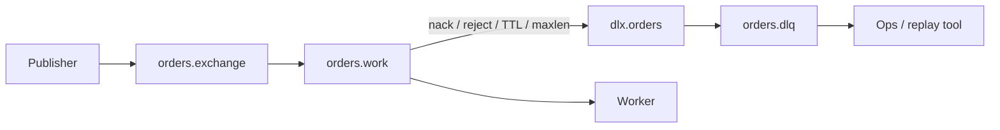

# 03. Dead Letter Exchange (DLX) and Dead Letter Queue (DLQ)

## Intro: "the message vanished into nowhere after the third nack"

A worker chokes on a "broken" order JSON. Without a redelivery policy, the message loops endlessly between the broker and the consumer — **ready** grows, throughput drops, alerts fire. In AWS SQS you configure a **redrive policy**: after `maxReceiveCount`, the message lands in a **DLQ**. In RabbitMQ, the same pattern is built on a **Dead Letter Exchange**: on failure or TTL expiry, the work queue **routes** a copy to an exchange, from which it ends up in a **DLQ**.

This chapter is the heart of the intermediate level: the DLX is not a "trash can" but a **contract** between the development and operations teams.

## What you'll learn

- The **`x-dead-letter-exchange`** and **`x-dead-letter-routing-key`** arguments.
- When a message gets **dead-lettered** (reject, expire, maxlen, admin).
- The **work queue → DLX → DLQ** topology.
- Comparison with [SQS DLQ](../aws-intermediate/07-sqs-dlq.md) and retry topics in Kafka.

---

## Mechanism



| Trigger | Condition |
|---------|---------|
| `basic.reject` / `basic.nack` | `requeue=false` |
| TTL | message or queue expires |
| `max-length` / `max-length-bytes` | queue is full |
| `delivery-limit` (quorum) | redelivery limit exceeded |

## Queue arguments

Reference from the environment: [`deploy/rabbitmq/examples/dlx-policy.json`](../../deploy/rabbitmq/examples/dlx-policy.json):

```json
{
  "queue": "orders.work",
  "durable": true,
  "arguments": {
    "x-dead-letter-exchange": "dlx.orders",
    "x-dead-letter-routing-key": "failed"
  }
}
```

- **`x-dead-letter-exchange`** — where to route the "dead" message (often **topic** or **direct**).
- **`x-dead-letter-routing-key`** — the key for the DLQ binding; if not set, the routing key of the original publish is used.

**Important:** the DLX must **exist**, and the **DLX → DLQ** binding must be created **before** the flow of poison messages.

## Comparison with SQS and Kafka

| | RabbitMQ DLX | SQS DLQ | Kafka (pattern) |
|---|--------------|---------|-----------------|
| Config | queue arguments + bindings | `redrive_policy` | separate `*.dlq` topic |
| Attempt counter | `delivery-limit` / manual nack in app | `maxReceiveCount` | consumer retry + commit |
| Inspection | Management UI, `get` on the DLQ | ReceiveMessage on the DLQ | consume the DLQ topic |
| Ordering | not guaranteed with competing consumers | Standard — no | within a partition — yes |

More on SQS: [07-sqs-dlq.md](../aws-intermediate/07-sqs-dlq.md), poison lab: [08-lab-sqs-dlq.md](../aws-intermediate/08-lab-sqs-dlq.md).

Kafka has no built-in DLX — the team publishes to a **retry topic** or **DLQ topic** explicitly ([delivery semantics](../kafka-intermediate/09-delivery-semantics.md)).

## Semantics and idempotency

A DLQ doesn't cancel **at-least-once**: the message may have been partially processed before the nack. The handler must be **idempotent** (`orderId` in the DB, a dedup table), just like for SQS Standard and a Kafka consumer.

## Operational model

1. **Alarm** on `messages_ready` of the DLQ > 0 (chapter 09).
2. **Runbook**: inspect payload → fix bug → **replay** (publish back to the work exchange) or handle manually.
3. **Don't** delete the DLQ without investigating — it's an audit trail.

## Common mistakes

| Mistake | Symptom |
|--------|---------|
| No DLX → DLQ binding | messages are lost or unroutable |
| DLX = default exchange without a key | goes to the wrong place |
| `requeue=true` on poison | infinite loop |
| Forgot durable on the DLQ | loss after restart |

## Summary

A DLX is the standard way to isolate "bad" messages. Queue configuration + exchange topology; the reference is `dlx-policy.json` on the environment.

## Checklist

- Which two arguments define a DLX?
- How is a DLQ in RabbitMQ similar to an SQS DLQ?
- Why must the consumer still be idempotent?
- When does a message get dead-lettered without a nack?

Next lesson: [04-lab-dlx.md](04-lab-dlx.md).
