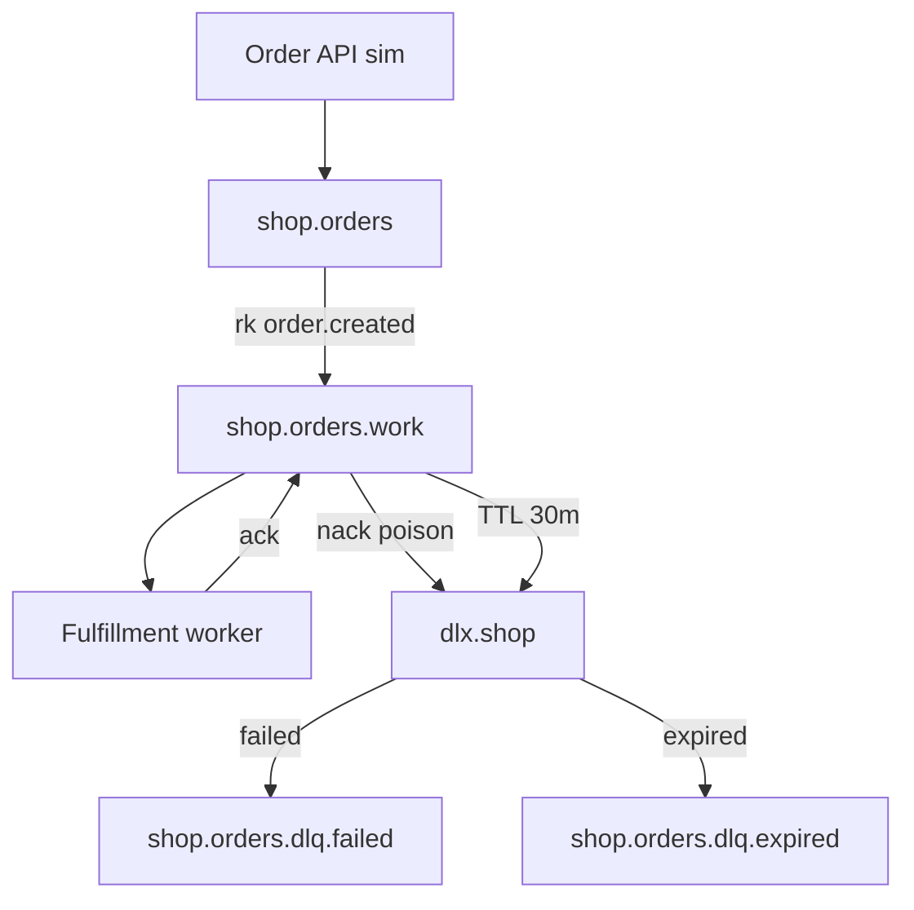

# 12. Final project: a reliable order pipeline with DLX

## Intro: the intermediate level in one loop

You've covered **quorum**, **DLX/DLQ**, **TTL**, **publisher confirms**, and **monitoring**. The **final** is an **order** pipeline on [`deploy/rabbitmq`](../../deploy/rabbitmq/README.md): a topic exchange, a work queue with DLX, separate DLQs for **failed** and **expired**, a publisher with confirms, a consumer with ack/nack, a runbook, and a report. No mandatory microservice framework — Python/scripts and the Management API are enough.

## What you submit

A `rabbitmq-intermediate-project/` folder (or a branch in a fork) with a **`PROJECT.md`** (≤5 pages): a diagram, a table of broker objects, screenshots/API output, a DLQ incident runbook, and a comparison with the SQS DLQ in 1 paragraph.

## Architecture



| Object | Type | Arguments / note |
|--------|-----|------------------------|
| `shop.orders` | topic exchange | durable |
| `shop.orders.work` | classic or quorum | DLX as in [`dlx-policy.json`](../../deploy/rabbitmq/examples/dlx-policy.json), rk `failed` |
| `checkout.hold` (opt.) | classic | `x-message-ttl`, rk `expired` |
| `dlx.shop` | topic | |
| `shop.orders.dlq.failed` | queue | binding rk `failed` |
| `shop.orders.dlq.expired` | queue | binding rk `expired` |

**Routing keys:**

- `order.created` — a new order
- `failed` — poison / nack
- `expired` — TTL checkout

## Requirements

| # | Requirement | Criterion |
|---|------------|----------|
| 1 | Environment | `deploy/rabbitmq` up, smoke OK |
| 2 | Topology | exchange + ≥3 queues + bindings |
| 3 | DLX | work queue with `x-dead-letter-exchange` / rk (as in the deploy example) |
| 4 | Publish | ≥10 order JSONs with `orderId`, **publisher confirms** + `delivery_mode=2` |
| 5 | Consume | worker processes ≥8, **basic.ack** |
| 6 | Poison | 2 orders with `simulateError:true` → **dlq.failed** |
| 7 | TTL (opt.) | hold queue → **dlq.expired** within lab time |
| 8 | Quorum (opt.) | one queue `x-queue-type=quorum` on cluster compose |
| 9 | Monitoring | curl API: depth of work + DLQ; a line from `:15692/metrics` |
| 10 | Drill | without a consumer ready≥15, then drain to 0 ([10-lab](10-lab-management-drill.md)) |
| 11 | Runbook | table: symptom → check → action (DLQ, unacked, alarm) |
| 12 | Comparison | paragraph: Rabbit DLX vs [SQS DLQ](../aws-intermediate/07-sqs-dlq.md) vs [Kafka EOS](../kafka-intermediate/09-delivery-semantics.md) |
| 13 | PROJECT.md | diagram, conclusions, what you'd change in prod |

## Recommended order

### Phase 1: infrastructure

Adapt [`examples/dlx-setup.sh`](examples/dlx-setup.sh):

```bash
# rename the exchange/queues to shop.* or extend the script
export API=http://localhost:15672/api
# shop.orders, dlx.shop, shop.orders.work, shop.orders.dlq.failed, ...
```

Verify the work queue against [`deploy/rabbitmq/examples/dlx-policy.json`](../../deploy/rabbitmq/examples/dlx-policy.json).

### Phase 2: publisher

- `confirm_delivery()`
- correlation `orderId` in the JSON
- log ack/nack

### Phase 3: consumer

- `prefetch_count=10`
- on `simulateError` → `basic.nack(requeue=False)`
- otherwise → `basic.ack`
- idempotency: an in-memory set `processed_order_ids` (for learning)

### Phase 4: incidents

1. Stop the consumer, publish 15 orders — record `messages_ready`.
2. Start the consumer — ready → 0.
3. Send poison — `shop.orders.dlq.failed` > 0.
4. (Opt.) TTL hold → expired DLQ.

### Phase 5: report

**PROJECT.md** sections:

1. Goal and diagram (mermaid).
2. Table of RabbitMQ objects.
3. UI screenshot or `jq` API output.
4. Runbook (at least 5 rows).
5. Comparison with AWS SQS and Kafka (links to the courses).
6. Quorum: single vs cluster — what you'd choose in prod.

## Success criteria (self-check)

- [ ] No "lost" poison: everything in the **failed** DLQ
- [ ] Confirms enabled on the publisher
- [ ] DLQ depth checked via the API in <30 s
- [ ] The runbook mentions **unacked** and **memory alarm**
- [ ] There's a link to `deploy/rabbitmq` and `dlx-policy.json`

## Next

- The planned [rabbitmq-advanced](../rabbitmq-advanced/README.md) (if it appears): federation, shovel, streams plugin.
- [kafka-intermediate](../kafka-intermediate/README.md) — event sourcing alongside task queues.
- [aws-intermediate](../aws-intermediate/README.md) — SQS + Lambda instead of self-hosted AMQP.

Good luck. Submit `PROJECT.md` and an archive of CLI output — that's enough to pass the intermediate level.
