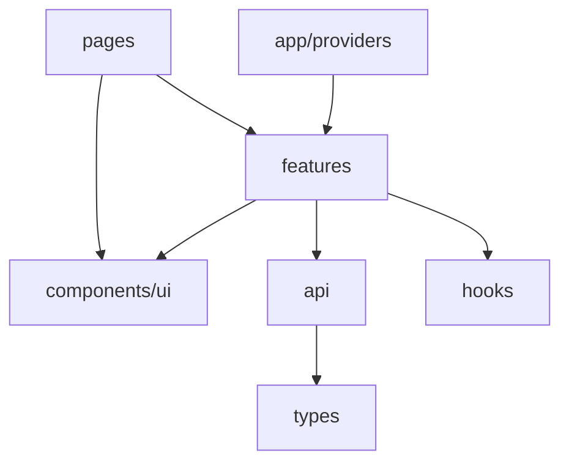

# 35. Project structure: features, components, hooks, api

## Introduction: "Where do I put useCart and fetchItems?"

After the labs [30-lab-context.md](30-lab-context.md) and [34-lab-typescript.md](34-lab-typescript.md), `src/` has a dozen files with no rules. A new developer creates `utils/cart.tsx` with JSX and `components/fetch.ts` with hooks. Code review: "We need a feature-based structure before the capstone."

Structure is a **convention**, not a React law. The goal for the mock-exams shop SPA: find code in 30 seconds, scale up to the capstone [38-capstone.md](38-capstone.md) and react-intermediate without a rewrite.

## What you'll learn

- Layer vs feature folders.
- The recommended tree for `react-basic/examples`.
- Boundaries: `api/`, `hooks/`, `components/`, `features/`, `pages/`.
- Barrel exports — when yes and no.
- Colocation vs shared.
- Connection to TypeScript paths and Vite aliases.

---

## The problem with a flat `src/`

```text
src/
  App.tsx
  Catalog.tsx
  Cart.tsx
  theme.tsx
  items.ts
  ProductCard.tsx
  useCart.ts
  ...
```

Works up to ~15 files. Beyond that — it's unclear what's **shared**, what's **catalog-only**, where the **API** is.

---

## Target structure (react-basic / capstone)

```text
src/
├── main.tsx                 # entry, StrictMode, mount
├── app/
│   ├── App.tsx              # routes shell
│   ├── providers.tsx        # Theme, Cart, QueryClient
│   └── routes.tsx           # route definitions (optional split)
├── pages/                   # route-level components (thin)
│   ├── CatalogPage.tsx
│   ├── ItemDetailPage.tsx
│   ├── CartPage.tsx
│   └── NotFoundPage.tsx
├── features/                # domain slices
│   ├── catalog/
│   │   ├── components/
│   │   │   ├── ProductCard.tsx
│   │   │   └── CatalogToolbar.tsx
│   │   ├── hooks/
│   │   │   └── useCatalogFilters.ts
│   │   └── index.ts         # optional public API
│   └── cart/
│       ├── context/
│       │   └── CartContext.tsx
│       └── components/
│           └── CartLineItem.tsx
├── components/              # truly shared UI (no domain)
│   ├── ui/
│   │   ├── Button.tsx
│   │   └── Spinner.tsx
│   └── feedback/
│       ├── ErrorPanel.tsx
│       ├── EmptyState.tsx
│       └── ProductListSkeleton.tsx
├── hooks/                   # generic hooks
│   └── useDebouncedValue.ts
├── api/
│   ├── client.ts            # BASE_URL, fetch wrapper
│   └── items.ts             # fetchItems, fetchItemById
├── types/
│   └── item.ts
├── context/                 # or inside features/*/context
│   └── ThemeContext.tsx
└── styles/
    ├── index.css
    └── tokens.css
```

**Rule:** `pages/` — the route **composition**; logic goes in `features/` and `hooks/`.

---

## Layers of responsibility



| Layer | Responsibility | Doesn't contain |
|------|-----------------|-------------|
| `pages/` | route params, layout, wire hooks | 300 lines of JSX business logic |
| `features/*` | catalog, cart, auth domain | a generic Button |
| `components/ui` | design primitives | fetch, cart state |
| `api/` | HTTP, URLs `:8090` | React hooks |
| `hooks/` | reusable use* | cart-specific (→ features/cart) |
| `types/` | shared interfaces | components |

---

## api/client.ts

A single point for FastAPI:

```tsx
const BASE =
  import.meta.env.VITE_API_URL ?? "http://localhost:8090";

export class ApiError extends Error {
  constructor(
    message: string,
    public status: number
  ) {
    super(message);
  }
}

export async function apiGet<T>(path: string): Promise<T> {
  const res = await fetch(`${BASE}${path}`);
  if (!res.ok) {
    throw new ApiError(`GET ${path} failed`, res.status);
  }
  return res.json() as Promise<T>;
}
```

`items.ts`:

```tsx
import { apiGet } from "./client";
import type { ItemsResponse, Item } from "../types/item";

export function fetchItems() {
  return apiGet<ItemsResponse>("/api/v1/items");
}

export function fetchItemById(id: number) {
  return apiGet<Item>(`/api/v1/items/${id}`);
}
```

See [18-cors-fastapi.md](18-cors-fastapi.md), [api-design](../api-design/README.md).

---

## Feature public API (barrel)

`features/catalog/index.ts`:

```tsx
export { ProductCard } from "./components/ProductCard";
export { useCatalogFilters } from "./hooks/useCatalogFilters";
```

Import:

```tsx
import { ProductCard } from "@/features/catalog";
```

**Careful:** barrels can hurt tree-shaking and cause circular deps. In basic — optional; in the capstone — export only the **public** surface.

---

## Path aliases (Vite)

`vite.config.ts`:

```ts
import path from "node:path";

export default defineConfig({
  resolve: {
    alias: {
      "@": path.resolve(__dirname, "./src"),
    },
  },
});
```

`tsconfig.json`:

```json
{
  "compilerOptions": {
    "paths": {
      "@/*": ["./src/*"]
    }
  }
}
```

---

## Colocation

ProductCard styles next to it:

```text
features/catalog/components/ProductCard/
  ProductCard.tsx
  ProductCard.module.css
```

Tests (javascript-testing):

```text
ProductCard.test.tsx  # next to it or in __tests__
```

---

## Where to put code from the lessons so far

| Code from a lesson | Path |
|--------------|------|
| ThemeProvider | `context/ThemeContext.tsx` or `features/theme/` |
| CartProvider | `features/cart/context/` |
| useDebouncedValue | `hooks/useDebouncedValue.ts` |
| fetchItems | `api/items.ts` |
| CatalogPage | `pages/CatalogPage.tsx` |
| ErrorPanel | `components/feedback/ErrorPanel.tsx` |
| Query keys | `api/queryKeys.ts` or `features/catalog/queryKeys.ts` |

---

## Anti-patterns

### A god `components/` folder

200 files with no subfolders — worse than a flat src.

### A `utils/` dumping ground

`utils/cart.tsx` with JSX — rename to a feature. `utils/formatPrice.ts` — OK.

### Circular imports

`ProductCard` imports `CatalogPage` imports `ProductCard` — extract shared types to `types/`.

### API calls inside components

```tsx
// CatalogPage.tsx — bad for tests
useEffect(() => { fetch("8090...") }, []);
```

Prefer `api/items.ts` + Query ([20-tanstack-query.md](20-tanstack-query.md)).

### Premature micro-frontends

One Vite app for react-basic — a **monolith SPA** is enough.

---

## Scaling to the capstone

The capstone [38-capstone.md](38-capstone.md) adds:
- `features/items/` — CRUD forms
- `pages/AdminItemFormPage.tsx`
- `api/items.ts` — POST/PUT if the API is extended

Don't create a second project — evolve `examples/` or `examples/capstone/`.

---

## Naming conventions

| Artifact | Convention |
|----------|------------|
| Component file | PascalCase `ProductCard.tsx` |
| hook file | camelCase `useCart.ts` |
| page | `*Page.tsx` |
| context | `*Context.tsx` + `use*` hook |
| api module | plural resource `items.ts` |
| CSS module | match component name |

Default export vs named: **named exports** for components — better refactor and grep.

---

## README in examples

Document:

- `npm run dev`
- `VITE_API_URL`
- a link to `deploy/fastapi`
- the folder structure in one paragraph

---

## Common mistakes

**400-line pages** — extract feature hooks ([28-custom-hooks.md](28-custom-hooks.md)).

**Duplicating the BASE URL** — only in `api/client.ts`.

**A shared component importing a feature** — direction: feature → ui, not ui → cart.

**index.ts re-exporting everything** — circular dependency hell.

---

## Summary

Organize the shop SPA: `app/` providers + routes, `pages/` thin, `features/` domain, `components/` shared UI, `api/` + `types/` for `:8090`. The capstone and reviews go faster with predictable paths.

## Checklist

- [ ] The difference between `pages/` and `features/`
- [ ] Where `fetchItems` goes and why not in a component
- [ ] What's in `components/ui` vs `features/catalog`
- [ ] Alias `@/` configured
- [ ] Cart context in feature cart, not in api

Next lesson: [36. DevTools](36-devtools.md).
