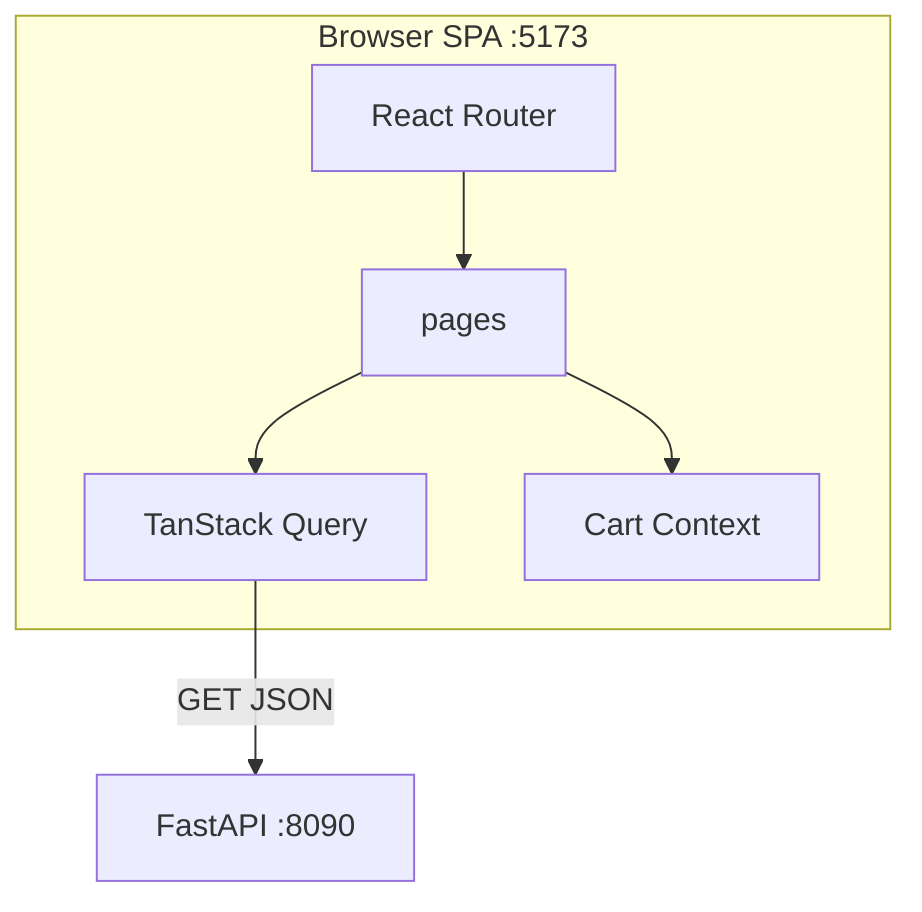

# 38. Capstone: Shop Catalog SPA (6–8 hours)

## Introduction: why a capstone

Up to this chapter you learned **fragments** of React: hooks in [09-useState.md](09-useState.md), Query in [20-tanstack-query.md](20-tanstack-query.md), Router in [23-react-router.md](23-react-router.md), Context in [30-lab-context.md](30-lab-context.md). The capstone assembles a **full SPA** for the mock-exams shop — a client for FastAPI [`deploy/fastapi`](../../deploy/fastapi/README.md) on `:8090`.

The equivalent in the JS track is [javascript-basic/39-capstone](../javascript-basic/39-capstone.md) (CLI Task Tracker); in the backend — [fastapi/42-capstone](../fastapi/42-capstone.md). Here it's **6–8 hours** of focused work (3–4 sessions of 2 hours).

If you get stuck — go back to the lessons in the "When to review" table, don't copy a ready-made SPA from the internet.

**Time estimate:** 6–8 hours.

---

## The task

**Shop Catalog SPA** — a single-page product catalog app with routing, data loading via TanStack Query, a Context-based cart, a feedback/request form (controlled form), explicit UI states, and TypeScript.

The domain is the same as in the FastAPI stack: **items** (`id`, `title`, `description`). The cart is client-side until "checkout" (POST optional extension).

---

## Functional requirements

### Routes (React Router)

| Path | Page | Description |
|------|----------|----------|
| `/` | Redirect | → `/catalog` |
| `/catalog` | CatalogPage | Product list from the API |
| `/items/:id` | ItemDetailPage | A single product's detail |
| `/cart` | CartPage | Cart from Context |
| `/contact` | ContactPage | Controlled form (API not required) |
| `*` | NotFoundPage | 404 |

Layout route: a shared `Header` (nav, theme toggle, cart badge) + `Footer` + `<Outlet />` ([24-nested-routes.md](24-nested-routes.md)).

### API (FastAPI :8090)

| Method | Endpoint | Usage |
|-------|----------|---------------|
| GET | `/health` | (optional) status in the footer |
| GET | `/api/v1/items` | Catalog list |
| GET | `/api/v1/items/{id}` | Item detail |

Base URL: `VITE_API_URL` or `http://localhost:8090`. CORS — [18-cors-fastapi.md](18-cors-fastapi.md).

```bash
cd deploy/fastapi
docker compose up -d --build
curl http://localhost:8090/api/v1/items
```

### CatalogPage

- TanStack Query `useQuery` key `["items"]`
- **Loading:** skeleton ([31-ui-states.md](31-ui-states.md))
- **Error:** message + "Retry" (`refetch`)
- **Empty:** empty state (if the array is empty)
- **Success:** grid of `ProductCard` cards
- Search: local filter **or** query param `?q=` ([26-url-state.md](26-url-state.md)) — at least one option
- "Add to cart" button → `useCart()`

### ItemDetailPage

- `useQuery` `["item", id]` + `fetchItemById`
- 404 from the API → "Product not found" + link to catalog
- Add to cart

### CartPage

- List of lines: title, qty +/-, remove, clear
- `totalItems` in the Header badge
- Empty cart state
- (Extension) persist to localStorage

### Theme

- `ThemeProvider` light/dark ([30-lab-context.md](30-lab-context.md))
- CSS variables ([33-styling.md](33-styling.md))

### ContactPage (form)

Controlled fields, minimum:

| Field | Type | Validation |
|------|-----|-----------|
| name | text | 2–100 characters |
| email | email | email format |
| message | textarea | 10–1000 characters |

Submit: `preventDefault`, show a success message **or** a mock 500ms delay (POST to the API — extension B). Validation errors inline under the fields ([10-events-controlled.md](10-events-controlled.md)).

---

## Non-functional requirements

| Requirement | Why |
|------------|-------|
| TypeScript strict, no `any` in new code | [32-typescript-react.md](32-typescript-react.md) |
| `types/item.ts` + `api/items.ts` | [34-lab-typescript.md](34-lab-typescript.md) |
| Structure `app/`, `pages/`, `features/`, `components/` | [35-project-structure.md](35-project-structure.md) |
| Keys `item.id` in lists | [07-lists-keys.md](07-lists-keys.md) |
| Rules of Hooks | [28-custom-hooks.md](28-custom-hooks.md) |
| README in `capstone/` or `examples/` with screenshots/commands | for the reviewer |
| `npm run build` with no errors | production-ready |

---

## Target structure

```text
examples/capstone/          # or evolve examples/src/
├── README.md
├── .env.example
├── package.json
├── vite.config.ts
├── tsconfig.json
├── index.html
└── src/
    ├── main.tsx
    ├── app/
    │   ├── App.tsx
    │   ├── providers.tsx
    │   └── routes.tsx
    ├── pages/
    │   ├── CatalogPage.tsx
    │   ├── ItemDetailPage.tsx
    │   ├── CartPage.tsx
    │   ├── ContactPage.tsx
    │   └── NotFoundPage.tsx
    ├── features/
    │   ├── catalog/
    │   │   └── components/ProductCard.tsx
    │   └── cart/
    │       └── context/CartContext.tsx
    ├── components/
    │   ├── layout/Header.tsx
    │   ├── layout/Footer.tsx
    │   └── feedback/ErrorPanel.tsx
    ├── api/
    │   ├── client.ts
    │   └── items.ts
    ├── hooks/
    │   └── useDebouncedValue.ts
    ├── context/
    │   └── ThemeContext.tsx
    ├── types/
    │   └── item.ts
    └── styles/
        └── index.css
```



---

## Step-by-step plan (recommended)

### Session 1 (~2 h): scaffold + API + catalog list

1. Scaffold Vite React TS (or copy `examples/`).
2. `api/client.ts`, `types/item.ts`, `fetchItems`.
3. `QueryClientProvider`, `BrowserRouter`, layout Header/Footer.
4. `CatalogPage` + Query + skeleton/error/list.
5. **Criterion:** the catalog shows the demo item from `:8090`.

**Lessons:** [18-cors-fastapi.md](18-cors-fastapi.md), [19-lab-fetch-items.md](19-lab-fetch-items.md), [20-tanstack-query.md](20-tanstack-query.md), [31-ui-states.md](31-ui-states.md).

### Session 2 (~2 h): Router + detail + cart

1. Routes `/catalog`, `/items/:id`, `/cart`, 404.
2. `ItemDetailPage` + `useParams`.
3. `CartProvider`, add/remove/qty, badge in Header.
4. **Criterion:** add on catalog → visible on `/cart` after navigation.

**Lessons:** [23-react-router.md](23-react-router.md), [29-context.md](29-context.md), [30-lab-context.md](30-lab-context.md).

### Session 3 (~2 h): theme, search, contact form

1. `ThemeProvider` + CSS variables.
2. Search filter or URL `?q=`.
3. `ContactPage` controlled form + validation.
4. **Criterion:** theme persists for the session; an invalid form is blocked.

**Lessons:** [10-events-controlled.md](10-events-controlled.md), [26-url-state.md](26-url-state.md), [33-styling.md](33-styling.md).

### Session 4 (~1–2 h): polish + README

1. Empty states, a11y focus, a responsive grid.
2. `npm run build`, fix TS errors.
3. README: setup, env, screenshots, known limits.
4. Self-check the acceptance criteria below.
5. Profiler smoke check — no obvious render storm ([36-devtools.md](36-devtools.md)).

**Lessons:** [35-project-structure.md](35-project-structure.md), [34-lab-typescript.md](34-lab-typescript.md).

---

## Implementation hints

### Query keys factory

```tsx
export const itemKeys = {
  all: ["items"] as const,
  detail: (id: number) => ["item", id] as const,
};
```

### Item detail enabled

```tsx
const { id } = useParams();
const numericId = Number(id);

useQuery({
  queryKey: itemKeys.detail(numericId),
  queryFn: () => fetchItemById(numericId),
  enabled: Number.isFinite(numericId),
});
```

### Cart add immutability

```tsx
setLines((prev) => {
  const i = prev.findIndex((l) => l.id === item.id);
  if (i >= 0) {
    return prev.map((l, idx) =>
      idx === i ? { ...l, qty: l.qty + 1 } : l
    );
  }
  return [...prev, { ...item, qty: 1 }];
});
```

### Form validation sketch

```tsx
function validateContact(values: ContactForm) {
  const errors: Partial<Record<keyof ContactForm, string>> = {};
  if (values.name.trim().length < 2) errors.name = "At least 2 characters";
  if (!/^[^\s@]+@[^\s@]+\.[^\s@]+$/.test(values.email))
    errors.email = "Invalid email";
  if (values.message.trim().length < 10)
    errors.message = "At least 10 characters";
  return errors;
}
```

---

## Extensions (optional)

| Level | Task | Hours |
|---------|--------|------|
| A | `ReactQueryDevtools` + `localStorage` cart | +0.5 |
| B | POST feedback to a mock endpoint / `jsonplaceholder` | +1 |
| C | Mutation optimistic add + toast | +1 |
| D | Pagination query `?page=` + UI | +1.5 |
| E | Vitest + Testing Library smoke test for CatalogPage | +2 |

Stand: [`deploy/fastapi`](../../deploy/fastapi/README.md).

---

## Acceptance criteria (self-check)

- [ ] `docker compose up` → the catalog loads items with no CORS error
- [ ] `/items/1` shows the demo item; `/items/999` — not found UI
- [ ] Cart: add, qty change, remove, empty state, badge count
- [ ] Theme toggle changes the styling on all routes
- [ ] Contact form doesn't submit when invalid; success UI when valid
- [ ] Loading skeleton, error retry, empty catalog/search work
- [ ] `npm run build` succeeds
- [ ] README with commands to run the frontend + backend
- [ ] No monolithic 600-line component — structure per [35-project-structure.md](35-project-structure.md)
- [ ] Went through [interview-cheatsheet.md](interview-cheatsheet.md) once without peeking

---

## Common mistakes

1. **Provider below Routes** — the cart resets on navigation. Providers **wrap** the Router (or sit at the same level above the outlet tree).

2. **Forgetting `enabled` on the detail query** — a fetch with `id=NaN`.

3. **Index as key** in cart lines after a sort — use `id`.

4. **Duplicating items in Context** — the cart stores `{id, title, qty}`, not the whole catalog.

5. **Effect fetch instead of Query** — no retry/refetch/cache; refactor to Query.

6. **Hardcoding the API URL** — use `VITE_API_URL` for CI/staging.

7. **No 404 route** — a blank page on an unknown URL.

---

## When to review the lessons

| Problem | Lesson |
|---------|------|
| CORS / API | 18, 19 |
| Query loading | 20, 31 |
| Router params | 23, 25 |
| Cart global | 29, 30 |
| Form validation | 10 |
| TS errors | 32, 34 |
| Folder chaos | 35 |
| Re-render debug | 27, 36 |

---

## After the capstone

1. Once more: [interview-cheatsheet.md](interview-cheatsheet.md) and [37-interview-qa.md](37-interview-qa.md).
2. Mark in [javascript-path.md](../javascript-path.md): **react-intermediate** or **javascript-testing**.
3. Optionally: deploy the static build behind nginx ([deploy/nginx](../../deploy/nginx/README.md)) + API `:8090`.
4. Portfolio: screenshots + a link to the repo/branch `capstone-shop-spa`.

Congratulations — **react-basic** is complete.
