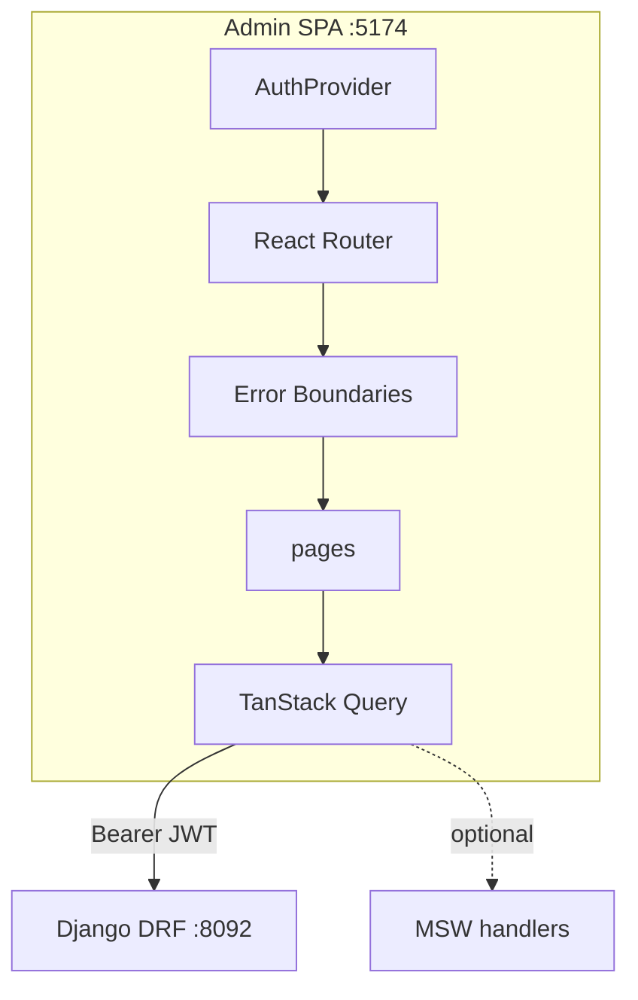

# 39. Capstone: Django Catalog Admin SPA (8–10 hours)

## Intro: why a capstone

Up to this chapter you learned **fragments** of a production admin: JWT ([08-jwt-basics.md](08-jwt-basics.md)–[13-lab-auth.md](13-lab-auth.md)), error boundaries ([14-error-boundaries.md](14-error-boundaries.md)–[17-lab-errors.md](17-lab-errors.md)), performance ([18-rerender-model.md](18-rerender-model.md)–[23-lab-performance.md](23-lab-performance.md)), MSW ([24-msw-intro.md](24-msw-intro.md)–[27-lab-msw.md](27-lab-msw.md)), forms and CRUD ([28-forms-rhf.md](28-forms-rhf.md)–[31-lab-crud.md](31-lab-crud.md)).

The capstone assembles a **complete Admin SPA** for the mock-exams catalog — a client for the Django DRF [`deploy/django`](../../deploy/django/README.md) on `:8092` (products + categories). An alternative backend is MSW for a demo without docker.

The equivalent in the JS track is [react-basic/38-capstone](../react-basic/38-capstone.md) (Shop Catalog against FastAPI `:8090`); here it's the **admin** domain with auth and CRUD.

If you get stuck — go back to the lessons from the "When to review lessons" table; don't copy a ready-made admin from the internet.

**Time estimate:** 8–10 hours (4–5 sessions of ~2 hours).

---

## The task

**Django Catalog Admin SPA** — an internal catalog management tool: login, guarded routes, a products table with server-side pagination/filters/sort, product CRUD, read-only categories, error boundaries, explicit UI states, TypeScript strict, production build.

The domain matches the Django stack: **Product** (`sku`, `title`, `description`, `price`, `is_active`, `category`), **Category** (`name`, `slug`).

---

## Functional requirements

### Routes (React Router)

| Path | Page | Guard | Description |
|------|----------|-------|----------|
| `/` | Redirect | — | → `/products` (if auth) or `/login` |
| `/login` | LoginPage | public | Email + password form |
| `/products` | ProductsTablePage | auth | Paginated table |
| `/products/new` | ProductCreatePage | auth | Create form |
| `/products/:id` | ProductDetailPage | auth | Read-only detail |
| `/products/:id/edit` | ProductEditPage | auth | Edit form |
| `/categories` | CategoriesPage | auth | Read-only list (optional cards/table) |
| `*` | NotFoundPage | — | 404 |

Layout route: `AdminLayout` — sidebar/nav, user menu (logout), `<Outlet />`, optional health indicator.



---

### API (Django :8092)

Base URL: `VITE_API_URL` or `http://localhost:8092`.

| Method | Endpoint | Usage |
|-------|----------|---------------|
| GET | `/health/` | Footer status (optional) |
| POST | `/api/v1/auth/login/` | Login (or mock MSW) |
| POST | `/api/v1/auth/refresh/` | Refresh access token |
| GET | `/api/v1/products/` | Table list + query params |
| POST | `/api/v1/products/` | Create |
| GET | `/api/v1/products/{id}/` | Detail |
| PATCH | `/api/v1/products/{id}/` | Update |
| DELETE | `/api/v1/products/{id}/` | Delete |
| GET | `/api/v1/categories/` | Filter dropdown + categories page |

**Products query params** ([29-admin-table.md](29-admin-table.md)):

- `page`, `search`, `ordering`, `category`, `is_active`, `min_price`, `max_price`

**Pagination response:**

```json
{
  "count": 142,
  "next": "...",
  "previous": null,
  "results": []
}
```

Start the backend:

```bash
cd deploy/django
docker compose up -d --build
curl http://localhost:8092/api/v1/products/
curl http://localhost:8092/api/v1/categories/
```

MSW mode: `VITE_USE_MSW=true` — extend [`examples/src/mocks/handlers.ts`](examples/src/mocks/handlers.ts) for full CRUD + refresh.

---

### Authentication

| Requirement | Details |
|------------|--------|
| Login form | email + password; RHF + Zod optional |
| Token storage | memory + refresh pattern ([09-token-storage.md](09-token-storage.md)) |
| Protected routes | redirect `/login` with `returnUrl` |
| Logout | clear tokens, `queryClient.clear()`, navigate to login |
| 401 interceptor | refresh queue → retry or logout ([12-refresh-flow.md](12-refresh-flow.md)) |
| MSW credentials | `admin@shop.local` / `admin` (as in handlers) |

---

### ProductsTablePage

- URL state: `page`, `q`, `category`, `ordering`, `is_active` ([29-admin-table.md](29-admin-table.md))
- TanStack Query `productKeys.list(params)`
- `placeholderData: keepPreviousData`
- Columns: SKU, title, category, price, active, actions (view/edit/delete)
- Sort headers: price, title, created_at
- Filters: search (debounced), category select, active select
- Pagination from `count`
- UI: loading skeleton, error + retry, empty state
- Row hover prefetch detail ([32-prefetch-patterns.md](32-prefetch-patterns.md)) — optional +points

---

### Product CRUD

**Create / Edit** — [28-forms-rhf.md](28-forms-rhf.md):

| Field | Zod | DRF field |
|------|-----|-----------|
| sku | string 2–64, regex | sku |
| title | string 2–200 | title |
| description | optional string | description |
| price | positive number | price |
| category | number id | category |
| is_active | boolean | is_active |

- Server 400 → `setError` per field
- Success → invalidate lists, toast, navigate to detail or list

**Delete** — confirm dialog; optional optimistic remove ([30-optimistic-advanced.md](30-optimistic-advanced.md))

**Detail** — read-only dl/card; links to edit/delete

---

### CategoriesPage (minimum)

- `GET /api/v1/categories/` — list name, slug
- No CRUD required (DRF read-only on the stand); extension: link to the Django admin `:8092/admin/`

---

### Error boundaries

| Level | Fallback |
|-------|----------|
| Root | "Something went wrong" + reload |
| Route (`/products/*`) | localized error + link to dashboard |
| Query errors | **not** a boundary — inline ErrorPanel |

Reset the boundary on navigation: `key={location.pathname}` ([15-boundaries-router.md](15-boundaries-router.md)).

---

### MSW option

| Env | Behavior |
|-----|----------|
| `VITE_USE_MSW=false` | Real Django :8092 |
| `VITE_USE_MSW=true` | Worker intercepts; full offline CRUD |

Handlers must mirror trailing slashes DRF style. Document both modes in the README.

---

## Non-functional requirements

| Requirement | Why |
|------------|-------|
| TypeScript strict, no `any` in new code | maintainability |
| `api/client.ts` + `ApiError` | [04-api-client.md](04-api-client.md) |
| Query keys factory | [06-query-advanced.md](06-query-advanced.md) |
| Feature structure `features/products`, `features/auth` | [02-architecture.md](02-architecture.md) |
| a11y: labels, table semantics, dialog focus | [34-accessibility.md](34-accessibility.md) |
| No secrets in `VITE_*` | [35-security-client.md](35-security-client.md) |
| `npm run build` with no errors | [36-production-build.md](36-production-build.md) |
| README with setup, env, screenshots | for the reviewer |
| Error boundaries ≥ 2 levels | capstone acceptance |

---

## Target structure

```text
examples/capstone/              # or evolve examples/src/
├── README.md
├── .env.example
├── package.json
├── vite.config.ts
├── tsconfig.json
├── index.html
└── src/
    ├── main.tsx
    ├── app/
    │   ├── App.tsx
    │   ├── providers.tsx
    │   ├── routes.tsx
    │   └── AdminLayout.tsx
    ├── pages/
    │   ├── LoginPage.tsx
    │   ├── ProductsTablePage.tsx
    │   ├── ProductCreatePage.tsx
    │   ├── ProductDetailPage.tsx
    │   ├── ProductEditPage.tsx
    │   ├── CategoriesPage.tsx
    │   └── NotFoundPage.tsx
    ├── features/
    │   ├── auth/
    │   │   ├── AuthProvider.tsx
    │   │   ├── useAuth.ts
    │   │   └── ProtectedRoute.tsx
    │   └── products/
    │       ├── components/
    │       │   ├── ProductForm.tsx
    │       │   ├── ProductRow.tsx
    │       │   ├── ProductFilterBar.tsx
    │       │   └── DeleteProductDialog.tsx
    │       ├── schemas/productFormSchema.ts
    │       └── hooks/useProductTableParams.ts
    ├── components/
    │   ├── errors/RouteErrorBoundary.tsx
    │   ├── errors/RootErrorBoundary.tsx
    │   ├── feedback/ErrorPanel.tsx
    │   ├── feedback/Toast.tsx
    │   └── ui/...
    ├── api/
    │   ├── client.ts
    │   ├── auth.ts
    │   └── products.ts
    ├── stores/
    │   └── uiStore.ts              # optional sidebar
    ├── mocks/
    │   ├── browser.ts
    │   └── handlers.ts
    ├── types/
    │   └── catalog.ts
    └── styles/
        └── index.css
```

---

## Step-by-step plan (recommended)

### Session 1 (~2 h): auth + layout + guarded routes

1. Scaffold or evolve `examples/`.
2. `AuthProvider`, login page, token in memory.
3. `ProtectedRoute`, `AdminLayout` shell.
4. API client + login/refresh stubs (MSW or Django).
5. **Success criterion:** login → `/products` empty shell; logout → login.

**Lessons:** [10-auth-context.md](10-auth-context.md), [11-protected-routes.md](11-protected-routes.md), [13-lab-auth.md](13-lab-auth.md).

### Session 2 (~2 h): products table + URL state

1. `fetchProducts`, paginated types.
2. `ProductsTablePage` filters/sort/pagination.
3. Query + `keepPreviousData`.
4. Categories query for the filter dropdown.
5. **Success criterion:** the table shows seed products from `:8092` or MSW; URL shareable.

**Lessons:** [05-pagination-filters.md](05-pagination-filters.md), [29-admin-table.md](29-admin-table.md), [07-lab-django-products.md](07-lab-django-products.md).

### Session 3 (~2 h): CRUD forms

1. Zod schema + `ProductForm`.
2. Create, detail, edit pages + mutations.
3. Delete confirm.
4. Server validation mapping.
5. **Success criterion:** a full create → edit → delete cycle.

**Lessons:** [28-forms-rhf.md](28-forms-rhf.md), [31-lab-crud.md](31-lab-crud.md).

### Session 4 (~2 h): errors + boundaries + polish

1. Root + route error boundaries.
2. Global toast; Query error panels.
3. a11y pass on form/table.
4. Categories page minimum.
5. **Success criterion:** a throw in a test component → boundary fallback, the rest of the app navigable.

**Lessons:** [14-error-boundaries.md](14-error-boundaries.md)–[17-lab-errors.md](17-lab-errors.md), [34-accessibility.md](34-accessibility.md).

### Session 5 (~1–2 h): MSW completeness + production + README

1. Full MSW handlers CRUD + refresh failure scenario.
2. `npm run build`, fix TS.
3. README: docker, env, MSW toggle, screenshots.
4. Self-check acceptance below.
5. Profiler smoke — no obvious render storm ([37-profiler.md](37-profiler.md)).

**Lessons:** [26-msw-query.md](26-msw-query.md), [36-production-build.md](36-production-build.md).

---

## Implementation hints

### Query keys factory

```tsx
export const productKeys = {
  all: ["products"] as const,
  lists: () => [...productKeys.all, "list"] as const,
  list: (params: ProductTableParams) =>
    [...productKeys.lists(), params] as const,
  details: () => [...productKeys.all, "detail"] as const,
  detail: (id: number) => [...productKeys.details(), id] as const,
};
```

### Auth header interceptor sketch

```tsx
async function api<T>(path: string, init: RequestInit = {}): Promise<T> {
  const headers = new Headers(init.headers);
  headers.set("Content-Type", "application/json");
  const token = getAccessToken();
  if (token) headers.set("Authorization", `Bearer ${token}`);

  let res = await fetch(`${baseUrl}${path}`, { ...init, headers });

  if (res.status === 401 && !path.includes("/auth/")) {
    const refreshed = await tryRefreshToken();
    if (refreshed) {
      headers.set("Authorization", `Bearer ${getAccessToken()}`);
      res = await fetch(`${baseUrl}${path}`, { ...init, headers });
    }
  }
  // throw ApiError, parse JSON...
}
```

### Route boundary

```tsx
<Route
  path="/products"
  element={
    <RouteErrorBoundary>
      <ProductsTablePage />
    </RouteErrorBoundary>
  }
/>
```

### Open redirect safe return

```tsx
const from = location.state?.from?.pathname ?? "/products";
const safe = from.startsWith("/") && !from.startsWith("//") ? from : "/products";
navigate(safe);
```

---

## Extensions (optional)

| Level | Task | Hours |
|---------|--------|------|
| A | Optimistic toggle + delete | +1 |
| B | `ReactQueryDevtools` + Zustand sidebar persist | +0.5 |
| C | Code-split the edit route + prefetch | +1 |
| D | nginx docker static + API proxy | +1.5 |
| E | Vitest + MSW: login + create product | +2 |
| F | Role-based UI (staff vs admin) | +2 |
| G | Bulk deactivate selected rows | +1.5 |

---

## Success criteria (self-check)

- [ ] Login/logout works; protected routes redirect
- [ ] Refresh flow on an expired access (MSW scenario or manual token tweak)
- [ ] `/products` — pagination, search, category filter, sort in the URL
- [ ] Create product → appears in the list; duplicate SKU — field error
- [ ] Edit updates the detail; delete removes from the list
- [ ] Loading / error / empty on table and detail
- [ ] Error boundary catches a render error at the route level
- [ ] Keyboard: login → table → edit without a mouse (smoke)
- [ ] `VITE_USE_MSW=true` — full flow without docker
- [ ] `VITE_USE_MSW=false` — flow against `:8092`
- [ ] `npm run build` succeeds
- [ ] README with frontend + backend commands + an env table
- [ ] No monolith 800-line file — feature structure
- [ ] Passed [interview-cheatsheet.md](interview-cheatsheet.md) without peeking

---

## Common mistakes

1. **Providers below Routes** — auth/query reset. Providers go **above** the Router tree.

2. **Trailing slash mismatch** — Django 301 on POST. Always `/api/v1/products/`.

3. **Client-side filter on paginated data** — only filters the current page.

4. **Tokens in localStorage without understanding the XSS risk** — document the choice; no secrets in VITE.

5. **Error boundary for fetch errors** — the user sees a generic crash; use ErrorPanel.

6. **Forgot to invalidate after a mutation** — stale table.

7. **MSW handlers don't update the mock array** — create succeeds once, then 404.

8. **Hardcode localhost in the production build** — use env.

9. **No confirm on delete** — accidental data loss.

10. **Skip a11y on an "internal tool"** — audit findings anyway.

---

## When to review lessons

| Problem | Lesson |
|---------|------|
| 401 loop / refresh | 12 |
| CORS / API client | 04, 07 |
| Table URL state | 29 |
| Form + server errors | 28 |
| Optimistic UI | 30 |
| MSW CRUD | 25, 27, 31 |
| Boundary + router | 15, 17 |
| Build/deploy | 36 |
| Perf regression | 37, 19 |
| Security review | 35 |

---

## After the capstone

1. Go through [interview-cheatsheet.md](interview-cheatsheet.md) and [38-interview-qa.md](38-interview-qa.md) once more.
2. Pick in [javascript-path.md](../javascript-path.md): **javascript-testing** or **nextjs-basic**.
3. Portfolio: README + screenshots of the table/form + a demo GIF of the login flow.
4. Optional: deploy static behind the [deploy/nginx](../../deploy/nginx/README.md) proxy to `:8092`.

Congratulations — **react-intermediate** is complete.

---

[← 38-interview-qa](38-interview-qa.md) · [interview-cheatsheet](interview-cheatsheet.md) · [README](README.md)
