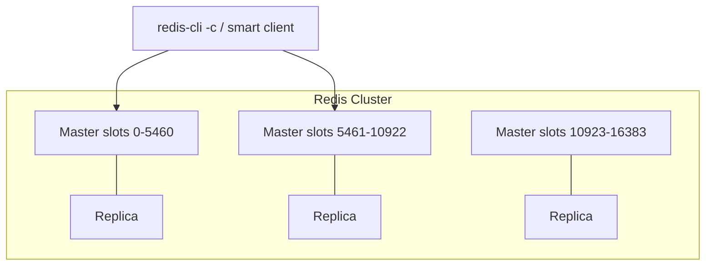

# 02. Redis Cluster

## Intro: “MOVED 3999” in application logs

After migrating from a single instance to Cluster, developers see strange Redis replies in logs: not `OK`, but **MOVED** or **ASK**. A client without cluster mode support stops working. Ops says: “We have 6 nodes, everything is healthy.” The problem isn’t “Redis crashed” — **keys are distributed across 16384 slots**, and the client must talk to the **correct master**.

## What you'll learn

- **Hash slots**, CRC16, **hash tags** `{...}`.
- Roles: **master / replica**, **quorum**, failover.
- The **MOVED / ASK** protocol, **resharding**.
- Cluster limitations (multi-key, Lua, transactions).
- Tie-in to the `7001-7006` stand and `init-cluster.sh`.

---

## Architecture



| Concept | Meaning |
|---------|----------|
| **16384 slots** | Fixed sharding space |
| **Master** | Owns a set of slots, accepts writes |
| **Replica** | Async replica of master; can become master |
| **Cluster bus** | Port **16379** (offset +10000 from client port) — gossip |

Training stand: [`deploy/redis/docker-compose.cluster.yml`](../../deploy/redis/docker-compose.cluster.yml) — 6 containers, from host **7001-7006**, init via [`scripts/init-cluster.sh`](../../deploy/redis/scripts/init-cluster.sh).

---

## Where a key lands

```text
slot = CRC16(key) mod 16384
```

**Hash tag:** only the substring in `{...}` participates in CRC:

```bash
# Both keys in one slot — MGET works in Cluster
SET user:{42}:profile "..."
SET user:{42}:cart "..."
```

Without a tag, `user:42:profile` and `user:42:cart` may land on **different** nodes → `CROSSSLOT` on multi-key.

---

## MOVED and ASK

| Reply | When | Client action |
|-------|-------|------------------|
| **MOVED** | Slot is **already** on another node (permanent) | Update slot map, retry |
| **ASK** | Temporary during slot **migration** | `ASKING` + command on target |

Production clients: **lettuce**, **go-redis**, **redis-py** cluster mode, **Jedis** — with auto redirect.

```bash
redis-cli -c -p 7001 SET product:1001 '{"sku":"x"}'
redis-cli -p 7001 CLUSTER KEYSLOT product:1001
```

The **`-c`** flag in `redis-cli` enables follow redirects.

---

## Failover

1. Master unreachable > `cluster-node-timeout` (stand: **5000 ms**).
2. Replicas vote (**quorum** majority of masters).
3. Replica promotes → master, slots reassigned.
4. Old master on return — usually a **replica** (unless split-brain with special settings).

**In the interview:** Cluster does **not** guarantee strong consistency under partition; **loss of recent writes** is possible when promoting a replica (async replication).

---

## Resharding and scaling

Adding a node:

1. `CLUSTER MEET` the new node.
2. `redis-cli --cluster reshard` — move a range of slots.
3. During migration — **ASK** redirects.

Plan for **even** slot distribution and **data size** per node — not just node count.

---

## Limitations

| Capability | Standalone | Cluster |
|-------------|--------------|-----------|
| Multi-key without shared slot | Yes | **No** (except hash tag) |
| `SELECT db` (1-15) | Yes | **db 0 only** |
| Lua with multiple keys | Yes | Keys **in one slot** |
| Sentinel for failover | Yes | **Not needed** — built-in |

**Alternatives** without full Cluster: **client-side sharding**, **Twemproxy**, **managed** (ElastiCache cluster mode).

---

## Comparison with Sentinel (intermediate)

| | Sentinel | Cluster |
|---|----------|---------|
| Sharding | No (one master) | Yes (slots) |
| Failover | Yes | Yes |
| Write scale-out | No | Yes (masters) |
| Ops complexity | Lower | Higher |

Many teams run **Sentinel + one master** until they hit real RAM/CPU limits.

---

## Common mistakes

- Running `redis-cli` **without `-c`** on Cluster — “random” errors.
- Hot key on **one slot** → one master at 100% CPU ([04](04-hot-keys-stampede.md)).
- `CLUSTERDOWN` — not enough quorum masters ([09](09-troubleshooting.md)).
- Forgot `init-cluster.sh` after `compose up` — nodes in **fail** state.

---

## Summary

1. **16384 slots**, master owns a range, replica handles failover.
2. A **cluster-aware** client is mandatory.
3. **Hash tags** — for multi-key locality.
4. Training cluster: ports **7001-7006**, bus **17001-17006**.

**Next:** [03. Lab: cluster](03-lab-cluster.md).
