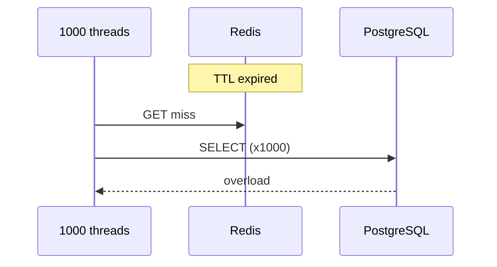

# 04. Hot keys and cache stampede

## Intro: “one key killed Black Friday”

Monitoring shows: Redis is **healthy**, API latency is **2 s**. In `INFO commandstats`, 90% of time is `GET promo:banner:2025`. One key on one master in Cluster — a **hot key**: single-threaded Redis becomes a bottleneck. Worse — **cache stampede**: TTL on thousands of keys expires at once, all threads hit PostgreSQL.

## What you'll learn

- Diagnosing a **hot key** (latency, commandstats, --hotkeys).
- Mitigation: **sharding key**, read replica, **local cache**.
- **Stampede**: jitter, lock, singleflight, early refresh.
- Hot keys in **Cluster** (one slot).

---

## Hot key: symptoms

| Signal | Tool |
|--------|------------|
| One master CPU 100% | `INFO CPU`, per-node Grafana |
| Spike of `GET` on one key | `INFO commandstats` |
| Bad p99 with low avg | latency doctor, slowlog |
| Cluster: one slot hot | `CLUSTER NODES` + load on one node |

```bash
redis-cli INFO commandstats | grep -E 'cmdstat_get|cmdstat_set'
redis-cli --hotkeys   # careful: O(N) on large DBs
```

**In prod:** sampling in a proxy (Envoy, Twemproxy), client-side metrics by key prefix, Redis Enterprise **hot key detection**.

---

## Hot key mitigation strategies

### 1. Logical counter sharding

Instead of `INCR global:views`:

```text
global:views:{0} ... global:views:{15}
```

Read: `MGET` + sum in the app (or pipeline). Write: `INCR` on `hash(userId) % 16`.

### 2. Read replicas (standalone / non-cluster write)

Hot **read-only** keys — read from replicas (eventual consistency).

### 3. Local / CDN cache

Static banner, config — **in-process cache** for 1-5 s + Redis.

### 4. Hash tags carefully

`{promo}:banner` and `{promo}:details` — **one slot** → one hot master. Sometimes you need to **split** them on purpose.

---

## Cache stampede



| Technique | Idea |
|---------|------|
| **TTL jitter** | `TTL = base + random(0..60s)` |
| **Mutex in Redis** | First sets lock `SET lock NX EX`; others wait / serve stale |
| **Singleflight** | One in-flight request per key in the app (Go `singleflight`) |
| **Early refresh** | Background worker refreshes before expiry on high hit rate |
| **Stale-while-revalidate** | Serve stale + async refresh |

Mutex pseudocode:

```text
v = GET key
if v: return v
if SET lock:key NX EX 10:
  v = load_from_db()
  SET key v EX 300
  DEL lock:key
  return v
else:
  sleep/retry GET key
```

---

## Cluster and hot keys

Even with 6 masters, **one** popular key → **one** slot → one CPU thread. Fix — **split the key** (sharded counter) or **read copies** outside Redis.

---

## In the interview

- **Question:** “How do you find a hot key among 10M keys?” — sampling, proxy metrics, `redis-cli --hotkeys` on staging, not at peak prod.
- **Question:** “Stampede after deploy?” — mass TTL flush / cold cache — jitter + prewarm.

---

## Common mistakes

- Adding **RAM** when the bottleneck is **one key / one thread**.
- `EXPIRE` on all keys at **midnight** via cron.
- Redlock for **every** cache miss ([15](15-patterns-redlock.md)).

---

## Summary

1. A hot key is **not always** “not enough memory” — often **skew** and single-thread.
2. Key sharding, local cache, replicas — main toolkit.
3. Stampede is fixed with **jitter + singleflight + lock**.

**Next:** [05. Lab: stampede](05-lab-stampede.md).
