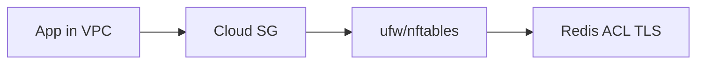

# 07. Security advanced

## Intro: “Redis with no password on the internet”

Shodan finds open Redis instances every day: `CONFIG SET dir /var/spool/cron`, `FLUSHALL`, ransomware. In the cloud the more common mistake is **Security Group 0.0.0.0/6379**, but a **host firewall** with no rules is the same hole. Redis in production is **private network + ACL + TLS + minimal commands**.

## What you'll learn

- **Defense in depth**: SG + [host firewall](../linux-intermediate/07-firewall.md) + bind.
- **ACL** (users, categories, key patterns).
- **rename-command** and disabling dangerous commands.
- **TLS**, `protected-mode`, audit.
- Tie-in to lab [08](08-lab-rename-commands.md) and [`examples/redis-security.conf`](examples/redis-security.conf).

---

## Defense layers



| Layer | Practice |
|------|----------|
| Network | Private subnet, **no** public 6379 |
| SG/NSG | Only the app security group → Redis |
| Host | [ufw: deny by default](../linux-intermediate/07-firewall.md), allow 6379 from app subnet |
| Redis | `bind`, `protected-mode`, ACL, TLS |
| Ops | Separate admin user, audit log |

**In the interview:** “Is a Security Group enough?” — no, defense in depth; compromising an app host ≠ scanning the whole VPC without host fw.

---

## ACL (Redis 6+)

File [`deploy/redis/config/users.acl`](../../deploy/redis/config/users.acl) on the stand — training `default on nopass` (**lab only**).

Production example:

```text
user default off
user app on >AppSecretSha256... ~app:* +@read +@write -@dangerous
user admin on >AdminSecret... ~* +@all
```

| Element | Meaning |
|---------|--------|
| `on` / `off` | Whether the user is enabled |
| `>password` | SHA256 password |
| `~pattern` | Allowed keys |
| `+@read` / `-flush` | Commands and categories |

```bash
redis-cli ACL LIST
redis-cli ACL WHOAMI
```

---

## rename-command

Disable or rename dangerous commands ([08-lab](08-lab-rename-commands.md)):

```text
rename-command FLUSHALL ""
rename-command FLUSHDB ""
rename-command CONFIG "CONFIG_SECRET_a8f3"
rename-command DEBUG ""
```

Empty string `""` — command is **removed**. Clients and **Sentinel** must know the new names.

---

## TLS

```text
tls-port 6379
port 0
tls-cert-file /tls/redis.crt
tls-key-file /tls/redis.key
tls-ca-cert-file /tls/ca.crt
tls-auth-clients optional
```

Managed (ElastiCache, MemoryDB) — TLS is **required** in compliance environments.

---

## protected-mode and bind

- **`protected-mode yes`**: without bind/ACL — localhost only.
- **`bind 10.0.1.5`**: listen only on internal IP.
- On the **training** cluster compose — `protected-mode no` for Docker DNS; **do not copy to prod**.

---

## Audit and secrets

- ACL passwords — in **Secrets Manager**, not in git.
- Credential rotation with a **dual-write** period.
- Log ACL denials (`ACL LOG`).

---

## Common mistakes

- `0.0.0.0/0` in SG “temporarily for debugging”.
- One `default` user with `+@all` and password in the README.
- `rename-command CONFIG` without updating **monitoring** (exporter breaks).

---

## Summary

1. Redis does **not authenticate** the network by itself — you build the perimeter.
2. **ACL** — least privilege per application.
3. **rename-command** — remove footguns; pair with [firewall](../linux-intermediate/07-firewall.md).

**Next:** [08. Lab: rename-command](08-lab-rename-commands.md).
