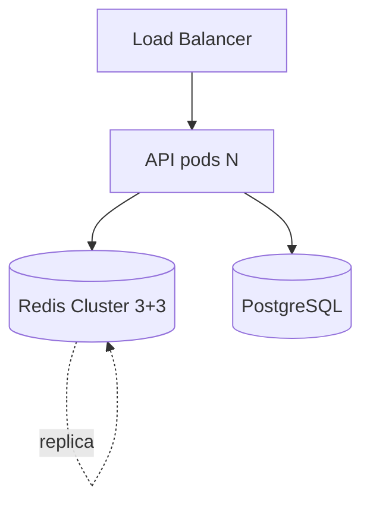

# 14. Lab: system design — reference walkthrough

## Goal

Solve the prompt from [12-lab-mock-interview](12-lab-mock-interview.md) on your own, then compare with the reference below. Note knowledge gaps.

## Prompt (repeat)

Marketplace: catalog 2M SKU (~2 KB JSON), **50k RPS read**, peaks **x3**. **500k** online sessions (~2 KB). PostgreSQL — source of truth. Region **EU**.

---

## Reference: requirements

| Type | Decision |
|-----|---------|
| Read-heavy | Cache-aside, 90%+ hit target |
| Sessions | TTL 24h, `noeviction` or separate instance |
| Consistency | Eventual on catalog; session read-your-writes via same key |
| DR | RPO 1h — AOF everysec + replica; not multi-master cache |

---

## Reference: sizing

```text
Catalog hot set (20% SKU): 400k × 2KB ≈ 800 MB
Full catalog if cached: 2M × 2KB ≈ 4 GB  → cache hot + long tail in DB
Sessions: 500k × 2KB ≈ 1 GB
Total ≈ 2-5 GB working set + 50% overhead + replica ≈ 8-12 GB RAM minimum
Peak RPS: 150k → Cluster 3 masters or r6g.2xlarge class (confirm with benchmark)
```

---

## Reference: diagram



---

## Reference: key patterns

```text
cat:v1:{skuId}     TTL 1800 + rand(0,300)
sess:{sessionId} TTL 86400
lock:cat:{skuId}   NX EX 10  # optional refresh
```

Hot SKU (Black Friday): `cat:v1:{skuId}` → local cache 2s + Redis; or read replica.

---

## Reference: anti-stampede

1. TTL jitter on catalog keys.
2. On miss: `SET lock:cat:{id} NX EX 5` → one loader.
3. Optional: prewarm top 10k SKU after deploy.

---

## Reference: security

- Redis in private subnet; SG only from EKS nodes.
- ACL: `api` user `~cat:* ~sess:* +@read +@write -@dangerous`.
- Host [ufw](../linux-intermediate/07-firewall.md) deny 6379 except node SG.
- TLS in-transit (ElastiCache in-transit encryption).

---

## Reference: alerts

1. `used_memory > 80% maxmemory`
2. `evicted_keys` rate > 0 on session instance (should be 0)
3. p99 `redis_commands_latency` > 5ms

---

## Self-check

| Criterion | You | Reference |
|----------|-----|--------|
| RAM estimate | | ✓ order 8-12 GB |
| Cluster vs single | | ✓ Cluster at 150k peak |
| Session policy | | ✓ separate or noeviction |
| Hot SKU plan | | ✓ local / replica |
| Security layers | | ✓ 3+ layers |

**Next:** [15. Redlock](15-patterns-redlock.md).
