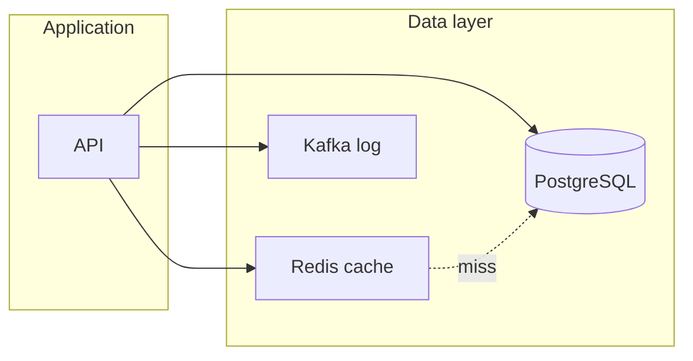

# 01. Why Redis: memory, speed and boundaries

## Intro: "PostgreSQL can't keep up with the catalog"

An online store serves its home page: **10,000** identical requests per second hit PostgreSQL for the list of categories. The DB CPU is at 90%, p99 latency grows, checkout suffers. The team caches the response in **Redis** — a single key `catalog:tree:v3`, TTL 5 minutes. The load on Postgres drops; Redis answers in **sub-milliseconds** from RAM.

A month later the same Redis is used as a **session store** and a **cart counter**. Then they put a **task queue** in it "just like Kafka" — and lose messages on restart without AOF. This chapter is a **mental model**: what Redis is good at and where it is not a replacement for a database or a broker.

## What you'll learn

- How an **in-memory data store** differs from an **OLTP DB** and a **message broker**.
- Typical use cases: **cache**, **session**, **rate limit**, **leaderboard**, **Pub/Sub**.
- Limitations: RAM volume, persistence, single-thread per command.
- Phrasing for the **interview**.

## Three roles in the architecture

| Role | Metaphor | Redis | PostgreSQL | Kafka |
|------|----------|-------|------------|-------|
| **Source of truth** | Ledger | no* | yes | no |
| **Fast snapshot / cache** | Sticky note on the monitor | yes | sometimes (materialized view) | no |
| **Event stream** | News feed | partially (Streams) | no | yes |

\* Redis **can** be the primary store for sessions and leaderboards, but with a conscious risk of loss on failure — see persistence in [02. Architecture](02-architecture.md).



## Why not "just run more Postgres"

| | PostgreSQL | Redis |
|---|------------|-------|
| Storage | disk + buffer pool | **primarily RAM** |
| Model | rows, SQL, JOIN | **key → typed structure** |
| Latency | milliseconds (normal) | **sub-ms** for simple commands |
| Read scale | replicas, connection pool | **very high QPS** on a single instance |

Redis does **not** replace complex queries, cross-table transactions and long history. It **takes the hot read off** and stores **ephemeral** state.

## Typical scenarios (basic)

1. **Caching pages and reference data** — TTL, cache-aside ([06. Patterns](06-patterns-cache.md)).
2. **User session** — HASH + TTL ([05. Lab](05-lab-session-cart.md)).
3. **Cart / favorites** — HASH, SET ([04. Data types](04-data-types.md)).
4. **Rate limiting** — INCR + EXPIRE ([17. Finale](17-final-project.md)).
5. **Leaderboard** — Sorted Set (ZSET).
6. **Pub/Sub notifications** — fire-and-forget ([08. Pub/Sub](08-pubsub.md)); not delivery-guaranteed.

## Redis vs "put it in the application's memory"

| | Local cache in JVM/Go | Redis |
|---|--------------------------|-------|
| Shared across N API instances | no | **yes** |
| Centralized eviction | hard | **maxmemory-policy** |
| Survives a process restart | no | optional (RDB/AOF) |

## On the stand: first touch

Bring up [`deploy/redis`](../../deploy/redis/README.md):

```bash
cd deploy/redis
docker compose up -d
docker compose ps
```

Check:

```bash
docker exec mock-redis redis-cli ping
```

A `PONG` reply — the instance is ready. Detailed commands are in [03. Lab: first keys](03-lab-first-keys.md).

## Common mistakes

| Thinking mistake | Why it's bad | The right way |
|-----------------|--------------|---------------|
| "Redis = database" | no JOIN, volume = RAM | cache + ephemeral state; the truth is in Postgres |
| "Redis = Kafka" | Pub/Sub without persistence by default | events in Kafka; Redis — cache/session/counter |
| "Everything is fine without TTL" | memory runs out, eviction throws out something random | **always** TTL for cache and sessions |
| "One key for a whole 50 MB catalog JSON" | locks, slow replication | split keys, compress, limit the size |

## In production

- **Cluster** or **Sentinel** for HA (intermediate/advanced).
- **ACL**, TLS, separate instances for cache vs sessions.
- Monitoring: **memory**, **evicted_keys**, **connected_clients**, **slowlog**.
- Runbook on **OOM**: eviction policy, heavy keys, `KEYS` is forbidden — only `SCAN`.

Comparison with Memcached and Kafka — [16. Redis vs Memcached vs Kafka](16-vs-memcached-kafka.md).

## Interview notes

- **Redis** is a structured **in-memory** store with optional persistence.
- **Single-threaded** command processing (per instance) — no lock contention, but a long command blocks everyone.
- **Cache-aside**: the application reads Redis → on a miss goes to the DB → writes to Redis.
- **Pub/Sub** — at-most-once; if a subscriber is offline, messages are lost.

## Summary

Redis is a tool of **speed and simple structures** in shared memory for many clients. The DB stores the **truth** and history. Kafka is an **event log** with replay. The choice starts with the question: do you need **millisecond read latency** and a **simple key–value model**, or **SQL/a log**?

## Checklist

- Name three legitimate Redis use cases in e-commerce.
- Why is a catalog cache without TTL dangerous?
- How does a session in Redis differ from JWT-only?
- Can you recover missed Pub/Sub messages?

Next lesson: [02. Architecture](02-architecture.md).
