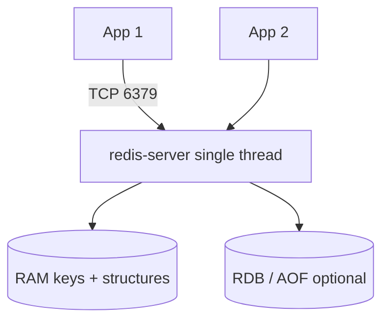

# 02. Architecture: process, memory, keys, persistence

## Intro: "Redis froze for a whole second"

An operator ran `KEYS *` in production against a million keys — the **entire** instance stopped responding to checkout. Redis processes commands **in a single thread** (the main event loop): a long O(N) operation blocks all clients. Redis architecture = understanding **memory**, the **key model** and **what you must not do in the CLI**.

## What you'll learn

- The **process / single-thread** model and its consequences for latency.
- The **key** namespace, TTL, value types.
- **RDB** and **AOF** on the training stand.
- How to read `INFO server` and `INFO memory`.

## Process and network

A single Redis instance is a `redis-server` process. Clients connect over **TCP** (port **6379** on the stand).

| Connection | Address |
|-------------|--------|
| From the host | `localhost:6379` |
| From a container in compose | `redis:6379` |

The training container: **`mock-redis`**. CLI:

```bash
docker exec -it mock-redis redis-cli
```

Stand config: [`deploy/redis/config/redis-single.conf`](../../deploy/redis/config/redis-single.conf) — `maxmemory 256mb`, `allkeys-lru`, AOF enabled.



## Single-thread and latency

- Commands run **sequentially** (exceptions: I/O threads for networking in newer versions — details in advanced).
- **Atomicity** of a single command — yes; composite scenarios — `MULTI`/`EXEC` ([10. Pipeline and transactions](10-pipeline-transactions.md)).
- **Long** commands: `KEYS`, a large `HGETALL`, `SMEMBERS` on a giant set — avoid in prod.

| Command | Complexity | Risk |
|---------|-----------|------|
| `GET key` | O(1) | low |
| `HGETALL big` | O(N) | high for a large hash |
| `KEYS pattern` | O(N) of all keys | **critical** |
| `SCAN` | iterative | safer |

## Keys and TTL

A key is a **byte string** (usually UTF-8 text):

```text
app:session:sess-7f3a2b1c
app:product:sku-BOOK-101
lab:hello
```

**Conventions** (recommendation):

- an environment/service prefix: `app:`, `lab:`;
- `:` as the hierarchy separator;
- avoid spaces and giant keys.

**TTL** — a key's time to live:

```bash
SET lab:ttl-demo "value" EX 60
TTL lab:ttl-demo
```

`-1` — no expiry; `-2` — the key does not exist.

## Value types (preview)

One key → **one type** (you can't change the type without deleting the key):

| Type | Purpose |
|-----|------------|
| **string** | JSON, counter, blob |
| **hash** | an object with fields (session) |
| **list** | queue, feed (careful with O(N)) |
| **set** | unique ids |
| **zset** | rating, leaderboard |

Details — [04. Data types](04-data-types.md).

## Memory and maxmemory

Data lives in **RAM**. The `maxmemory` parameter limits usage; when it is reached — **eviction** ([12. Memory and eviction](12-memory-eviction.md)).

On the stand:

```text
maxmemory 256mb
maxmemory-policy allkeys-lru
```

`INFO memory` shows `used_memory_human`, `maxmemory`, `mem_fragmentation_ratio`.

## Persistence (simplified)

| Mechanism | Essence | Pro | Con |
|----------|------|------|-------|
| **RDB** | scheduled snapshot to disk | compact, fast restore | data loss between snapshots |
| **AOF** | a log of every write | less loss | more disk, rewrite |

Stand: `appendonly yes`, `appendfsync everysec` — a typical compromise.

**Important:** Redis is not a replacement for a PostgreSQL backup; RDB/AOF protect the **state of Redis**, not your OLTP.

## On the stand: INFO and config

```bash
docker exec mock-redis redis-cli INFO server | head -20
docker exec mock-redis redis-cli CONFIG GET maxmemory
docker exec mock-redis redis-cli CONFIG GET maxmemory-policy
```

Example fragment:

```text
redis_version:7.2.x
tcp_port:6379
```

```bash
docker exec mock-redis redis-cli SET lab:arch-ping ok
docker exec mock-redis redis-cli TYPE lab:arch-ping
docker exec mock-redis redis-cli DEL lab:arch-ping
```

**What you'll see:** `string`, then the key is deleted.

## Common mistakes

| Symptom | Cause | Fix |
|---------|---------|---------|
| All clients "hang" | `KEYS *`, a huge `LRANGE 0 -1` | `SCAN`, limits, pagination |
| WRONGTYPE | writing a LIST into an existing STRING | `DEL` or a separate key |
| Memory grows without TTL | cache without EX | TTL policy + eviction |
| Sessions "disappeared" after `FLUSHALL` | testing on a shared stand | prefix `lab:yourname:` |

## In production

- Separate instances: **cache** (can be lost) vs **critical** (sessions, persistence).
- A value size limit (for example, < 1 MB per key).
- Alerts on `used_memory > 80%`, `evicted_keys` rate, `blocked_clients`.
- Redis Commander / RedisInsight — visualization; in prod — read-only roles only.

## Summary

**Redis-server** is a single main command thread, data in RAM, keys with TTL and a strict value type. **maxmemory** + **eviction** protect against OOM. **AOF/RDB** are insurance for Redis state, not OLTP. Safe operation = short commands and `SCAN` instead of `KEYS`.

## Checklist

- Why is `KEYS` dangerous in production?
- What does `TTL` = -2 mean?
- Where is the memory limit set on the stand?
- How does AOF differ from RDB in one phrase?

Next lesson: [03. Lab: first keys](03-lab-first-keys.md).
