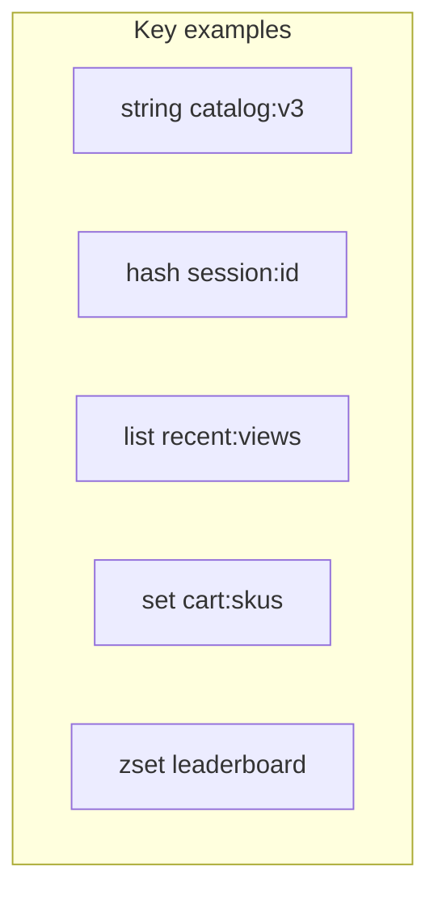

# 04. Data types: string, hash, list, set, zset

## Intro: "everything in one JSON string"

A team stores a session as `SET session:abc '{"userId":1,"cart":[...]}'`. Changing a single field means **rewriting the whole JSON**, races on concurrent requests, extra traffic. A **HASH** gives you the `userId`, `locale` fields separately; a **SET** — unique SKUs in the cart; a **ZSET** — a rating sorted by score. This chapter is about choosing the type for the task.

## What you'll learn

- The commands and complexity of **string, hash, list, set, zset**.
- When **not** to use a LIST as a reliable queue.
- Key conventions for a session and a cart.
- Examples on the `mock-redis` stand.

## String

A universal type: text, numbers, binary data (up to a reasonable size).

| Command | Purpose |
|---------|------------|
| `SET` / `GET` | write/read |
| `INCR` / `DECR` | counters |
| `SET key value EX sec` | value + TTL |
| `GETSET` | atomically replace and return the old value |

```bash
docker exec mock-redis redis-cli SET lab:types:counter 0
docker exec mock-redis redis-cli INCR lab:types:counter
```

**When string:** a simple cache of a whole JSON, flags, view counters.

## Hash

Fields inside a single key — a "mini-object":

```bash
docker exec mock-redis redis-cli HSET lab:types:user:1 name "Anna" tier "GOLD"
docker exec mock-redis redis-cli HGET lab:types:user:1 name
docker exec mock-redis redis-cli HGETALL lab:types:user:1
```

| Command | Purpose |
|---------|------------|
| `HSET` / `HGET` | a single field |
| `HMGET` | several fields |
| `HDEL` | delete a field |
| `HINCRBY` | a counter in a field |

**When hash:** a **session**, a profile, settings with partial updates.

**Careful:** `HGETALL` on a hash with thousands of fields is like a heavy `KEYS`.

## List

A doubly linked list of strings, ordered by insertion:

```bash
docker exec mock-redis redis-cli DEL lab:types:queue
docker exec mock-redis redis-cli LPUSH lab:types:queue job1 job2
docker exec mock-redis redis-cli RPOP lab:types:queue
```

| Command | Purpose |
|---------|------------|
| `LPUSH` / `RPUSH` | insert |
| `LPOP` / `RPOP` | remove |
| `LRANGE 0 -1` | the whole list (careful) |
| `BLPOP` | blocking wait |

**When list:** a feed of the last N events (`LTRIM`), a simple queue **within a single instance** with an understanding of the risks.

**Don't confuse** with Kafka/Rabbit: if a consumer crashes between `RPOP` and ACK, the data is already removed. A reliable queue is **Streams** (intermediate) or a broker.

## Set

An unordered collection of unique strings:

```bash
docker exec mock-redis redis-cli SADD lab:types:tags redis cache session
docker exec mock-redis redis-cli SADD lab:types:tags redis
docker exec mock-redis redis-cli SMEMBERS lab:types:tags
docker exec mock-redis redis-cli SISMEMBER lab:types:tags cache
```

| Command | Purpose |
|---------|------------|
| `SADD` / `SREM` | add/remove |
| `SISMEMBER` | membership check |
| `SCARD` | size |
| `SINTER` / `SUNION` | intersection/union |

**When set:** tags, "who is online", unique ids in a cart.

## Sorted Set (ZSET)

Member + **score** (float); sorted by score:

```bash
docker exec mock-redis redis-cli ZADD lab:types:board 100 user:alice 250 user:bob 180 user:carol
docker exec mock-redis redis-cli ZREVRANGE lab:types:board 0 2 WITHSCORES
docker exec mock-redis redis-cli ZINCRBY lab:types:board 50 user:alice
```

| Command | Purpose |
|---------|------------|
| `ZADD` | add/update a score |
| `ZRANGE` / `ZREVRANGE` | top N |
| `ZRANK` / `ZSCORE` | rank and score |
| `ZINCRBY` | atomically add points |

**When zset:** a **leaderboard**, rate limiting by time (score = timestamp), delayed tasks.



## Comparison for choosing a type

| Task | Type | Key (example) |
|--------|-----|----------------|
| Cache a JSON API | string | `app:cache:product:101` |
| Session | hash | `app:session:{id}` |
| Last 10 views | list + `LTRIM` | `app:user:1:recent` |
| SKUs in a cart | set or hash | `app:cart:{userId}` |
| Top sellers of the day | zset | `app:lb:daily` |

## On the stand: cleaning up demo keys

After experimenting:

```bash
docker exec mock-redis redis-cli DEL lab:types:counter lab:types:user:1 lab:types:queue lab:types:tags lab:types:board
```

## Common mistakes

| Mistake | Consequence | Fix |
|--------|-------------|---------|
| A giant JSON in a string | extra CPU, conflicts | hash or separate keys |
| A LIST as a global prod queue | loss on failure, no consumer group | Streams / SQS / Kafka |
| `SMEMBERS` on a set of 1M | blocking | `SSCAN` |
| A single ZSET for a whole year of leaderboard | a huge key | shard by date `lb:2026-05-18` |

## In production

- Serialization: **JSON** in string/hash fields is fine; MessagePack for savings.
- The schema version in the key: `catalog:v3` — swap the cache without leftover v2 "ghosts".
- Document the **key convention** (like [`rate-limit-keys.txt`](examples/rate-limit-keys.txt)).

## Summary

**String** — simplicity and counters. **Hash** — objects with fields. **List** — ordered elements with O(N) operations on ranges. **Set** — uniqueness. **Zset** — sorting and ratings. The type is chosen by the application's operations, not by "what's more convenient to serialize".

## Checklist

- Why is a hash better than a single JSON string for a session?
- Why is LIST ≠ Kafka?
- How do you get the top 3 in a leaderboard?
- When is `HGETALL` dangerous?

Next lesson: [05. Lab: session and cart](05-lab-session-cart.md).
