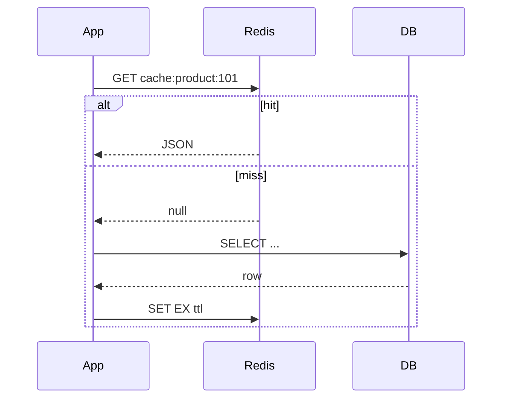
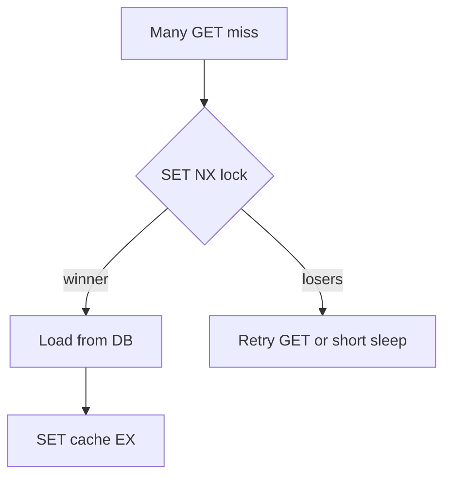

# 06. Patterns: cache-aside, TTL, stampede

## Intro: "the cache expired — and the DB went down"

A sale at midnight: the catalog cache TTL expired on **all** API instances at once. Thousands of requests hit PostgreSQL — a **cache stampede**. A minute later the cache is warm again, but the SLA is already breached. Caching patterns are not "put it in Redis", they are **when** to read, **how** to invalidate and **how** to survive a miss.

## What you'll learn

- **Cache-aside** (lazy loading) vs **write-through** (preview).
- Choosing a **TTL**, **jitter**, key versioning.
- **Cache stampede** and mitigations (lock, singleflight).
- Anti-patterns: an eternal cache, a cache without a source of truth.

## Cache-aside (the most common)



| Step | Action |
|-----|----------|
| 1 | `GET` from Redis |
| 2 | hit → return to the client |
| 3 | miss → read the **DB** |
| 4 | `SET` into Redis with a **TTL** |
| 5 | return to the client |

**Pros:** simplicity, the DB remains the source of truth.  
**Cons:** the first request after expiry is slow; **stale** data is possible until the TTL.

Practice in [07. Lab: cache-aside](07-lab-cache-aside.md).

## Write-through and write-behind (preview)

| Pattern | Write | When in basic |
|---------|--------|----------------|
| **Write-through** | Redis first, then the DB (or together) | rarely in basic |
| **Write-behind** | Redis immediately, the DB asynchronously | risk of loss; advanced |

In basic, **cache-aside** + explicit **invalidation** when something changes in the admin panel is enough: `DEL cache:product:101`.

## TTL and jitter

| Parameter | Recommendation |
|----------|--------------|
| Reference data | 5–60 min |
| Personal data | seconds–minutes or don't cache |
| Hot keys | shorter TTL + monitoring |

**Jitter:** `TTL = base + random(0..60)` — so keys don't expire at the same time.

```bash
# Pseudocode: EX = 300 + rand(0, 60)
SET app:cache:product:101 "{...}" EX 347
```

## Cache stampede

**The problem:** on a miss, N threads go to the DB for the same key at once.

**Mitigations:**

1. **Mutex in Redis:** `SET lock:product:101 1 NX EX 5` — only one builds the cache.
2. **Logical expiration:** store the value + `softExpire`; on soft — serve stale, one thread refreshes.
3. **Pre-warming** before a sale.
4. **Singleflight** in the application (one request per key per process).



## What to cache (and what not)

| Cache | Don't cache |
|------------|----------------|
| read-heavy reference data | personal secrets |
| home-page aggregates | data with strict consistency and no stale allowed |
| rendered HTML fragment | huge responses > the limit |

## Version in the key

When the response format changes:

```text
app:cache:product:v2:101
```

Old `v1` keys expire by TTL without a mass `KEYS`.

## On the stand: simulating a miss

```bash
docker exec mock-redis redis-cli DEL lab:cache:product:demo
docker exec mock-redis redis-cli GET lab:cache:product:demo
```

`(nil)` — a miss. After lab 07 the key will appear with a TTL.

## Common mistakes

| Mistake | Consequence | Fix |
|--------|-------------|---------|
| No TTL | memory, eternal stale | always `EX` |
| Invalidation via TTL only | the admin changes the price — an hour of stale | `DEL` on update |
| Cache without a DB fallback | Redis down → 500 | degrade: go to the DB |
| A single TTL for 1M keys | stampede | jitter + lock |

## In production

- Metrics: **hit rate**, `keyspace_hits` / `keyspace_misses` in `INFO stats`.
- Alert on a sharp rise in DB latency after a deploy (a broken key/version).
- **Don't** cache errors (404/500) for long — an "anti-cache" against empty responses.

## Summary

**Cache-aside:** the application manages reading and writing the cache. **TTL + jitter** reduce spikes. **Stampede** is treated with a lock or stale-while-revalidate. Redis is an accelerator, **not** a replacement for business-logic invalidation.

## Checklist

- Describe cache-aside in 4 steps.
- Why jitter on the TTL?
- What do you do when a product is updated in the admin panel?
- Why is caching a 500 error dangerous?

Next lesson: [07. Lab: cache-aside](07-lab-cache-aside.md).
