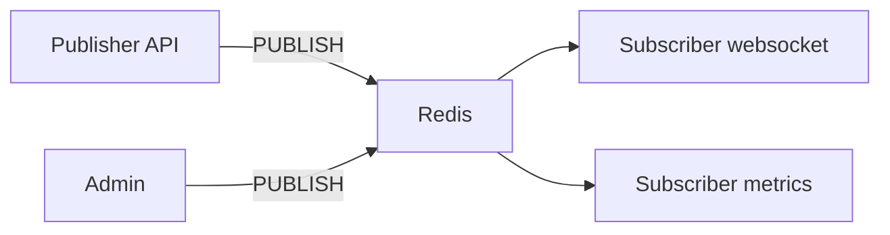

# 08. Pub/Sub: channels, patterns, limitations

## Intro: "the notification didn't arrive after a restart"

The **Notifications** service is subscribed to the `orders:paid` channel. Redis was restarted — the subscriber reconnected, but the event was published **during the downtime**. The message is **not stored** in Pub/Sub: there was no subscriber — there's no data. It's not a bug, it's the **fire-and-forget** model. For event history — Kafka ([kafka-basic/01](../kafka-basic/01-why-kafka.md)) or **Redis Streams** (intermediate).

## What you'll learn

- The **SUBSCRIBE**, **PUBLISH**, **PSUBSCRIBE** commands.
- The difference between a **channel** and a **pattern**.
- Delivery semantics: **at-most-once**, no backlog.
- When Pub/Sub is appropriate and when it's not.

## The Pub/Sub model



- A **Publisher** doesn't know who is listening.
- A **Subscriber** in subscribe mode **cannot** run ordinary commands (other than subscribing) on the same connection — for applications this is often a **second** connection.
- Messages are **not written to disk** like a queue (unlike Streams/Kafka).

## Commands

| Command | Purpose |
|---------|------------|
| `SUBSCRIBE channel` | subscribe to a channel |
| `UNSUBSCRIBE` | unsubscribe |
| `PUBLISH channel message` | send to all subscribers |
| `PSUBSCRIBE orders:*` | subscribe by a pattern |
| `PUBSUB CHANNELS` | list of active channels (diagnostics) |

Example (two terminals — in lab 09):

```bash
# Terminal A
SUBSCRIBE lab:notify:orders

# Terminal B
PUBLISH lab:notify:orders '{"orderId":"ord-1","status":"paid"}'
```

**What you'll see** in A: a `message`-type message, the channel, the payload.

## Channel vs pattern

| | `SUBSCRIBE foo` | `PSUBSCRIBE foo:*` |
|---|-----------------|---------------------|
| Match | an exact name | a pattern with `*` `?` |
| PUBLISH message | `PUBLISH foo` | `PUBLISH foo:bar` |

Naming as for keys: `app:domain:event`.

## Semantics and comparison

| | Redis Pub/Sub | Kafka consumer |
|---|---------------|----------------|
| Storage | none | log + retention |
| Offline consumer | miss | catches up from the offset |
| Scale | thousands of subscribers per channel | partition + groups |
| Guarantee | at-most-once | at-least-once (configurable) |

Detailed comparison — [16. Redis vs Memcached vs Kafka](16-vs-memcached-kafka.md) and [kafka-basic/18-vs-queues](../kafka-basic/18-vs-queues.md).

## Typical use cases (yes)

- **Live** notifications: "order paid" → websocket gateway.
- **Cache invalidation** between instances: `PUBLISH cache:invalidate product:101`.
- **Internal signals** where loss is acceptable.

## Typical use cases (no)

- Billing, payments, integration with accounting systems — you need a **broker** or **Streams**.
- Tasks for workers with ACK — a **queue** (SQS, Rabbit, Streams consumer group).

## On the stand: PUBSUB NUMSUB

```bash
docker exec mock-redis redis-cli PUBLISH lab:notify:ping "hello"
docker exec mock-redis redis-cli PUBSUB NUMSUB lab:notify:ping
```

**What you'll see:** `0` subscribers — the message went nowhere (this is normal without SUBSCRIBE).

## Common mistakes

| Mistake | Consequence | Fix |
|--------|-------------|---------|
| Pub/Sub as a task queue | loss when offline | Streams / SQS |
| SUBSCRIBE in the same pool as GET/SET | a blocked connection | a separate client |
| Huge payloads in PUBLISH | pressure on the network and memory | id in the message, details via GET |
| No subscriber monitoring | silent loss | subscriber healthcheck, metrics |

## In production

- **Redis 7 sharded Pub/Sub** in a cluster — a separate topic (advanced).
- For **cache invalidation** Pub/Sub is often simpler than polling.
- Critical domains — **outbox + Kafka**, not PUBLISH.

## Summary

**Pub/Sub** is lightweight real-time broadcast without persistence. A subscriber must be **online**. For **history** and **replay** — a different tool. Lab: [09. Pub/Sub](09-lab-pubsub.md).

## Checklist

- What happens to a message if there are 0 subscribers?
- Can you run GET in the same `redis-cli` after SUBSCRIBE?
- How does Pub/Sub differ from a Kafka log?
- Name one legitimate Pub/Sub use case in e-commerce.

Next lesson: [09. Lab: Pub/Sub](09-lab-pubsub.md).
