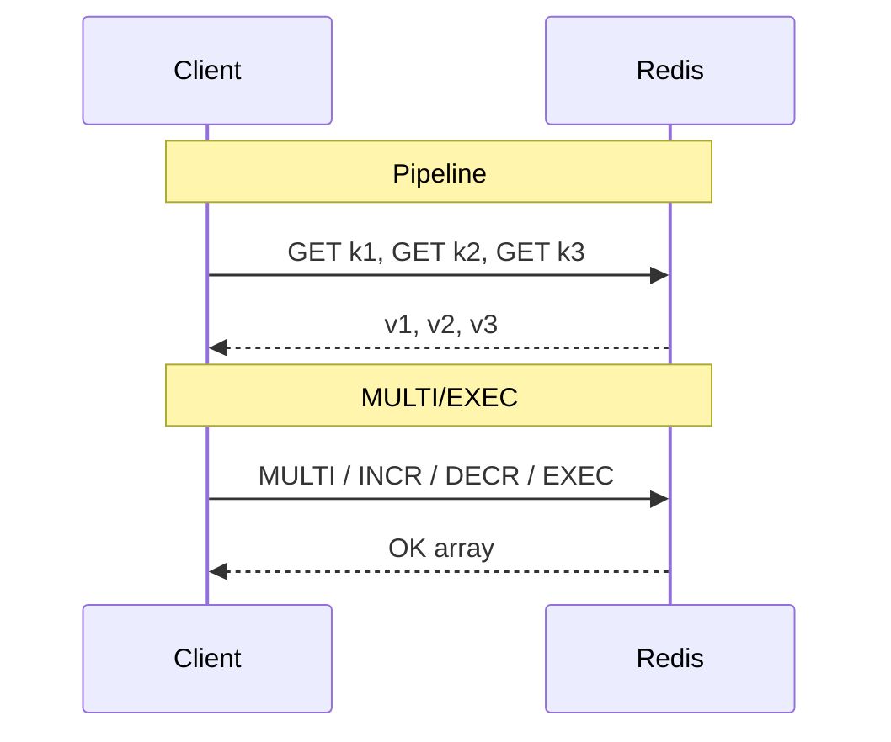

# 10. Pipeline and transactions: MULTI, EXEC, WATCH

## Intro: "1000 requests — and the API slows down"

A service does a `GET` on 500 keys in a loop — 500 round-trips to Redis. **PIPELINE** packs the commands into a single network packet: the server runs them in order, the client gets an array of responses. Latency drops several times over. For **atomicity** of several commands — **MULTI/EXEC**; for optimistic locking — **WATCH**.

## What you'll learn

- **Pipeline** vs ordinary requests (RTT).
- **MULTI/EXEC** — a transaction without per-command rollback.
- **WATCH** — a CAS before the transaction.
- Limitations: no nested MULTI, errors in the queue.

## Round-trip and pipeline

| Mode | Network | Atomicity of all commands |
|-------|------|-------------------------|
| One by one | N RTT | each command is atomic |
| **Pipeline** | ~1 RTT | **no** overall atomicity |
| **MULTI/EXEC** | 1 RTT (batch) | yes, the block between MULTI and EXEC |



## Pipeline in redis-cli

```bash
cat <<'EOF' | docker exec -i mock-redis redis-cli --pipe
SET lab:pipe:1 a
SET lab:pipe:2 b
SET lab:pipe:3 c
EOF
```

Or interactively: `redis-cli` with the `--pipe` flag for bulk loading.

In code (pseudocode): `pipe.get("k1"); pipe.get("k2"); pipe.execute()`.

**Important:** if one command in a pipeline errors, the rest **still** run (unlike an SQL transaction).

## MULTI / EXEC

```bash
docker exec mock-redis redis-cli MULTI
docker exec mock-redis redis-cli INCR lab:tx:account:a
docker exec mock-redis redis-cli DECR lab:tx:account:b
docker exec mock-redis redis-cli EXEC
```

In a **single** interactive session it's more convenient:

```text
127.0.0.1:6379> MULTI
OK
127.0.0.1:6379> INCR lab:tx:bal
QUEUED
127.0.0.1:6379> INCR lab:tx:bal
QUEUED
127.0.0.1:6379> EXEC
1) (integer) 1
2) (integer) 2
```

| Behavior | Detail |
|-----------|--------|
| Queue | commands reply `QUEUED` |
| EXEC | executes **sequentially**, without interleaving from other clients |
| Syntax error in MULTI | EXEC abort (depends on the version/error type) |
| Runtime error (WRONGTYPE) | a command may "fail", the rest run |

**No ROLLBACK** like in SQL: design for idempotency.

## WATCH — optimistic locking

```text
WATCH lab:tx:version
val = GET lab:tx:version
MULTI
SET lab:tx:data ...
INCR lab:tx:version
EXEC
```

If `lab:tx:version` changed between `WATCH` and `EXEC` — `EXEC` returns `(nil)`, a retry is needed.

**Use case:** reserving stock without a pessimistic lock in Postgres.

## Pipeline vs MULTI

| Need | Choice |
|-------|-------|
| Just speed up many reads | **Pipeline** |
| Moving money / linked counters | **MULTI/EXEC** or Lua (intermediate) |
| A "if unchanged" condition | **WATCH** + MULTI |

## On the stand: preparing keys

```bash
docker exec mock-redis redis-cli SET lab:tx:account:a 100
docker exec mock-redis redis-cli SET lab:tx:account:b 50
```

Lab 11 — measuring a batch through a pipeline.

## Common mistakes

| Mistake | Consequence | Fix |
|--------|-------------|---------|
| Expecting a rollback on an INCR error | data partially applied | Lua script / check types beforehand |
| MULTI inside a pipeline | protocol issue | separate modes |
| A huge MULTI (10k commands) | blocks the event loop | chunks of 100–500 |
| WATCH without a retry in the application | lost update | a retry loop |

## In production

- Hot read path — **pipeline** + connection pooling (lettuce, redis-py).
- Complex logic — **Lua** (`EVAL`) atomically (intermediate).
- Monitor long transactions via **SLOWLOG** ([14. CLI](14-cli-observability.md)).

## Summary

**Pipeline** saves RTT but doesn't give batch atomicity. **MULTI/EXEC** — an atomic batch without SQL rollback. **WATCH** — a "the key hasn't changed" check before commit. The choice depends on whether you need **speed** or **consistency** across several keys.

## Checklist

- How does a pipeline differ from MULTI in terms of atomicity?
- What does EXEC return if WATCH detected a change?
- Why are 10,000 commands in a single MULTI dangerous?
- When is a pipeline without MULTI enough?

Next lesson: [11. Lab: pipeline](11-lab-pipeline.md).
