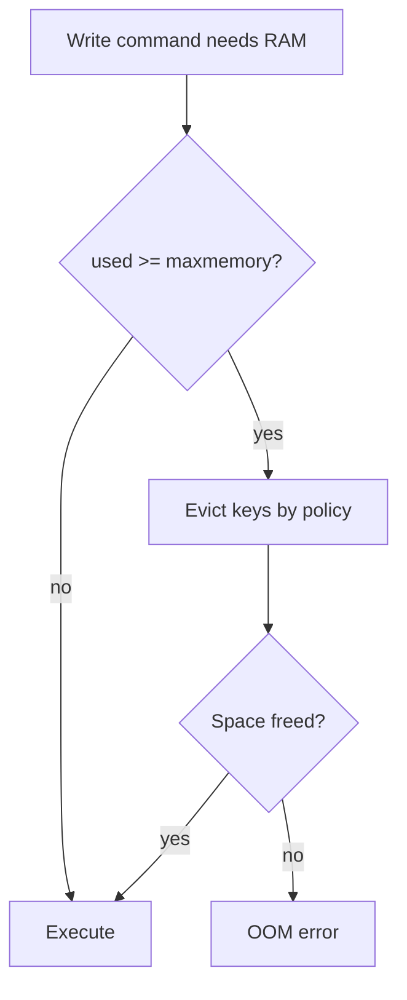

# 12. Memory, maxmemory and eviction policies

## Intro: "Redis threw out sessions but kept the cache"

An alert at night: `used_memory` at the limit. **Eviction** began — Redis deletes keys according to the `maxmemory-policy`. Under `allkeys-lru` an **important** key without a TTL could be evicted if it hadn't been accessed for a while, while the hot cache stayed. On the training stand [`redis-single.conf`](../../deploy/redis/config/redis-single.conf): **256mb**, **allkeys-lru**. This chapter is about how memory is accounted for and how a policy is chosen.

## What you'll learn

- The metrics **used_memory**, **fragmentation**, **maxmemory**.
- The **volatile-*** and **allkeys-*** policies.
- Behavior on **OOM command not allowed**.
- Practices: TTL, separate instances, monitoring `evicted_keys`.

## How Redis accounts for memory

| Metric | Meaning |
|---------|--------|
| `used_memory` | memory allocated by the allocator (data + overhead) |
| `used_memory_rss` | the process RSS (OS) |
| `mem_fragmentation_ratio` | rss / used; >> 1 — fragmentation |
| `maxmemory` | a hard ceiling (0 = no limit) |

```bash
docker exec mock-redis redis-cli INFO memory
```

On the stand, look for:

```text
maxmemory:268435456
maxmemory_policy:allkeys-lru
```

## What happens when maxmemory is reached

1. A new write that needs memory → Redis tries to **free** space per the policy.
2. If there's nothing to free (or the policy is `noeviction`) → the **`OOM command not allowed`** error on write commands.
3. Read commands usually keep working.



## Eviction policies (the main ones)

| Policy | What it deletes | When to choose |
|--------|--------------|----------------|
| **noeviction** | nothing | error on write; critical data with no loss |
| **allkeys-lru** | any keys, LRU | a **pure cache** (basic stand) |
| **allkeys-lfu** | any, LFU | hot keys with frequent access |
| **volatile-lru** | only those with a TTL, LRU | a mix of cache and "permanent" without TTL |
| **volatile-ttl** | with TTL, nearest expiry | emphasis on the soonest expiration |
| **volatile-random** / **allkeys-random** | at random | rarely |

**LRU** in Redis is approximate (sampled), not perfect LRU.

## volatile vs allkeys

| Scenario | Policy |
|----------|--------|
| All keys are cache with TTL | `allkeys-lru` or `volatile-lru` |
| Sessions without TTL + cache with TTL | a **separate instance** or `volatile-lru` + **never** store sessions without a TTL on a cache instance |
| Data must not be lost | `noeviction` + an alert before the limit |

On the stand it's **allkeys-lru**: a key **without a TTL** can also be evicted — important for lab 13.

## TTL as the first line of defense

Eviction is the **second** line. The first is **EXPIRE** on cache and sessions:

```bash
SET app:cache:x "..." EX 300
```

Sessions: a sliding TTL on every request ([05. Lab](05-lab-session-cart.md)).

## Fragmentation and active memory

A high `mem_fragmentation_ratio` after mass deletions is a reason for a **restart** in a maintenance window or `MEMORY PURGE` (depends on the allocator). In basic — just know the metric exists.

## On the stand: evicted_keys

```bash
docker exec mock-redis redis-cli INFO stats | grep evicted
```

After lab 13, `evicted_keys` should grow.

## Common mistakes

| Mistake | Consequence | Fix |
|--------|-------------|---------|
| No maxmemory in prod | Redis eats all the host's RAM | a limit + a policy |
| Sessions on an allkeys-lru cache instance | mass logout | separating instances |
| Giant values | fast OOM | a key size limit |
| Ignoring `evicted_keys` | a hidden rise in DB misses | an alert |

## In production

- **maxmemory** ~ 75% of the instance RAM (leave room for the OS and the replica buffer).
- Dashboard: memory %, evictions/s, hit rate.
- Load tests with a **real** value size.
- For critical data — **noeviction** + headroom + scaling.

## Summary

**maxmemory** limits RAM; the **policy** decides **which** keys are sacrificed. **allkeys-lru** on the stand is an aggressive cache mode. **TTL** is mandatory. **OOM** is a signal to change the policy, the volume or the architecture.

## Checklist

- Which policy is on the training stand?
- Will `allkeys-lru` delete a key without a TTL?
- What does `OOM command not allowed` mean?
- Why look at `evicted_keys`?

Next lesson: [13. Lab: eviction](13-lab-eviction.md).
