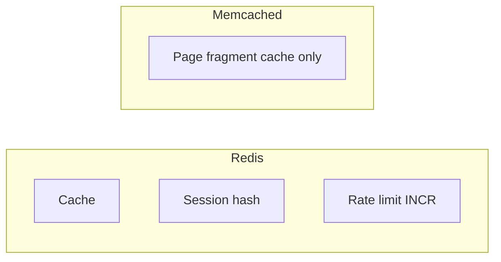
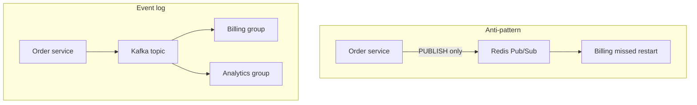

# 16. Redis vs Memcached vs Kafka (interview)

## Intro: "let's put Redis everywhere"

In a system design interview you're asked: catalog cache, sessions, a notification queue and an order stream for analytics — **one** Redis? Answering "yes" mixes **three different models**: in-memory **structures**, a simple **cache** and a **commit log**. This chapter is a matrix of trade-offs and the connection to the Kafka course.

## What you'll learn

- A comparison of **Redis** and **Memcached** for caching.
- A comparison of **Redis** (Pub/Sub, Streams) and **Kafka** for events.
- Typical interview questions and answer phrasing.
- Links to [kafka-basic/01](../kafka-basic/01-why-kafka.md) and [kafka-basic/18](../kafka-basic/18-vs-queues.md).

## Summary table

| Criterion | **Redis** | **Memcached** | **Apache Kafka** |
|----------|-----------|---------------|------------------|
| Model | structures in RAM + disk options | key-value **string only** | **distributed log** |
| Data types | string, hash, list, set, zset, … | string | bytes in a partition |
| Persistence | RDB/AOF optional | none | yes (segments on disk) |
| Pub/Sub | yes, no backlog | none | via consumer groups |
| Replay | Streams (intermediate) | none | yes (retention) |
| Write scale | high per node | very high for simple GET/SET | very high horizontally |
| Typical use case | cache, session, rate limit, leaderboard | pure cache of HTML/objects | event streaming, integration |

## Redis vs Memcached

| | Redis | Memcached |
|---|-------|-----------|
| **Structures** | hash, zset — natively | you serialize everything into a string |
| **TTL** | yes | yes |
| **Atomic ops** | INCR, HINCRBY, … | INCR/DECR on a string |
| **Cluster** | Redis Cluster | client-side sharding |
| **Memory** | single thread + efficient encodings | simpler, sometimes less overhead for a pure GET |

**Choose Memcached:** only a **simple** string cache, maximum QPS, the team doesn't want to operate Redis.

**Choose Redis:** sessions in a **hash**, a **leaderboard** (zset), **rate limit**, a single tooling stack.



## Redis vs Kafka

Kafka is **not** a cache and **not** a session store. See [01. Why Kafka](../kafka-basic/01-why-kafka.md): a **commit log**, **offset**, **retention**, independent **consumer groups**.

| Question | Redis Pub/Sub | Kafka |
|--------|---------------|-------|
| A message after an offline consumer | **lost** | read from the offset |
| Storage | none | retention by policy |
| Order | no global order | within a partition |
| Load "the entire order history" | not suitable | suitable |

**Redis Streams** (intermediate) is closer to a log with consumer groups, but Kafka's scale and ecosystem for a **central bus** are usually broader.

Comparison of Kafka with RabbitMQ/SQS — [18. Kafka vs queues](../kafka-basic/18-vs-queues.md).



## What goes where in one project

| Task | Tool |
|--------|------------|
| Catalog cache | Redis (or Memcached) |
| User session | Redis HASH + TTL |
| API rate limit | Redis INCR + EXPIRE |
| "Order created" for 5 services + replay | **Kafka** |
| A background job on a single worker | SQS / Rabbit / Redis Streams |
| Live websocket "delivery status" | Redis Pub/Sub |

## Interview Q&A

**Q: Redis vs Memcached?**  
A: Memcached is a **simple string cache**. Redis is **structures**, persistence, more patterns (zset, hash); slightly heavier ops.

**Q: Can you replace Kafka with Redis Pub/Sub?**  
A: No for **integration** with history: Pub/Sub **does not store** messages for an offline consumer. Kafka is a **log** with offsets.

**Q: Redis as a primary DB?**  
A: Only deliberately (sessions, leaderboard) with **persistence** and backup; OLTP — PostgreSQL.

**Q: Where does Redis fit in an event-driven architecture?**  
A: **Cache and ephemeral state** next to Kafka; events go into Kafka, not Pub/Sub.

## On the stand: one phrase — three tools

```bash
docker exec mock-redis redis-cli SET app:cache:demo "from-redis" EX 60
docker exec mock-redis redis-cli GET app:cache:demo
docker exec mock-redis redis-cli DEL app:cache:demo
```

Kafka on the same laptop is a separate compose [`deploy/kafka`](../../deploy/kafka/README.md); don't confuse the ports: Redis **6379**, Kafka **9094**.

## Common interview mistakes

| Mistake | Correction |
|--------|-------------|
| "Kafka is faster than Redis" | different tasks; you're comparing log ingest vs GET |
| "One Redis for everything" | separate cache / sessions / optional queue |
| "Pub/Sub = a queue" | no ACK backlog; see kafka 18 |
| "Memcached is obsolete" | still valid for a simple cache |

## Summary

**Memcached** — a narrow **string cache**. **Redis** — **structures**, cache, sessions, counters, lightweight realtime. **Kafka** — an **event stream** with history. In a design you draw **three layers**: OLTP, Redis, Kafka — and don't mix the delivery semantics.

## Checklist

- Name one use case that's only for Kafka, not Redis.
- Why is a leaderboard a zset and not Memcached?
- How does Pub/Sub differ from a consumer group?
- Where do you send the link to the comparison with RabbitMQ/SQS?

Next lesson: [17. Final project](17-final-project.md).
