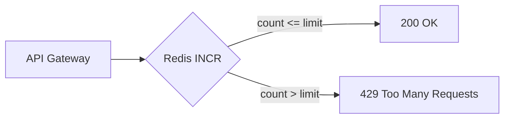

# 17. Final project: rate limit or leaderboard

## Intro: bringing basic together into one loop

Separately you can do keys, hashes, zsets, TTL, INCR, eviction and the CLI. The **finale** is one coherent scenario on [`deploy/redis`](../../deploy/redis/README.md): either API **rate limiting** or a store **leaderboard**. No separate application — `redis-cli` and a shell; optionally Redis Commander.

## What you'll learn (course wrap-up)

- Design a **key convention** and TTLs.
- Implement a **fixed window** rate limit or a **top-N** leaderboard.
- Capture an **operator's** checklist and a short report.

## Choose a track

| Track | Difficulty | Main commands |
|------|-----------|------------------|
| **A. Rate limit** | basic | `INCR`, `EXPIRE`, `TTL` |
| **B. Leaderboard** | basic+ | `ZADD`, `ZINCRBY`, `ZREVRANGE` |

One track per report; the second is optional for practice.

---

## Track A: Rate limit (recommended)

### Architecture



**Rule:** no more than **10 requests per minute** per `clientId` for the `api` scope.

Key convention — [`examples/rate-limit-keys.txt`](examples/rate-limit-keys.txt):

```text
rl:fw:api:{clientId}:{bucketId}
```

`bucketId = floor(unix_time / 60)` — in the lab, compute it in the shell or substitute the bucket by hand.

### Requirements

| # | Requirement | Criterion |
|---|------------|----------|
| 1 | Stand | `mock-redis` healthy, `PING` → `PONG` |
| 2 | Keys | prefix `app:fp:` or `rl:fw:` (no `FLUSHALL`) |
| 3 | Limit | 10 req / 60 s per client |
| 4 | Demo | client `fp-user-1` — 12 requests, requests 11–12 rejected logically |
| 5 | TTL | window key with EX ≥ 60 |
| 6 | Second client | `fp-user-2` doesn't share a counter with the first |
| 7 | CLI | report: a fragment of `GET`/`TTL`/`INFO stats` |
| 8 | Document | `PROJECT.md` in your copy (template below) |

### Runbook — phase 1: stand

```bash
cd deploy/redis
docker compose up -d
docker compose ps
bash scripts/smoke.sh
```

### Runbook — phase 2: simulation (example)

Substitute `BUCKET` (for example, `28600600`):

```bash
CLIENT=fp-user-1
SCOPE=api
BUCKET=28600600
KEY="rl:fw:${SCOPE}:${CLIENT}:${BUCKET}"

for n in $(seq 1 12); do
  COUNT=$(docker exec mock-redis redis-cli INCR "$KEY")
  docker exec mock-redis redis-cli EXPIRE "$KEY" 90 >/dev/null
  if [ "$COUNT" -le 10 ]; then
    echo "req $n: ALLOW count=$COUNT"
  else
    echo "req $n: DENY count=$COUNT"
  fi
done

docker exec mock-redis redis-cli TTL "$KEY"
```

**What you'll see:** `ALLOW` for 1–10, `DENY` for 11–12.

### Runbook — phase 3: cleanup

```bash
docker exec mock-redis redis-cli DEL "rl:fw:api:fp-user-1:${BUCKET}" "rl:fw:api:fp-user-2:${BUCKET}"
```

---

## Track B: Leaderboard

### Architecture

ZSET `app:fp:lb:daily` — member = `userId`, score = points.

### Requirements

| # | Requirement | Criterion |
|---|------------|----------|
| 1 | Stand | healthy |
| 2 | ZSET | ≥5 users with points |
| 3 | Update | `ZINCRBY` after a "purchase" |
| 4 | Top 3 | `ZREVRANGE 0 2 WITHSCORES` |
| 5 | Rank | `ZRANK` / `ZREVRANK` for a single user |
| 6 | TTL | optional EXPIRE on the key 86400 |
| 7 | Report | `PROJECT.md` |

### Runbook (example)

```bash
docker exec mock-redis redis-cli ZADD app:fp:lb:daily 100 u-alice 80 u-bob 120 u-carol 90 u-dave 70 u-eve
docker exec mock-redis redis-cli ZINCRBY app:fp:lb:daily 50 u-bob
docker exec mock-redis redis-cli ZREVRANGE app:fp:lb:daily 0 2 WITHSCORES
docker exec mock-redis redis-cli ZREVRANK app:fp:lb:daily u-bob
docker exec mock-redis redis-cli DEL app:fp:lb:daily
```

**What you'll see:** the top after INCRBY reflects the new points.

---

## PROJECT.md template

```markdown
# Redis Basic — final project

## Track
A (rate limit) / B (leaderboard)

## Stand
- deploy/redis, mock-redis healthy
- Date:

## Implementation
- Key schema:
- Limit / leaderboard rules:

## Evidence
- Paste the command output (fragments)

## Incidents
- What went wrong / how it was fixed

## Conclusions (3 points)
1.
2.
3.
```

## Success criteria (general)

- [ ] The stand is up per [`deploy/redis/README.md`](../../deploy/redis/README.md)
- [ ] Track A or B chosen, all track requirements met
- [ ] No `FLUSHALL` / no others' prefixes without `lab:` / `app:fp:` / `rl:`
- [ ] `PROJECT.md` filled in
- [ ] Keys deleted or documented

## Related courses

- Order events onto the bus — [`kafka-basic`](../kafka-basic/README.md), not Redis Pub/Sub.
- Redis replication — [`redis-intermediate`](../redis-intermediate/README.md).

## Course summary

You've traveled the path from **why Redis** to **operations and the comparison with Kafka**. The finale checks that you can **design keys**, **apply a data type** and **explain the behavior** under load and during eviction — a skill that transfers to any stack with Redis.
