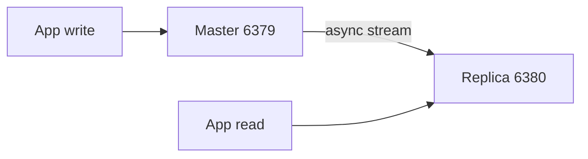

# 03. Master–replica replication

## Intro: "we read from the replica — saw yesterday's prices"

The product catalog is cached in Redis. After an outage the master came back, the replica is **catching up** with 30 seconds of lag — some requests to the read replica return **stale** stock. Redis replication is **asynchronous**: the master does not wait for the replica to acknowledge every write.

At intermediate you separate **writes** (master) and **reads** (replica), read `INFO replication`, and understand manual **promote** before Sentinel.

## What you'll learn

- **Master** and **replica** roles (formerly slave).
- `REPLICAOF`, `replica-read-only`.
- Partial resync, backlog, `master_repl_offset`.
- Limits: writes only on the master.

## How replication works



1. Replica on start: `REPLICAOF master-host 6379` (in config — `replicaof`).
2. Master sends an **RDB snapshot** + command stream (replication buffer).
3. On disconnect — **partial resync** if `repl_backlog` is enough.

Training stand: [`docker-compose.replication.yml`](../../deploy/redis/docker-compose.replication.yml)

| Role | From host | Container |
|------|---------|-----------|
| Master | `localhost:6379` | `mock-redis-master` |
| Replica | `localhost:6380` | `mock-redis-replica` |

Replica config: [`redis-replica.conf`](../../deploy/redis/config/redis-replica.conf) — `replicaof redis-master 6379`, `replica-read-only yes`.

## INFO replication

```bash
docker compose -f docker-compose.replication.yml up -d
docker exec mock-redis-master redis-cli INFO replication
docker exec mock-redis-replica redis-cli -p 6379 INFO replication
```

On master:

- `role:master`, `connected_slaves:1`
- `master_repl_offset`

On replica:

- `role:slave` (output may keep the legacy name) / `role:replica`
- `master_link_status:up`
- `slave_read_only:1`

## Reading from the replica

Clients with a **read your writes** policy must not read from a replica without sticky routing. For reports and heavy `GET`s — a replica with acceptable **eventual consistency**.

Read-only check:

```bash
redis-cli -p 6380 SET x 1
# (error) READONLY You can't write against a read only replica.
```

## Manual failover (without Sentinel)

If the master is dead:

1. Pick the **freshest** replica (`INFO replication` → offset).
2. `REPLICAOF NO ONE` on the chosen one — it becomes master.
3. Others: `REPLICAOF new-master 6379`.
4. Update DNS / application connection strings.

This is a **manual** procedure; automation is [05. Sentinel](05-sentinel.md).

## On the stand

```bash
cd deploy/redis
docker compose down
docker compose -f docker-compose.replication.yml up -d

redis-cli -p 6379 SET course:repl:test ok
redis-cli -p 6380 GET course:repl:test
```

Replication delay (lag simulation):

```bash
docker exec mock-redis-master redis-cli CONFIG SET repl-backlog-size 1048576
docker exec mock-redis-replica redis-cli INFO replication | grep master_repl_offset
```

## Common mistakes

| Symptom | Cause | Solution |
|---------|---------|---------|
| Replica `DOWN` | network, master unreachable | DNS between containers, healthcheck |
| Dual master | two `REPLICAOF NO ONE` | Sentinel / orchestration |
| Writes to replica | wrong endpoint | port 6379 vs 6380 |
| Full resync every time | small backlog | increase `repl-backlog-size` |
| "Lost" writes | async, master died before replicate | wait for ack (Redis 7 wait), Sentinel |

## In production

- At least **one** replica in another AZ; for HA — Sentinel or a K8s Operator.
- Monitoring: `master_link_down_since_seconds`, offset lag.
- Don't use a replica as the **only** backup — it's a live copy, not an archive.
- TLS and ACL on the replication port in the cloud (ElastiCache).

## Summary

Master accepts writes; the replica copies **asynchronously**. Read scaling — yes; strong consistency on the replica — no. Training stand: **6379 master, 6380 replica**.

## Checklist

- Where does a `SET` go when connected to `6380`?
- What does `REPLICAOF NO ONE` do?
- How do you check that the replica caught up with the master?
- How does Redis replication differ from synchronous Postgres standby?

Next lesson: [04. Lab: replica and failover](04-lab-replica-failover.md).
