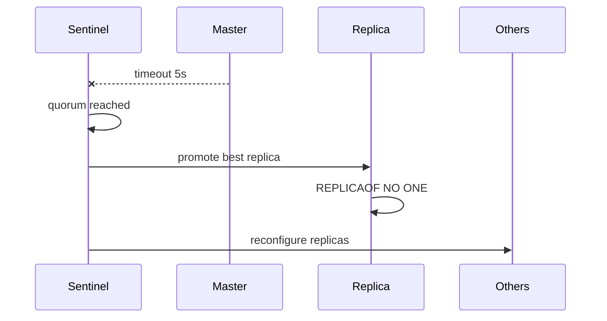

# 05. Redis Sentinel

## Intro: "master died at night — on-call was asleep, API was down 40 minutes"

Manual failover from [chapter 03](03-replication.md) needs a human and a runbook. **Sentinel** processes watch: they vote that the master is down, **elect** a replica, run `REPLICAOF NO ONE`, and publish the new master address to clients.

This isn't full Kubernetes, but the classic HA pattern for self-hosted Redis before Cluster.

## What you'll learn

- Sentinel architecture (quorum, subjective/objective down).
- The `sentinel monitor` config.
- Commands `SENTINEL masters`, `get-master-addr-by-name`.
- How apps should connect (Sentinel-aware client).

## Training stand architecture

[`docker-compose.sentinel.yml`](../../deploy/redis/docker-compose.sentinel.yml):

- 1 master + 2 replicas
- 3 Sentinels (quorum **2** of 3)

[`sentinel.conf`](../../deploy/redis/config/sentinel.conf):

```text
sentinel monitor mymaster redis-master 6379 2
sentinel down-after-milliseconds mymaster 5000
sentinel failover-timeout mymaster 60000
```

| Parameter | Meaning |
|----------|--------|
| `mymaster` | logical master name |
| `6379 2` | Redis port and **quorum** — how many Sentinels must agree |
| `down-after-milliseconds 5000` | 5 s without a reply → subjective down |
| `failover-timeout` | timeout for failover stages |

From the host:

| Service | Port |
|--------|------|
| Master (initial) | `6379` |
| Sentinel | `26379` (only `sentinel-1` is published) |

## Discovering the master

```bash
cd deploy/redis
docker compose -f docker-compose.sentinel.yml up -d
redis-cli -p 26379 SENTINEL get-master-addr-by-name mymaster
redis-cli -p 26379 SENTINEL masters
redis-cli -p 26379 SENTINEL replicas mymaster
```

Clients (Jedis, redis-py, go-redis) take a Sentinel list and the name `mymaster` — on failover they reconnect to the **new** IP.

## Failover stages (simplified)



1. **SDOWN** — one Sentinel considers the master unreachable.
2. **ODOWN** — quorum reached.
3. Replica election (priority, offset, runid).
4. Failover: promote → reconfigure replicas → update configs.

## On the stand

Write via the current master:

```bash
MASTER=$(redis-cli -p 26379 SENTINEL get-master-addr-by-name mymaster)
echo "Master: $MASTER"
redis-cli -h localhost -p 6379 SET lab:sentinel:ping 1
```

## Common mistakes

| Symptom | Cause | Solution |
|---------|---------|---------|
| Failover doesn't start | quorum too high | `quorum ≤ N/2 + 1` Sentinels |
| Split-brain two masters | network partition | odd number of AZs, fencing |
| Client on old IP | not a Sentinel client | driver with Sentinel |
| Endless failovers | `down-after` too small | tuning, network check |
| Lost writes | async replication | `min-replicas-to-write` (availability risk) |

## In production

- At least **3** Sentinels on independent hosts (not on the same VMs as the only Redis).
- Monitoring: `sentinel_masters`, last failover, `+switch-master` in pub/sub.
- In AWS — **ElastiCache Multi-AZ** instead of rolling your own Sentinel (see [19](19-managed-elasticache.md)).
- Test failover in a maintenance window.

## Summary

Sentinel automates promote and master switch. Quorum protects against false positives. Apps must use a **Sentinel-aware** configuration, not a static IP.

## Checklist

- Why three Sentinels with quorum=2?
- What will `get-master-addr-by-name` return after failover?
- How does Sentinel differ from Redis Cluster?
- Who can become the new master?

Next lesson: [06. Lab: Sentinel](06-lab-sentinel.md).
