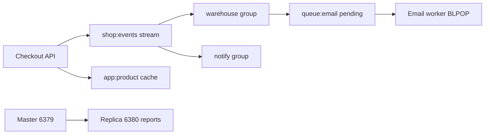

# 20. Final project: mini notification platform

## Intro: assemble intermediate into one loop

Separately you covered persistence, replication, Sentinel, Streams, ACL, Lua, queues, monitoring, and backup. The **finale** is a coherent "online store" scenario: order events in a **Stream**, processing in a **consumer group**, catalog cache with **ACL**, email **queue** on List, **read replica** for reports (optional), a runbook, and a short report.

## What you'll learn (course outcome)

- Design **key names** and flows.
- Run an event through a **Stream pipeline**.
- Restrict access with **ACL**.
- Capture an **operator** checklist.

## Architecture



| Component | Redis structure | Stand |
|-----------|-----------------|-------|
| Order events | Stream `shop:events` | single `6379` |
| Consumer groups | `warehouse`, `notify` | single |
| Product cache | String `app:product:{id}` | single + ACL |
| Email queue | List `queue:email:pending` | single |
| Reports (opt.) | `GET` from replica | replication `6380` |

## Requirements

| # | Requirement | Criterion |
|---|------------|----------|
| 1 | Single stand | `mock-redis` healthy |
| 2 | Stream | ≥5 `order.*` events with fields `orderId`, `event` |
| 3 | Groups | `warehouse` and `notify` both read all with `XACK` |
| 4 | ACL | user `readonly` reads `app:*`, does not write |
| 5 | Queue | ≥3 email tasks via `LMOVE` + ACK |
| 6 | Lua lock | acquire `lock:shop:import` with TTL 30s |
| 7 | Persistence | after single restart keys `app:product:*` remain |
| 8 | SLOWLOG | ≥1 entry after training load |
| 9 | Backup | `dump.rdb` in a directory + successful restore on a stand copy |
| 10 | Replication (opt.) | read `app:report:count` from `6380` |
| 11 | Document | `PROJECT.md` (template below) |

## Runbook — recommended order

### Phase 1: infrastructure

```bash
cd deploy/redis
docker compose down
docker compose up -d
docker compose ps
bash scripts/smoke.sh
```

### Phase 2: catalog and ACL

```bash
docker exec mock-redis redis-cli SET app:product:101 '{"name":"Notebook","price":10}'
docker exec mock-redis redis-cli SET app:product:102 '{"name":"Mouse","price":25}'
# ACL readonly — see 10-lab-acl-readonly.md
docker exec mock-redis redis-cli ACL SETUSER readonly on '>readonly-secret' '~app:*' '-@all' '+@read' '+ping'
docker exec mock-redis redis-cli --user readonly --pass readonly-secret GET app:product:101
```

### Phase 3: Stream pipeline

```bash
for id in 1001 1002 1003 1004 1005; do
  docker exec mock-redis redis-cli XADD shop:events '*' event order.created orderId $id
done
docker exec mock-redis redis-cli XGROUP CREATE shop:events warehouse 0 MKSTREAM
docker exec mock-redis redis-cli XGROUP CREATE shop:events notify 0
# XREADGROUP + XACK for each group — see 08-lab-streams-consumer.md
```

`notify` on processing `order.created` — `LPUSH queue:email:pending` JSON with `orderId`.

### Phase 4: Email worker

```bash
# LMOVE queue:email:pending → queue:email:processing
# process → LREM + SADD queue:email:done <orderId>
```

### Phase 5: Lua lock for "catalog import"

Script from [12-lab-lua-lock](12-lab-lua-lock.md) on key `lock:shop:import`.

### Phase 6: Operations

```bash
docker exec mock-redis redis-cli INFO memory
docker exec mock-redis redis-cli SLOWLOG GET 3
./courses/redis-intermediate/examples/backup-restore.sh backup ./project-backup
```

### Phase 7 (optional): replica for reports

```bash
docker compose down
docker compose -f docker-compose.replication.yml up -d
redis-cli -p 6379 SET app:report:count 42
redis-cli -p 6380 GET app:report:count
```

## PROJECT.md template

Create in your copy (no need to commit):

```markdown
# Redis Intermediate — final project

## Architecture
(diagram or key list)

## Stream
- Name: shop:events
- Groups: warehouse, notify
- Sample ID and XACK

## ACL
- User readonly: what it can / cannot

## Email queue
- Lists: pending, processing, done
- Idempotency: queue:email:done

## Operations
- INFO memory (used_memory_human):
- SLOWLOG: (paste one line)
- Backup file path:

## Replication (if done)
- Master/replica ports, GET app:report:count

## What you would do in AWS
- ElastiCache Multi-AZ, SG, link to aws-basic/07-databases
```

## Success criteria (self-check)

- [ ] You can explain **at-least-once** for the queue and Stream.
- [ ] You know when **Sentinel** vs **ElastiCache Multi-AZ**.
- [ ] You compared **Streams** with a **Kafka consumer group** in one paragraph.
- [ ] The runbook is reproducible from scratch in < 2 hours.

## Troubleshooting

| Problem | See |
|----------|-----|
| Port 6379 busy | `deploy/redis/README.md` — down other compose |
| NOPERM | [10-lab-acl-readonly](10-lab-acl-readonly.md) |
| PEL growing | [08-lab-streams-consumer](08-lab-streams-consumer.md) — XACK |
| Empty after restart | volume, [02-lab-rdb-aof](02-lab-rdb-aof.md) |

## Next

[`redis-advanced`](../redis-advanced/README.md) — Cluster, Redis Stack, advanced patterns.
