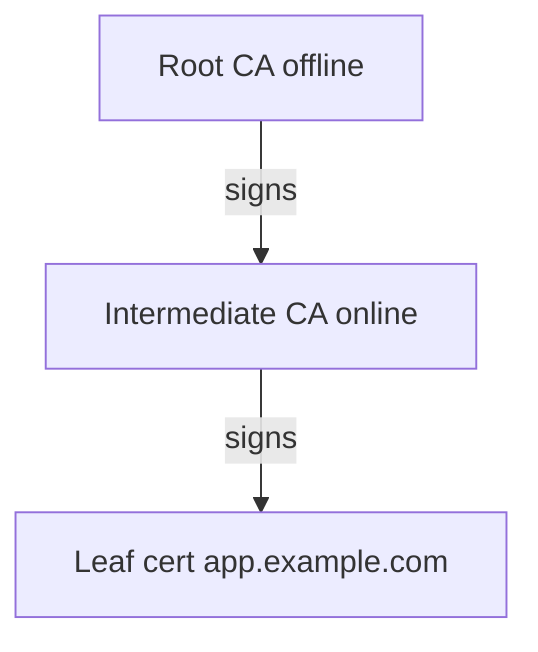

# 01. PKI in Vault: overview and trust model

## Intro: "The certificate expired on Saturday"

A microservice came back up after a deploy, but the **TLS handshake failed**. In Grafana — a spike of `certificate has expired`. It turned out: the leaf was issued by hand a year ago, **nobody set up renewal**, and the secret in the Kubernetes Secret was never updated. At an interview they expect more than "what is TLS" — they want **who issues certs**, **how to rotate them**, **where the private key lives**, and why **Vault PKI** beats an unmanaged `openssl req` in CI.

## What you'll learn

- The role of the **PKI secrets engine** in Vault.
- The **root CA → intermediate → leaf** chain.
- **Roles**, **TTL**, **allowed_domains**, leases.
- The difference between an **internal CA** on the sandbox and a **public CA** (Let's Encrypt).
- The link to [linux-security: secrets on disk](../linux-security/07-secrets-disk.md) and [aws-intermediate: KMS](../aws-intermediate/11-secrets-kms.md).

---

## Why PKI in Vault

| Approach | Pro | Con |
|--------|------|-------|
| Manual openssl | Fast in a lab | No audit, no centralized rotation |
| Public CA (ACME) | Browsers trust it | Not for an internal mTLS mesh |
| **Vault PKI** | API, policies, TTL, audit, automation | You have to operate a CA hierarchy |

Vault stores the **CA keys** inside storage (encrypted with the master key). Operators do **not** copy `ca.key` over SSH — issuance happens through the API and policy.

---

## Trust model



On the [`deploy/vault`](../../deploy/vault/README.md) sandbox the `init-engines.sh` script creates **one internal root** with `common_name=lab.mock-exams.local` — enough for the course. In production:

- **Root** — rarely, long TTL, offline/HSM.
- **Intermediate** — signs leaf certs, can be rotated more often.
- **Leaf** — short TTL (days/weeks), automatic renewal.

---

## Enabling and configuring (sandbox)

After `docker compose up -d`:

```bash
cd deploy/vault
bash scripts/init-engines.sh
```

The script:

1. `vault secrets enable pki`
2. `vault secrets tune -max-lease-ttl=87600h pki`
3. `vault write pki/root/generate/internal` — generates the root
4. `vault write pki/config/urls` — issuing CA and CRL URLs
5. `vault write pki/roles/lab-server` — the role for the labs

Verification:

```bash
export VAULT_ADDR=http://localhost:8200
export VAULT_TOKEN=course
vault read pki/cert/ca
vault read pki/roles/lab-server
```

**API paths:** mount `pki/` → endpoints `pki/issue/...`, `pki/sign/...`, `pki/cert/...`.

---

## Role: issuance constraints

A role is a template for **who can get which cert**. For an example from the sandbox, see [`examples/pki-role.json`](examples/pki-role.json).

| Parameter | Meaning |
|----------|--------|
| `allowed_domains` | CN/SAN suffixes |
| `allow_subdomains` | `api.lab.mock-exams.local` |
| `max_ttl` / `ttl` | Upper bound and default duration |
| `server_flag` / `client_flag` | EKU for TLS server/client |
| `allow_ip_sans` | IP in SAN (services without DNS) |

**At the interview:** "How do you forbid issuing a cert for `evil.com`?" — a strict `allowed_domains`, no `allow_any_name`, review the policy on `pki/issue/*`.

---

## Issuing a leaf (concept)

```bash
vault write pki/issue/lab-server \
  common_name="api.lab.mock-exams.local" \
  ttl=24h \
  -format=json
```

The response contains `certificate`, `private_key`, `ca_chain`, `lease_id`. The **private key** is shown **once** — just like with dynamic secrets; the application must write it to PEM and discard the API response.

Alternative: bring your own CSR:

```bash
vault write pki/sign/lab-server csr=@request.csr
```

The application **generates the key locally** — Vault never sees the private key (better for compliance).

---

## Leases and revocation

With `generate_lease=true` the cert is tied to a **lease**. To revoke early:

```bash
vault lease revoke <lease_id>
```

The CRL is refreshed at `pki/crl`. Clients must check **expiry + revocation** (or OCSP in Enterprise).

---

## PKI vs KMS / Secrets Manager

| | Vault PKI | AWS ACM / PCA | KMS |
|---|-----------|---------------|-----|
| Object | X.509 + key | Certificates | Symmetric keys |
| mTLS mesh | Yes | Partially (PCA) | No |
| Audit of who issued | Vault audit | CloudTrail | CloudTrail |

KMS encrypts **data**; PKI attests the **identity** of a channel. Often used together: a TLS cert + an application payload encrypted with a key from Transit ([05](05-transit-encryption.md)).

---

## Anti-patterns

| Bad | Why | Better |
|-------|--------|-------|
| Root CA online with a 10-year TTL for everything | Compromise = total collapse of trust | Offline root + intermediate |
| A single `allow_any_name` role | An internal "public" CA | Different roles per team/env |
| Private key in Git | Leak = impersonation | CSR flow or short-lived + agent |
| Ignoring CRL/renewal | A "sudden" outage | Monitor expiry, [03](03-rotation-renewal.md) |

---

## At the interview

1. **How does the PKI engine differ from KV with a PEM file?** — Lifecycle, signing API, CRL, roles; don't store ready-made certs statically without TTL discipline.
2. **Internal vs public CA?** — Internal for service-to-service; public for users in a browser.
3. **Where is the leaf private key?** — Either ephemeral in the issue response, or only on the client with CSR.

---

## Summary

- PKI in Vault is a **centralized CA** with policy and audit.
- On the sandbox: `init-engines.sh` → root `lab.mock-exams.local`, role `lab-server`.
- The **role** constrains domains and TTL; **issue** vs **sign** is a trade-off over where the key is stored.
- Next step: [02. Lab: issuing a certificate](02-lab-pki-issue-cert.md).
